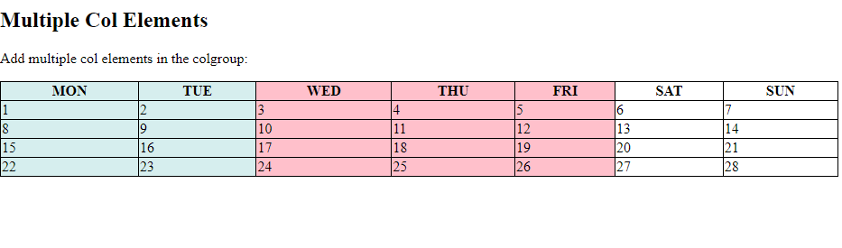

# Learn HTML and CSS in 30 Chapters

### After completing this course, we'll build [20 Projects](#20-html--css-projects) with HTML and CSS.

While you complete the 30-chapter module, jump in the [Projects Section](#20-html--css-projects).

|                                      Chapter                                      |                                                                       Topics                                                                        | Video Explanation |
| :-------------------------------------------------------------------------------: | :-------------------------------------------------------------------------------------------------------------------------------------------------: | :---------------: |
|                   [00](#chapter-00-how-the-course-is-designed)                    |                                        [How The Course is Designed](#chapter-00-how-the-course-is-designed)                                         |   [Watch Now]()   |
|   [01](#chapter-01-environment-setup-html-elements-attributes-text-formatting)    |       [Environment Setup, HTML Elements, Attributes, Text Formatting](#chapter-01-environment-setup-html-elements-attributes-text-formatting)       |   [Watch Now]()   |
|              [02](#chapter-02-html-quotation-link-image-and-favicon)              |                            [HTML Quotation, Link, Image and Favicon](#chapter-02-html-quotation-link-image-and-favicon)                             |     Watch Now     |
| [03](#chapter-03-html-table-list-iframes-code-tag-semantic-element-and-entities)  |  [HTML Table, List, Iframes, Code Tag, Semantic Element and Entities](#chapter-03-html-table-list-iframes-code-tag-semantic-element-and-entities)   |     Watch Now     |
|             [04](#chapter-04-html-symbols-emojis-charsets-and-forms)              |                           [HTML Symbols, Emojis, Charsets and Forms](#chapter-04-html-symbols-emojis-charsets-and-forms)                            |     Watch Now     |
|                 [05](#chapter-05-html-canvas-svg-and-html-media)                  |                                    [HTML Canvas, SVG and HTML Media](#chapter-05-html-canvas-svg-and-html-media)                                    |     Watch Now     |
|   [06](#chapter-06-introduction-to-css-css-selectors-ways-of-styling-and-color)   |      [Introduction to CSS, CSS Selectors, Ways of Styling and Color](#chapter-06-introduction-to-css-css-selectors-ways-of-styling-and-color)       |     Watch Now     |
| [07](#chapter-07-css-background-border-margin-padding-width-height-and-box-model) | [CSS Background, Border, Margin, Padding, Width, Height and Box Model](#chapter-07-css-background-border-margin-padding-width-height-and-box-model) |     Watch Now     |
|                  [08](#chapter-08-css-outline-text-fonts--icons)                  |                                 [CSS Outline, Text, Fonts, Icons, Lists](#chapter-08-css-outline-text-fonts--icons)                                 |     Watch Now     |
|                           [09](#chapter-09-css-display)                           |                                                       [CSS Display](#chapter-09-css-display)                                                        |     Watch Now     |
|          [10](#chapter-10-css-max-width-min-width-max-height-min-height)          |                  [CSS Max-width, Min-width, Max-height and Min-height](#chapter-10-css-max-width-min-width-max-height-min-height)                   |     Watch Now     |
|                  [11](#chapter-11-css-position-z-index-overflow)                  |                                    [CSS Position, Z-index, Overflow](#chapter-11-css-position-z-index-overflow)                                     |     Watch Now     |
|                   [12](#chapter-12-css-float-display-alignment)                   |                                     [CSS Float, Display and Alignment](#chapter-12-css-float-display-alignment)                                     |     Watch Now     |
|                           [13](#chapter-13)                           |                                                       [CSS Flexbox](#chapter-13)                                                        |     Watch Now     |
|                          [14](#chapter-14)                          |                                                     [CSS Selectors](#chapter-14)                                                      |     Watch Now     |
|                      [15](#chapter-15-css-text-fonts--icons)                      |                                           [CSS Text, Fonts and Icons](#chapter-15-css-text-fonts--icons)                                            |     Watch Now     |
|            [16](#chapter-16-css-links-lists-tables-display--max-width)            |                        [CSS Links, Lists, Tables, Display, Max-width](#chapter-16-css-links-lists-tables-display--max-width)                        |     Watch Now     |
|               [17](#chapter-17-css-image-gallery-and-image-sprites)               |                               [CSS Image Gallery and Image Sprites](#chapter-17-css-image-gallery-and-image-sprites)                                |     Watch Now     |
|                                        18                                         |                                                                                                                                                     |     Watch Now     |
|             [19](#chapter-19-visualize-and-play-with-css-properties)              |                            [Visualize and Play with CSS Properties](#chapter-19-visualize-and-play-with-css-properties)                             |     Watch Now     |
|                         [20](#chapter-20-css-grid-layout)                         |                                                   [CSS Grid Layout](#chapter-20-css-grid-layout)                                                    |     Watch Now     |
|                          [21](#chapter-21-css-gradient)                           |                                                      [CSS Gradients](#chapter-21-css-gradient)                                                      |     Watch Now     |
|                    [22](#chapter-22-css-2d-and-3d-transforms)                     |                                          [CSS 2D and 3D Transforms](#chapter-22-css-2d-and-3d-transforms)                                           |     Watch Now     |
|                         [23](#chapter-23-css-animations)                          |                                                    [CSS Animations](#chapter-23-css-animations)                                                     |     Watch Now     |
|                                        24                                         |                                                                                                                                                     |     Watch Now     |
|                                        25                                         |                                                                                                                                                     |     Watch Now     |
|                                        26                                         |                                                                                                                                                     |     Watch Now     |
|                                        27                                         |                                                                                                                                                     |     Watch Now     |
|                                        28                                         |                                                                                                                                                     |     Watch Now     |
|                                        29                                         |                                                                                                                                                     |     Watch Now     |
|                                        30                                         |                                                                                                                                                     |     Watch Now     |

|

# 20 HTML & CSS Projects

|                     Project No.                      |                                       Project Name                                       | Video Explanation |                          Live Demo                          |
| :--------------------------------------------------: | :--------------------------------------------------------------------------------------: | :---------------: | :---------------------------------------------------------: |
|                          01                          |                                                                                          |     Watch Now     |                          Live Demo                          |
|  [02](#project-02-simple-website-layout-with-float)  |   [Simple Website Layout with CSS Float](#project-02-simple-website-layout-with-float)   |     Watch Now     |                          Live Demo                          |
| [03](#project-03-simple-website-layout-with-flexbox) | [Simple Website Layout with CSS Flexbox](#project-03-simple-website-layout-with-flexbox) |     Watch Now     |                          Live Demo                          |
|                          04                          |                                                                                          |     Watch Now     |                          Live Demo                          |
|      [05](#project-05-simple-3d-animation-page)      |             [Simple 3D Animation Page](#project-05-simple-3d-animation-page)             |  [Watch Now](#)   | [Live Demo](https://codepen.io/FarmerAbdulAlim/pen/zYjPVQp) |
|                          06                          |                                                                                          |     Watch Now     |                          Live Demo                          |
|                          07                          |                                                                                          |     Watch Now     |                          Live Demo                          |
|                          08                          |                                                                                          |     Watch Now     |                          Live Demo                          |
|                          09                          |                                                                                          |     Watch Now     |                          Live Demo                          |
|                          10                          |                                                                                          |     Watch Now     |                          Live Demo                          |
|                          11                          |                                                                                          |     Watch Now     |                          Live Demo                          |
|                          12                          |                                                                                          |     Watch Now     |                          Live Demo                          |
|                          13                          |                                                                                          |     Watch Now     |                          Live Demo                          |
|                          14                          |                                                                                          |     Watch Now     |                          Live Demo                          |
|                          15                          |                                                                                          |     Watch Now     |                          Live Demo                          |
|                          16                          |                                                                                          |     Watch Now     |                          Live Demo                          |
|                          17                          |                                                                                          |     Watch Now     |                          Live Demo                          |
|                          18                          |                                                                                          |     Watch Now     |                          Live Demo                          |
|                          19                          |                                                                                          |     Watch Now     |                          Live Demo                          |
|                          20                          |                                                                                          |     Watch Now     |                          Live Demo                          |

# Chapter-00: How The Course is Designed

## কোর্সটি যেভাবে সাজানো হয়েছেঃ

## কোর্সটি কাদের জন্য?

- এই কোর্সটিতে যেকেউ অংশগ্রহণ করতে পারবে। শিখার জন্য মনের ইচ্ছাটাই আসল!
- Course টি মূলত Beginner-friendly. যারা Web Programming এ নতুন তাদেরকে উদ্দেশ্য করেই Course টি সাজানো।

## Prerequisite

- HTML সম্পর্কে অল্প ধারনা থাকলে ভালো, না থাকলেও সমস্যা নেই।

# Chapter-01: Environment Setup, HTML Elements, Attributes, Text Formatting

- [What is Programming Lanuage](#what-is-programming-lanuage)
- [What is Program, Programming & Programmer](#what-is-program-programming--programmer)
- [What is IDE](#what-is-ide)
- [Difference between Web Design & Web Development
  ](#difference-between-web-design--web-development)
- [What is HTML?](#what-is-html)
- [History of HTML](#history-of-html)
  - [Founder of HTML](#founder-of-html)
  - [The World’s First Website](#the-worlds-first-website)
- [What is CSS?](#what-is-css)
  - [Founder of CSS](#founder-of-css)
- [Environment Setup](#environment-setup)
- [HTML Basics](#html-basics)
- [HTML Elements](#html-element)
- [HTML Attributes](#html-attributes)
- [HTML Style Attribute](#html-style-attribute)
- [HTML Text Formatting](#html-text-formatting)
- [Assignments for Chapter 01](#assignments-for-chapter-01)
- [How Web Works? (Optional for Right Now)](#how-web-works)

## What is Programming Lanuage

- যে ভাষা ব্যবহার করে মানুষ মানুষের সাথে কথা বলে, তাকে বলে Lanuage বা ভাষা। অপরদিকে যে ভাষা ব্যবহার করে মানুষ Computer এর সাথে কথা বলে তাকে বলা হয় Programming Lanuage বা প্রোগ্রামিং ভাষা।
- Computer 0 এবং 1 ছাড়া কোনকিছুই বুঝতে পারে না। তাই আমরা যে Code লিখি সেই কোডকে আসলে 0 এবং 1 Convert করতে হয়। আর এই কাজটি করে Interpreter এবং Compiler.
- Examples: C, C++, Java, Python, JavaScript, PHP etc.


## What is Program, Programming & Programmer

- একটি প্রোগ্রাম হল Insturctions এর তালিকা যা একটি
  নির্দিষ্ট কাজ সম্পন্ন করে এবং Computer দ্বারা Executed হয়। (A program is a list of instructions that is executed by a computer to accomplish a particular task.)
- এই Instructions তৈরি করাকেই প্রোগ্রামিং বলে। যে তৈরি করে তাকে প্রোগ্রামার বলে।

## What is IDE

- An Integrated Development Environment (IDE) is a software application that combines common software development tasks into a single application.
- Example: VS Code, Atom, Netbeans, Android Studio, Sublime Text, Code Blocks etc.

**Common Task of An IDE:**


## Difference between Web Design & Web Development

| **Criteria**   | **Web Design**                                                                                                          | **Web Development**                                             |
| -------------- | ----------------------------------------------------------------------------------------------------------------------- | --------------------------------------------------------------- |
| **Definition** | Designing the overall look & feel of the website, creating visual elements such as logos, icons, buttons, graphics etc. | Implementing the design into a functional website writing code. |
| **Tools**      | Adobe Photoshop, Adobe XD, Figma etc.                                                                                   | VS Code, Sublime Text, Atom etc.                                |
| **Skills**     | Design Principles, Layout Techniques, Color Theory, Typography, UI Design etc.                                          | HTML, CSS, JavaScript, ReactJS, PHP, Laravel etc.               |

## What is HTML?

- The full meaning of HTML is **_Hyper Text Markup Language_**. HTML হলো একটি _Markup language_.  
  HTML is used to build the **_STRUCTURE_** of the web pages.
- একটি ভাষা শিখতে যেমন বর্ণমালা দিয়ে শুরু করতে হয়, ঠিক তেমনি Web Developement শিখতেও HTML, CSS দিয়ে শুরু করতে হয়।
- এইচটিএমএল এর মার্ক আপ ট্যাগ সমূহ ব্যবহার করে ওয়েবপেজ এর বেসিক কাঠামো তৈরি করা হয়। কঙ্কাল যেমন মানুষের দেহ গঠন করে , তেমনি এইচটিএমএল একটি ওয়েবসাইটের কাঠামো তৈরি করে ।
- HTML কোনো প্রোগ্রামিং ল্যাংগুয়েজ নয় বরং একটি মার্কআপ ল্যাংগুয়েজ যা কতগুলো মার্কআপ ট্যাগ এর সমন্বয় গঠিত।
- HTML ফাইলের এক্সটেনশন **_.html_** অথবা **_.htm_** দিতে হয়।

## History of HTML

- ১৯৯১ সালে ব্রিটিশ পদার্থবিদ ও কম্পিউটার বিজ্ঞানী **টিম বার্নার্স-লি**, CERN(European Council for Nuclear Research) এ কর্মরত ছিলেন। ঐ সময় CERN এর কর্মীদের মাঝে বিভিন্ন Documents Share করার জন্য সর্বপ্রথম HTML আবিষ্কার করেন। পরবর্তীতে ১৯৯৩ সালে HTML 1.0 Officially Released করা হয়।
- ঐ সময় HTML এর ট্যাগ ছিল মাত্র ১৮ টা। বর্তমানে ১৪২ টা ট্যাগ আছে।
- HTML এর বিভিন্ন Versions and Release Year

| **Version** | **Release Year** |
| ----------- | ---------------- |
| HTML 1.0    | 1993             |
| HTML 2.0    | 1995             |
| HTML 3.0    | 1997             |
| HTML 4.0    | 1999             |
| HTML 5.0    | 2014             |

### Founder of HTML


### The World’s First Website

- To Visit the World's First Website: [Click Here](http://info.cern.ch/hypertext/WWW/TheProject.html)
- Screenshot:
  

## What is CSS?

- CSS (Cascading Style Sheet ) হল একটি Style Sheet Lanuage যা HTML এ লিখিত ডকুমেন্ট কীভাবে উপস্থাপিত ও সজ্জিত হবে তা নির্ধারণ করে। অর্থাৎ HTML দিয়ে Website এর Structure এবং CSS দিয়ে Design করা হয়।
- CSS File এর Extension হলো **_.css_**

## History of CSS

- CSS আসার আগে, যেকোনো ওয়েব ডকুমেন্ট (web document) এর কোনো style বা design ছিলোনা। মানে, যখন একটি ওয়েবসাইট বা ওয়েব পেজের মধ্যে ভিসিট করা হতো, তখন সেখানে কেবল **বিচ্ছিন্ন কিছু TEXT** ছাড়া কিছুই থাকতোনা। এই সমস্যার সমাধান করতে গিয়ে HTML `<style></style>` tag এর বিকাশ হলো। কিন্তু এরও কিছু সীমাবদ্ধতা থেকে গেলো।
- অবশেষে ১৯৯৪ সালে Håkon Wium Lie নামে একজন Computer Scientist CSS আবিষ্কার করেন। ১৯৯৬ সালে Officially CSS 1.0 Version Release করা হয়। তিনিও **টিম বার্নার্স-লি** এর মত CERN(European Council for Nuclear Research) এ কর্মরত ছিলেন।
- Version History:

| **Version** | **Release Year** |
| ----------- | ---------------- |
| CSS 1.0     | 1996             |
| CSS 2.0     | 1998             |
| CSS 3.0     | 1999 (Draft)     |

- CSS3 Single Version এ Released হয়নি, বরং বিভিন্ন Module এ Release হয়েছে। যেমনঃ
- ২০০১ সালে CSS3 তে Selector Level 3 আসে।
- ২০০২ সালে Box Model, Background, Borders আসে।
- ২০০৯ সালে আসে Media Queries, Transitions, Animation এবং Flexbox.
- ২০১১ সালে আসে Grid Layout, Multi Column Layout.

CSS এর Details Version History দেখতে [এখানে](https://www.w3.org/Style/CSS20/) ক্লিক করুন।

### Founder of CSS


## Environment Setup

- VS Code Download করতে [এখানে](https://code.visualstudio.com/) ক্লিক করুন।
- Windows এর জন্য নিচের দেখানো Marked Button এ ক্লিক করুন। Download এর পরে Install করুন।
  
- এরপর নিচের Extensions গুলো ইনস্টল করুন:
  - Auto Close Tag
  - Auto Rename Tag
  - Code Runner
  - IntelliSense for CSS class names
  - JavaScript Code Snippets
  - Live Preview
  - Live Server
  - Prettier - Code Formatter

**_Congratulations! you're ready to code now!_**

## HTML Basics

- **`<!DOCTYPE html>`** is used to **tell** the browser, this is an HTML5 document.
- **`<html>`** is the **container** of all HTML elements. This tag is used to **indicate** the beginning and end of all HTML elements in an HTML Document.

- **`<head>`** element is used to give **browser and search engine** informations about the page.
- **`<title>`** element specifies a title for the HTML page (which is shown in the browser's title bar and in the page's tab).
- **`<body>`** element is the container for all the visible contents such as headings, paragraphs, images, hyperlinks, tables, lists, etc in the webpage.
- The **`<em>`** element is used to define emphasized text. By default, emphasized text is
  displayed in _italic_.
- The **`<strong>`** element is used to represent important content. Browsers, by default, render strong content in **bold**.
- The **`<i>`** and **`<b>`** elements are considered deprecated because HTML should not be used for styling. That’s the role of CSS.
- Headings are represented using **`<h1>`**, **`<h2>`**, **`<h3>`**, **`<h4>`**, **`<h5>`**, **`<h6>`**. Every web page should have one and only one **`<h1>`** element. Headings should have a natural hierarchy and should not be skipped.
- Entities are used to display special characters such as angle brackets, copyright symbol, etc. The most important entities are: **`&nbsp;`** (non-breaking space), **`&lt;`** (less than sign), **`&gt;`** (greater than sign) and **`&copy;`** (copyright symbol).
- The **`<div>`** and **`<span>`** elements are generic containers used for styling purposes. Divs are block-level elements, spans are inline elements. A block-level element starts on a new line and takes up the entire available horizontal space.
- Semantic elements help us write markup that is more meaningful and descriptive to search engines, screen readers and other software. So, use **`<div>`** and **`<span>`** elements when no other semantic element is appropriate.
- The semantic elements in HTML5 are: **`<header>`, `<footer>`, `<nav>`, `<main>`, `<aside>`, `<article>`, `<section>`, `<figure>`, `<time>` and `<mark>.`**

  **An Example of Basic HTML Boilerplate is**

```html
<!DOCTYPE html>
<html lang="en">
  <head>
    <meta charset="UTF-8" />
    <meta http-equiv="X-UA-Compatible" content="IE=edge" />
    <meta name="viewport" content="width=device-width, initial-scale=1.0" />
    <meta name="keywords" content="CodeJogot, CodeJogot Course" />
    <meta
      name="description"
      content="CodeJogot - A game-based learning platform!"
    />
    <title>CodeJogot</title>
  </head>
  <body></body>
</html>
```

## HTML Element

- An HTML element is defined by a start tag, some content, and an end tag.
- যে Element এর কোন Content থাকে না, তাকে Empty Element বলে। যেমনঃ `<br>`

- HTML Tags are not case-sensitive. অর্থাৎ `<DIV>` এবং `<div>` এই দুটোর অর্থ একই। কিন্তু W3C(World Wide Web Consortium) recommend করে Lowercase এ লিখার জন্য।

### Structure of an Element/Tag


### HTML Attributes

- HTML Attributes, HTML Element কে আরও Features যোগ করার ক্ষমতা দেয়, ফলে Element টি আরও শক্তিশালী হয়ে উঠে!
- Element এর প্রথম Tag এ Attributes লিখতে হয়।
- Format: `name: "value"`
- Example: `<p title="CodeJogot.Com">CodeJogot is an educational platform<p>`

## HTML Style Attribute

- কোন একটা Element কে Style করতে Style Attribute ব্যবহার করা হয়। যেমনঃ Element এর color, font-size, width, height ইত্যাদি।
- Syntax: `<tagname style="property:value;">` এখানে Property এবং Value কি সেটা আমরা CSS এ শিখবো।
- Example: `<p style="color:blue;">I am blue</p>`

## HTML Text Formatting

- HTML এ বেশ কয়েকটি Element আছে যেগুলো দিয়ে বিভিন্ন ধরনের Text Display করতে পারি। যেমনঃ

| **No.** | **Element Name** | **Element Role**                                                                                                                                                                 |
| ------- | ---------------- | -------------------------------------------------------------------------------------------------------------------------------------------------------------------------------- |
| 1       | `<b>`            | Text Bold করার জন্য। (without SEO concern)                                                                                                                                       |
| 2       | `<strong>`       | Text Bold করার জন্য। (with SEO concern)                                                                                                                                          |
| 3       | `<i>`            | Text Italic করার জন্য। (without SEO concern)                                                                                                                                     |
| 4       | `<em>`           | Text Italic/Emphasized করার জন্য। (with SEO concern)                                                                                                                             |
| 5       | `<mark>`         | Text Mark করার জন্য।                                                                                                                                                             |
| 6       | `<small>`        | খুব ছোট্ট টেক্সট এর জন্য।                                                                                                                                                        |
| 7       | `<del>`          | টেক্সট এর মাঝখানে একটা লাইন দিয়ে এটা Deleted সেটা বুঝানোর জন্য।                                                                                                                  |
| 8       | `<ins>`          | কোন Text কে Document এ Insert করার জন্য।                                                                                                                                         |
| 9       | `<sub>`          | Subscript Text এর জন্য। এটি Normal Line থেকে একটু নিচে চলে যায়। সারারনত Chemical Formula যেমন পানির সংকেত, সালফিউরিক এসিডের সংকেত ইত্যাদি এগুলোর জন্য এই Element ব্যবহার করা হয়। |
| 10      | `<sup>`          | Superscript Text এর জন্য। এই Element সাধারনত Mathematical Formula লিখতে ব্যবহার করা হয়।                                                                                          |

## Assignments for Chapter 01


## How Web Works?

Hey, rather wasting some time, I'm gonna provide you some useful resources to learn how the web works!
Here we go:

1. An amazing Video [Explanation](https://youtu.be/zN8YNNHcaZc) on freeCodeCamp.
2. Another Amazing [Explanation](https://github.com/vasanthk/how-web-works) by Vasa.
3. Video [Explanation](https://www.youtube.com/watch?v=hJHvdBlSxug) on Academind.
4. An [Explanation](https://developer.mozilla.org/en-US/docs/Learn/Getting_started_with_the_web/How_the_Web_works) on Mozilla.

<div align="right">
    <b><a href="#learn-html-and-css-in-60-chapters">↥ Go to Top</a></b>
</div>

# Chapter-02: HTML Quotation, Link, Image and Favicon

- [HTML Quotation](#html-quotation)
  - [Blockquote Element](#blockquote-element)
  - [Q Element](#q-element)
  - [ABBR Element](#abbr-element)
  - [Address Element](#address-element)
  - [Cite Element](#cite-element)
  - [BDO Element](#bdo-element)
- [HTML Link](#html-link)
  - [Absolute URL vs Relative URL](#absolute-url-vs-relative-url)
  - [Image as A Link](#image-as-a-link)
  - [Link to An Email Address](#link-to-an-email-address)
  - [Button As A Link](#button-as-a-link)
  - [Link Bookmark](#link-bookmark)
- [HTML Image](#html-image)
  - [Image Map](#image-map)
  - [Image As Background](#image-as-background)
- [HTML Favicon](#html-favicon)

## HTML Quotation

### Blockquote Element

- সাধারণত কোন Section (Text, Images etc) যদি অন্য কোন Source থেকে আসে, তাহলে ঐ Section কে Quote করার জন্য আমরা `<blockquote>` Element টি ব্যবহার করে থাকি। Section টি যে Source থেকে এসেছে, সেই Source এর লিংক _cite_ Attribute এ দিতে হয়। যেমনঃ

```html
<blockquote cite="https://en.wikipedia.org/wiki/Cox%27s_Bazar">
  Cox's Bazar is a city, fishing port, tourism centre, and district headquarters
  in Southeastern Bangladesh. It is located 150 km (93 mi) south of the city of
  Chittagong.
</blockquote>
```

- Blockquote Element টি by default বাম ও ডান দিক থেকে কিছু Margin নেয়।
- সাধারণত বড় Quote বা Section কে `<blockquote>` দিয়ে এবং ছোট Quote কে `<q>` দিয়ে Express করা হয়।

### Q Element

- Short Quote এর জন্য এই Element টি ব্যবহার করা হয়।
- `<q>` element টি তার Content এর উভয় দিকে double quotation("") sign দিয়ে দেয়।

### ABBR Element

- Abbreviation or Acronym এর জন্য `<abbr>` element টি ব্যবহার করা হয়। যেমন: HTML, CSS, ATM, IP, WHO etc.
- এই Element এর _title_ attribute এ যা দেয়া হবে সেটা Mouse Hover করলে দেখা যাবে।

### Address Element

- Contact Information এর জন্য `<address>` element টি ব্যবহার করা হয়।
- Contact Information যেকোনো কিছুই হতে পারে যেমনঃ Email Address, Phone Number, URL, Physical Address, Social Media Handle etc.
- Address Element এর Content by default Italic থাকে।

### Cite Element

- কোন একটা Creative কাজের (e.g. a book, a poem, a song, a movie, a painting, a sculpture, etc.) Title দেবার জন্য `<cite>` element টি ব্যবহার করা হয়। যেমনঃ

```html
<cite>Paradoxical Sajid</cite> by Arif Azad, first published in 2018.
```

### BDO Element

- BDO(Bi-directional Override) Element টি বর্তমান Text Direction কে Override করে। _dir_ নামে Attribute এ যে Direction দেয়া থাকে সেই Direction অনুযায়ী Browser এ Render হয়।

যেমনঃ

```html
<bdo dir="rtl">CodeJogot is an online educational platform</bdo>
```

## HTML Link

- এক পেইজ থেকে অন্য পেইজে Visit করার জন্য লিংক ব্যবহার করা হয়।
- লিংক কেবলমাত্র Text ই হবে এমনটা নয়, Images বা যেকোনো HTML Element-ও হতে পারে।
- `<a>` Anchor Element দিয়ে লিংক তৈরি করতে হয়।
- Anchor Element এর সবচেয়ে গুরুত্বপূর্ণ Attribute হলো _href_ attribute. এই Attribute এর মাধ্যমে বলে দিতে হয় লিংক এর destination কোথায়।
- By default Anchor Element এর কিছু বৈশিষ্ট থাকেঃ
  - An unvisited link is underlined and blue.
  - A visited link is underlined and purple.
  - An active link is underlined and red.
- _target_ attribute এর Value `_blank` দিলে নতুন Window/Tab এ পেজ Open হবে।
- _title_ attribute এ Extra Information দেয়া যায়, যা Tooltip আঁকারে Display হয়। যেমনঃ

```html
<a href="https://github.com/CodeJogot" title="Go to CodeJogot GitHub"
  >Visit CodeJogot GitHub</a
>
```

### Absolute URL vs Relative URL

- Absolute Link হলো একটা Complete URL যেটা Internet এ থাকা Resources কে Exactly Point করে। Absolute Link শুরু হয় **_http://_** or **_https://_**, এরপর Domain Name, এরপর Resource Path. অর্থাৎ **_Absolute Link = https:// + www.example.com + Resources Path_**

  - Example:

  ```html
  <a href="https://www.example.com/resources/document.pdf">Download PDF</a>
  ```

- A relative link, on the other hand, specifies the path to the linked resource relative to the current location of the HTML file. Instead of providing the entire URL, a relative link only includes the path to the resource from the current directory or position. Here's an example:
  - Example:
  ```html
  <a href="../resources/document.pdf">Download PDF</a>
  ```
  - `..` দিলে Directory এক লেভেল উপরে চলে যাবে।

### Image as a Link

- Image কে চাইলে লিংক হিসেবে ব্যবহার করা যায়। যে Image কে আমরা লিংক হিসেবে ব্যবহার করতে চাই, ঐ Image কে Anchor Tag এর মধ্যে দিতে হয়। Example:

```html
<a href="https://www.codejogot.com">
  
</a>
```

### Link to An Email Address

- Email Link তৈরি করার জন্য আমাদের **_href_** attribute এর মধ্যে **_mailto:_** ব্যবহার করতে হয়। Example:

```html
<a href="mailto:support@codejogot.com">Send email</a>
```

### Button As A Link

- আমরা চাইলে একটা Button কেও লিংক হিসেবে ব্যবহার করতে পারি। সেক্ষেত্রে Button এ ক্লিক করলে কি হবে সেটা _onclick_ attribute এ আমরা বলে দিতে পারি।
  যেমনঃ

```html
<button onclick="document.location='https://github.com/CodeJogot'">
  CodeJogot GitHub
</button>
```

### Link Bookmark

- একটা Webpage এ যদি অনেক বেশি Contents থাকে, তাহলে চাইলে নির্দিষ্ট একটা Section এ Jump করতে পারি।

## HTML Image

- Image এর চারটা গুরুত্বপূর্ণ Attribute হলো: **_src, alt, width, height_**.

### Image Map

- একটা Image এর মধ্যে বিভিন্ন Region Clickable করার জন্য Image Map Concept ব্যবহার করা হয়।
- Image Map তৈরি করার Steps:
  - একটা Image Element তৈরি করতে হবে যার **_usemap_** নামে একটা Attribute থাকতে হবে।
  - `<map>` element তৈরি করতে হবে যার **_name_** নামে একটা Attribute থাকতে হবে।
  - `<map>` elements এর মধ্যে `<area>` elements তৈরি করতে হবে। যতগুলো Regions কে Clickable করা প্রয়োজন ঠিক ততগুলো `<area>` elements তৈরি করতে হবে।
  - প্রত্যেকটা Area Elements এ **_shape_**, **_coords_**, এবং **_href_** attributes দিতে হবে।

### Image As Background

### Picture Element

- Picture Element এর মধ্যে `<source>` এবং `` element ব্যবহার করতে হয়। Image Element টি শেষ Child হিসেবে দিতে হয়, যাতে কোন Browser যদি Picture Element Support না করে, তাহলে Image Element এর Image টি Render/Display করতে পারে।

### The Purpose of Picture Element

- যখন আমরা ভিন্ন ভিন্ন Screen Size এ ভিন্ন ভিন্ন Image Display করতে চাই, তখন Picture Element ব্যবহার করে কাজটি সহজে করতে পারি।
- অনেক সময় Browser বা Devices এর কারনে Specific Image Type Display হয় না, সেক্ষেত্রে আমরা সবগুলো Image Type `<source>` element এর মধ্যে দিয়ে দিতে পারি। এই সমস্যা সমাধানের জন্য Picutre Element খুবই Effective.
- ছোট Device এর জন্য বড় Size এর Image Render হওয়া জরুরী নয়। তাই ছোট Device এ কেমন Size এর Image Render হবে সেটা আমরা এই Picture Element দিয়ে বলে দিতে পারি।

## HTML Favicon

- Webpage এর Page Title এর পাশে ছোট্ট যে Image ব্যবহার করা হয় তাকে Favicon বলে।

<div align="right">
    <b><a href="#learn-html-and-css-in-30-chapters">↥ Go to Top</a></b>
</div>

# Chapter-03: HTML Table, List, Iframes, Code Tag, Semantic Element and Entities

- [HTML Table](#html-table)
  - [এক নজরে সবগুলো প্রয়োজনীয় টেবিল ট্যাগস](#এক-নজরে-সবগুলো-প্রয়োজনীয়-টেবিল-ট্যাগস)
  - [Table Border](#table-border)
- [HTML List](#html-list)
  - [Unordered List](#unordered-list)
  - [Ordered List](#ordered-list)
- [HTML Iframe](#html-iframe)
- [Code Tag](#code-tag)
- [HTML Semantic Element](#html-semantic-element)
- [HTML Entities](#html-entities)
- [Assignment for Chapter 3](#assignments-for-chapter-3)

## HTML Table

- HTML Table তৈরি করতে সাধারণত আমাদের 6 টা ট্যাগ ব্যবহার করতে হয়। সেগুলো হলোঃ `<table>`, `<thead>`, `<tbody>` `<tr>`, `<th>` এবং `<td>`.

### Example


### Source Codes

```html
<!DOCTYPE html>
<html lang="en">
  <head>
    <meta charset="UTF-8" />
    <meta name="viewport" content="width=device-width, initial-scale=1.0" />
    <title>Document</title>
    <style>
      table,
      th,
      td {
        border: 2px solid black;
        padding: 10px;
        border-collapse: collapse;
      }
    </style>
  </head>
  <body>
    <h3>3. Table</h3>
    <table border="1" cellspacing="2" cellpadding="2">
      <tr>
        <th rowspan="11">TCB</th>
        <th>Order no:</th>
        <td colspan="3">#ABC001</td>
      </tr>
      <tr>
        <th>Order date:</th>
        <td colspan="3">23-Ma-2016</td>
      </tr>
      <tr>
        <th colspan="4">Customer</th>
      </tr>
      <tr>
        <th>Name:</th>
        <td colspan="3">John Papas</td>
      </tr>
      <tr>
        <th>Address:</th>
        <td colspan="3">Independence Day 5th str, 11511</td>
      </tr>
      <tr>
        <th colspan="4">Order Details</th>
      </tr>
      <tr>
        <td>1</td>
        <td>Of Mice and Men</td>
        <td>Book</td>
        <td>10.00 &euro;</td>
      </tr>
      <tr>
        <td>2</td>
        <td>Les Miscerables</td>
        <td>Book</td>
        <td>12.00 &euro;</td>
      </tr>
      <tr>
        <td>3</td>
        <td>Game of Thrones-So1</td>
        <td>DVD</td>
        <td>50.00 &euro;</td>
      </tr>
      <tr>
        <td>4</td>
        <td>Samsung Galaxy</td>
        <td>Mobile Phone</td>
        <td>200.00 &euro;</td>
      </tr>
      <tr>
        <th colspan="3">Total:</th>
        <td>272.00 &euro;</td>
      </tr>
    </table>
  </body>
</html>
```

### এক নজরে সবগুলো প্রয়োজনীয় টেবিল ট্যাগস
| **নং** | **ট্যাগ**    | **Attribute** | **যে কারনে ব্যবহার করা হয়**                           |
| ------ | ------------ | ------------- | ----------------------------------------------------- |
| 1      | `<table>`    |            | টেবিল তৈরি করার জন্য।                                 |
| 2      | `<th>`       |            | টেবিলের মধ্যে Cell তৈরি করার জন্য। (Header Cell)      |
| 3      | `<tr>`       |            | টেবিলের Row তৈরি করার জন্য ।                          |
| 4      | `<td>`       |            | টেবিলের মধ্যে Cell তৈরি করার জন্য। (Data Cell)        |
| 5      | `<caption>`  |            | টেবিলের ক্যাপশন দেয়ার জন্য। এই Element টেবিল Element এর ঠিক নিচেই দিতে হয়                           |
| 6      | `<colgroup>` |            | এক বা একাধিক Columns কে গ্রুপ করার জন্য।  এটি Caption Element এর নিচে লিখতে হয়, তবে যদি Caption না থাকে, তাহলে Table Element এর ঠিক নিচে লিখতে হয়            |
| 7      | `<col>`      |           | `<colgroup>` এর মধ্যে প্রতিটা কলাম Specify করার জন্য। |
| 8      | `<thead>`    |            | টেবিলের Header Contents কে গ্রুপ করার জন্য।           |
| 9      | `<tbody>`    |            | টেবিলের Body Contents কে গ্রুপ করার জন্য।             |
| 10     | `<tfoot>`    |            | টেবিলের Footer Contents কে গ্রুপ করার জন্য।           |
| 11     |     |    `rowspan`        | টেবিলের একাধিক Row কে Span করার জন্য           |
| 12     |     |    `colspan`        | টেবিলের একাধিক Column কে Span করার জন্য           |


### Table Border

- টেবিলে বর্ডার অ্যাড করার জন্য `<table>`, `<th>`, `<td>` এ CSS ব্যবহার করতে হয়। যেমনঃ

```css
table,
th,
td {
  border: 1px solid black;
}
```


- Double Border Avoid করার জন্য নিচের CSS ব্যবহার করতে হয়।

```css
table,
th,
td {
  border: 1px solid black;
  border-collapse: collapse;
}
```


- Border এর Color দেয়ার জন্য `border-color` property ব্যবহার করতে হয়।

### Table Size

- HTML টেবিলের প্রতিটি কলাম, সারি বা পুরো টেবিলের Size পরিবর্তন করা যায়।


Image Credit: W3 School

- পুরো Table এর Width পরিবর্তন করার জন্য Table Element এ `width` property ব্যবহার করতে হয়।
- কোন একটা কলামের সাইজ পরিবর্তন করার জন্য ঐ কলামের যেকোন একটি Cell কে ধরে তার Width Change করতে হয়। অপরদিকে Row এর Height পরিবর্তন করার জন্য ঐ Row এর যেকোন একটি Cell কে ধরে তার Height Change করতে হয়।

### Padding & Spacing

- Cell কে Padding দেয়ার জন্য `<th>` এবং `<td>` তে `padding` property ব্যবহার করতে হয়। যেমনঃ

```css
th,
td {
  padding: 15px;
}
```

- পাশাপাশি Cells এর মধ্যে Space দেয়ার জন্য `<table>` element এ `border-spacing` property ব্যবহার করতে হয়। যেমনঃ

```css
table {
  border-spacing: 30px;
}
```

### Colspan & Rowspan

- একটা Cell অনেকগুলয় Rows বা Columns এর জায়গা দখল করতে পারে। যেমনঃ
  

Image Credit: W3 School

- `colspan` attribute দিয়ে একটি Cell অনেকগুলো Columns এর জায়গা দখল করতে পারে।
- `rowspan` attribute দিয়ে একটি Cell অনেকগুলো Rows এর জায়গা দখল করতে পারে।
  যেমনঃ

```html
<table>
  <tr>
    <th colspan="2">Name</th>
    <th>Age</th>
  </tr>
  <tr>
    <td>Jill</td>
    <td>Smith</td>
    <td>43</td>
  </tr>
  <tr>
    <td>Eve</td>
    <td>Jackson</td>
    <td>57</td>
  </tr>
</table>
```

### HTML Table Styling

- আপনি যদি প্রতিটি টেবিলের Row তে একটি Background Color দেন, তাহলে আপনি একটি চমৎকার জেব্রা স্ট্রাইপ ইফেক্ট পাবেন।
- একটি টেবিলের শুধু Even Row কে Background Color দেয়ার জন্য `:n-th-child(even)` Pseudo Class ব্যবহার করতে হয়। যেমনঃ

```css
tr:nth-child(even) {
  background-color: #d6eeee;
}
```


- একটি টেবিলের শুধু Odd Row কে Background Color দেয়ার জন্য `:n-th-child(odd)` Pseudo Class ব্যবহার করতে হয়। যেমনঃ

```css
tr:nth-child(odd) {
  background-color: #d6eeee;
}
```

### Horizontal Divider

- Horizontal Divider তৈরি করার জন্য সকল tr element এ `border-bottom` property ব্যবহার করতে হয়। যেমনঃ

```css
tr {
  border-bottom: 1px solid #ddd;
}
```


- Hover Effect Add করার জন্য `tr:hover` Pseudo Class ব্যবহার করতে হয়। যেমনঃ

```css
tr:hover {
  background-color: #d6eeee;
}
```


### HTML Colgroup

- আপনি যদি এক বা একাধিক কলাম ধরে ধরে Style করতে চান, তাহলে `colgroup` element ব্যবহার করতে হয়। এবং এর মধ্যে `col` element ব্যবহার করতে হয়।
- আপনি যদি ১ম ২ টি কলাম Style করতে চান, তাহলে `col` element এ `span=2` attribute ব্যবহার করতে হবে।
- `colgroup` element টি table element এর Immediate পরেই দিতে হয়। তবে যদি `caption` element থাকে, তাহলে `caption` element এর পরেই `colgroup` element টি দিতে হয়।



Code:

```html
<!DOCTYPE html>
<html>
  <head>
    <style>
      table,
      th,
      td {
        border: 1px solid black;
        border-collapse: collapse;
      }
    </style>
  </head>
  <body>
    <h2>Multiple Col Elements</h2>
    <p>Add multiple col elements in the colgroup:</p>

    <table style="width: 100%;">
      <colgroup>
        <col span="2" style="background-color: #D6EEEE" />
        <col span="3" style="background-color: pink" />
      </colgroup>
      <tr>
        <th>MON</th>
        <th>TUE</th>
        <th>WED</th>
        <th>THU</th>
        <th>FRI</th>
        <th>SAT</th>
        <th>SUN</th>
      </tr>
      <tr>
        <td>1</td>
        <td>2</td>
        <td>3</td>
        <td>4</td>
        <td>5</td>
        <td>6</td>
        <td>7</td>
      </tr>
      <tr>
        <td>8</td>
        <td>9</td>
        <td>10</td>
        <td>11</td>
        <td>12</td>
        <td>13</td>
        <td>14</td>
      </tr>
      <tr>
        <td>15</td>
        <td>16</td>
        <td>17</td>
        <td>18</td>
        <td>19</td>
        <td>20</td>
        <td>21</td>
      </tr>
      <tr>
        <td>22</td>
        <td>23</td>
        <td>24</td>
        <td>25</td>
        <td>26</td>
        <td>27</td>
        <td>28</td>
      </tr>
    </table>
  </body>
</html>
```

- আমরা চাইলে মাঝে থেকেও কিছু কলাম Select করতে পারি। যেমনঃ

```html
<!DOCTYPE html>
<html>
  <head>
    <style>
      table,
      th,
      td {
        border: 1px solid black;
        border-collapse: collapse;
      }
    </style>
  </head>
  <body>
    <h2>Empty Colgroups</h2>
    <p>
      Add "empty" col elements that represents the columns before the columns
      you want to style:
    </p>

    <table style="width: 100%;">
      <colgroup>
        <col span="3" />
        <col span="2" style="background-color: pink" />
      </colgroup>
      <tr>
        <th>MON</th>
        <th>TUE</th>
        <th>WED</th>
        <th>THU</th>
        <th>FRI</th>
        <th>SAT</th>
        <th>SUN</th>
      </tr>
      <tr>
        <td>1</td>
        <td>2</td>
        <td>3</td>
        <td>4</td>
        <td>5</td>
        <td>6</td>
        <td>7</td>
      </tr>
      <tr>
        <td>8</td>
        <td>9</td>
        <td>10</td>
        <td>11</td>
        <td>12</td>
        <td>13</td>
        <td>14</td>
      </tr>
      <tr>
        <td>15</td>
        <td>16</td>
        <td>17</td>
        <td>18</td>
        <td>19</td>
        <td>20</td>
        <td>21</td>
      </tr>
      <tr>
        <td>22</td>
        <td>23</td>
        <td>24</td>
        <td>25</td>
        <td>26</td>
        <td>27</td>
        <td>28</td>
      </tr>
    </table>
  </body>
</html>
```


- আমরা চাইলে যেকোনো এক বা একাধিক Column কে Disappeared করে দিতে পারি। ধরুন, আমাদের ৭ টি কলাম আছে। আমরা চাচ্ছি ৩, ৪ ও ৫ নং কলামকে Disappeared করতে।

Disappeared করার আগে Table:


Disappeared করার পরে Table:


Code:

```html
<colgroup>
  <col span="2" />
  <col span="3" style="visibility: collapse" />
</colgroup>
```

## HTML List

- HTML List ২ প্রকারঃ Ordered List & Unordered List

### Unordered List

- একটি Unordered List তৈরি করার জন্য `ul` element ব্যবহার করতে হয়। এবং এর মধ্যে `li` element ব্যবহার করতে হয়। যেমনঃ

```html
<ul>
  <li>Coffee</li>
  <li>Tea</li>
  <li>Milk</li>
</ul>
```

- CSS এ `list-style-type` প্রপার্টি এর Value `circle`, `square`, `none` ব্যবহার করে Customized List Style দেয়া যায়। যেমনঃ

```html
<ul style="list-style-type:square;">
  <li>Coffee</li>
  <li>Tea</li>
  <li>Milk</li>
</ul>
```

### Ordered List

- একটি Ordered List তৈরি করার জন্য `ol` element ব্যবহার করতে হয়। এবং এর মধ্যে `li` element ব্যবহার করতে হয়। যেমনঃ

```html
<ol>
  <li>Coffee</li>
  <li>Tea</li>
  <li>Milk</li>
</ol>
```

### Creating A Navbar Using Unordered List

- Step-01: `ul` element এ `list-style-type` property টি `none` দিতে হবে।
- Step-02: একটা Height দিতে হবে।
- Step-03: `li` element এ `float: left` দিতে হবে।
- Step-04: `li` element এর মধ্যে `a` element `text-decoration` property টি `none` দিতে হবে এবং `display: block` দিতে হবে।
- Step-05: `li a:hover` এ একটা Background দিতে হবে।


Code:

```html
<style>
      ul {
        list-style-type: none;
        margin: 0;
        padding: 0;
        height: 60px;
        background-color: #333;
      }
      li {
        float: left;
      }
      li a {
        text-decoration: none;
        display: block;
        color: #fff;
        padding: 18px;
      }
      li a:hover {
        background-color: #111;
      }
    </style>
  </head>
  <body>
    <ul>
      <li><a href="">Home</a></li>
      <li><a href="">News</a></li>
      <li><a href="">Contact</a></li>
      <li><a href="">About</a></li>
    </ul>
  </body>
```

## HTML Iframe

## Code Tags

## HTML Semantic Element

## HTML Entities

Some characters are reserved in HTML. If you use the less than (<) or greater than (>) signs in your text, the browser might mix them with tags.
Character entities are used to display reserved characters in HTML.
**_Here are the list of some HTML Entities:_**
| Entity | Description | Entity Name |
|:------:|:---------------------------------:|:-----------:|
| | non-breaking space | `&nbsp;`| |
| < | less than | `&lt;` |
| > | greater than | `&gt;` |
| & | ampersand | `&amp;` |
| " | double quotation mark | `&quot;` |
| ' | single quotation mark(apostrophe) | `&apos;` |
| £ | pound | `&pound;` |
| € | euro | `&euro;` |
| © | copyright | `&copy;` |
| ® | registered trademark | `&reg;` |

**Note:** Entities names are case-sensitive.
Here is the [HTML](table.html) and [CSS](table.css) code that generates all the entites listed above.

## Assignments for Chapter 3

### Assignment 01

Create a simple HTML page that contains a table to display information about your favorite fruits. The table should have four columns: Fruit Name, Color, Taste, and Rating. Add at least five rows of data to the table.

### Assignment 02

Build an HTML page that showcases a collection of your favorite books, movies, or places to visit. Create an ordered list for books/movies or an unordered list for places to visit. Include at least eight items in the list and add appropriate descriptions for each.

### Assignment 03

Create a webpage that explains the basics of a programming language of your choice (e.g., Python, JavaScript, or HTML). Use the `<code>` tag to highlight and display example code snippets that demonstrate different programming concepts. Include a brief explanation of each code snippet.

### Assignment 04

Develop an HTML page that contains text about a foreign country or city. Use HTML entities to represent special characters, currency symbols, or other symbols that are relevant to the location you're describing. Ensure that the entities are accurately used throughout the text.

<div align="right">
    <b><a href="#learn-html-and-css-in-30-chapters">↥ Go to Top</a></b>
</div>

# Chapter-04: HTML Symbols, Emojis, Charsets and Forms

- [HTML Symbols](#html-symbols)
- [Some Mathematical Symbols](#some-mathematical-symbols)
- [Some Greek Letters](#some-greek-letters)
- [Some Other Entities Supported by HTML](#some-other-entities-supported-by-html)
- [HTML Emojis](#html-emojis)
  - [Some Emoji Symbols in UTF-8](#some-emoji-symbols-in-utf-8)
- [HTML Charsets](#html-charsets)
  - [Comparison Between Different Charsets](#comparison-between-different-charsets)
- [HTML Forms](#html-forms)
- [Assignment for Chapter-04](#assignment-for-chapter-04)

## HTML Symbols

### Some Mathematical Symbols


### Some Greek Letters


### Some Other Entities Supported by HTML


## HTML Emojis

- Emoji কে Image অথবা Icon এর মতো মনে হলেও, Emoji আসলে UTF-8 Character set এর Characters/Letters.
- পৃথিবীতে যত Characters এবং Symbols আছে মোটামুটি সব এই UTF-8 Character set এ বিদ্যমান।
- HTML Page এ সব ধরনের Characters এবং Symbols প্রদর্শন করানোর জন্য অবশ্যই আমাদের `<meta>` ট্যাগ এর মধ্যে `charset: "UTF-8"` দিতে হবে। অর্থাৎ `<meta charset="UTF-8">` এই ফরমেটে ট্যাগটা ব্যবহার করতে হবে।
- অনেক UTF-8 Characters আমাদের Keyboard দিয়ে Type করা যায় না (যেমন কোন Emoji), সেক্ষেত্রে আমাদের Entity Number ব্যবহার করতে হয়।
- যেমনঃ `<p>&#128516;</p>` এই কোডটি 😄 এই Emoji প্রদর্শন করে। আবার `<p>&#65;</p>` এই কোডটি **A** প্রদর্শন করে।
- যেহেতু A, B, C এর মতো Emoji-ও একেকটি Character, তাই Character এর ক্ষেত্রে আমরা যেরকম CSS কোড ব্যবহার করি একইভাবে Emoji এর খেত্রেও ব্যবহার করা হয়। যেমন ফন্ট সাইজ বড় করা, কালার দেয়া ইত্যাদি।

### Some Emoji Symbols in UTF-8


## HTML Charsets

- HTML Page কে সঠিকভাবে প্রদর্শন করার জন্য Web Browser কে অবশ্যই বলে দিতে হবে এই পেইজে কোন Charsets ব্যবহার করা হচ্ছে।
  এইটা আমরা `<meta charset="UTF-8">` এই ট্যাগ দ্বারা বলে দিতে পারি।

- ASCII(American Standard Code for Information Interchange) হল প্রাচীনতম অক্ষর এনকোডিং মানগুলির মধ্যে একটি এবং এটি 1960-এর দশকে বিকশিত হয়েছিল। ASCII প্রতিটি অক্ষরকে উপস্থাপন করতে একটি 7-বিট বাইনারি কোড ব্যবহার করে, যা মোট 128টি সম্ভাব্য অক্ষরের জন্য অনুমতি দেয়। 2^7 = 128
- ASCII-তে, প্রতিটি অক্ষরকে 0 থেকে 127 পর্যন্ত একটি Unique সংখ্যা দ্বারা প্রকাশ করা হয়। উদাহরণস্বরূপ: **_A_** অক্ষরটিকে 65 হিসাবে প্রকাশ করা হয়। **_B_** অক্ষরটিকে 66 হিসাবে প্রকাশ করা হয়।
- অন্যদিকে UTF-8 হল একটি মডার্ন ক্যারেক্টার এনকোডিং যা ইউনিকোড স্ট্যান্ডার্ডের অংশ, যার লক্ষ্য বিশ্বব্যাপী ব্যবহৃত বিভিন্ন ভাষা এবং চিহ্নের অক্ষরগুলির একটি বিস্তৃত পরিসরকে অন্তর্ভুক্ত করা।
- UTF-8 তার প্রতিটা Character কে এক থেকে চার বাইট সংখ্যা দ্বারা Represent করে।
- সমস্ত ASCII Character sets UTF-8 এ বিদ্যমান। অর্থাৎ বলতে পারি, সব ASCII ই UTF-8 কিন্তু সব UTF-8 ASCII নয়।

### Comparison Between Different Charsets

### The ASCII Character Set

- ASCII Control Characters এর জন্য 0 থেকে 31 (এবং 127) পর্যন্ত মান ব্যবহার করে।
- ASCII Letters, Digits এবং Symbol এর জন্য 32 থেকে 126 পর্যন্ত মান ব্যবহার করে।
- ASCII 128 থেকে 255 পর্যন্ত মান ব্যবহার করে না।

### The ANSI Character Set

- ANSI 0 থেকে 127 পর্যন্ত মানের জন্য ASCII-এর অনুরূপ।
- ANSI এর 128 থেকে 159 পর্যন্ত মানের জন্য অক্ষরগুলির একটি proprietary সেট রয়েছে৷
- ANSI 160 থেকে 255 পর্যন্ত মানের জন্য UTF-8-এর অনুরূপ।

### The UTF-8 Character Set

- UTF-8 0 থেকে 127 পর্যন্ত মানের জন্য ASCII-এর অনুরূপ।
- UTF-8 128 থেকে 159 পর্যন্ত মান ব্যবহার করে না।
- UTF-8 160 থেকে 255 পর্যন্ত মানের জন্য ANSI এবং 8859-1 উভয়ের অনুরূপ।
- UTF-8 Character Set এ 10000 এর বেশি Characters আছে।

## HTML Form

| **No** | Element                                         | Role/Usage                                                                                                                                                         |
| ------ | ----------------------------------------------- | ------------------------------------------------------------------------------------------------------------------------------------------------------------------ |
| **1**  | `<form>`                                        | Form এর Container হিসেবে ব্যবহার করা হয়।                                                                                                                           |
| **2**  | `<input type="text">`                           | Single line text input field এর জন্য।                                                                                                                              |
| **3**  | `<input type="radio">`                          | Radio Button তৈরি করার জন্য                                                                                                                                        |
| **4**  | `<input type="checkbox">`                       | Checkbox তৈরি করার জন্য।                                                                                                                                           |
| **5**  | `<input type="submit">`                         | Submit Button তৈরি করার জন্য।                                                                                                                                      |
| **6**  | `<input type="button">`                         | Clickable Button তৈরি করার জন্য।                                                                                                                                   |
| **7**  | `<label>`                                       | Form Element এর Label দেয়ার জন্য।                                                                                                                                  |
| **8**  | `<select>`                                      | Drop-down List তৈরি করার জন্য।                                                                                                                                     |
| **9**  | `<option>`                                      | Drop down List এর Option দেয়ার জন্য।                                                                                                                               |
| **10** | `<select size="3">`                             | Size Attribute এ যে সংখ্যা দেয়া হবে, ততগুলো Items Visible হবে Drop-down list এর।                                                                                   |
| **11** | `<select size="4" multiple>`                    | Multiple Attribute এর মাধ্যমে Drop-down List থেকে Multiple Items Select করা যায়। (Hold down the Ctrl (windows) / Command (Mac) button to select multiple options.) |
| **12** | `<textarea name="message" rows="10" cols="30">` | Multi-line Text field এর জন্য।                                                                                                                                     |
| **13** | `<button>`                                      | Clickable Button তৈরি করার জন্য।                                                                                                                                   |
| **14** | `<fieldset>` and `<legend>`                     | একটা ফর্ম এ Related data নিয়ে ফর্ম গ্রুপ তৈরি করার জন্য Fieldset Element টি ব্যবহার করা হয় এবং Legend Element ঐ গ্রুপের Caption দেবার জন্য ব্যবহার করা হয়।         |
| **15** | `<datalist id="abc">`                           | Input field এ Pre-defined কিছু Data সেট করার জন্য।                                                                                                                 |

## Assignment for Chapter-04

### Assignment 01


<div align="right">
    <b><a href="#learn-html-and-css-in-30-chapters">↥ Go to Top</a></b>
</div>

# Chapter-05: HTML Canvas, SVG and HTML Media

- JavaScript Course শেষ করে আমরা এই Chapter শিখবো ইনশাআল্লাহ্‌। কারন এই Chapter এর Contents ভালো করে বুঝতে JavaScript এর Concept লাগবে।

# Chapter-06: Introduction to CSS, CSS Selectors, Ways of Styling and Color

- [Introduction to CSS](#introduction-to-css)
- [CSS Syntax](#css-syntax)
- [Ways of Styling HTML Elements](#ways-of-styling-html-elements)
- [CSS Color](#css-color)
  - [Named Color](#named-color)
  - [RGB Color](#rgb-color)
  - [What is Additive Color Model and How it Works](#what-is-additive-color-model-and-how-it-works)
  - [RGBA Color](#rgba-color)
  - [HEX Color](#hex-color)
  - [HSL Color](#hsl-color)
- [Assignments for Chapter 06](#assignment-for-chapter-06)

## Introduction to CSS

- CSS এর পূর্ণরূপ Cascading Style Sheets. HTML দিয়ে একটি Website এর Structure গঠন করা হয়, অপরদিকে CSS দিয়ে Website কে Style বা Design করা হয়।

## CSS Syntax


Photo Courtesy: W3 School

## CSS Selector

- CSS Selector HTML Elements কে Select করে Style করে। তারমানে, CSS Selector এর কাজ হলো HTML Elements কে Select করা

CSS Selector সম্পর্কে [_Chapter-14_](#chapter-14) এ বিস্তারিত আলচনা করা হয়েছে।

আমরা এখানে শুধুমাত্র Simple Selector নিয়ে আলোচনা করবো। ঐসব Selector কে Simple Selector বলে যারা HTML Elements কে Name, ID এবং Class দ্বারা Select করে।

## Ways of Styling HTML Elements

- HTML Elements কে ৩ ভাবে Style করা যায়।
  - Inline CSS
  - Internal CSS
  - External CSS

## CSS Color

- CSS এ বিভিন্নভাবে Color দেয়া যায়। যেমনঃ
  - **Named Color**
  - **RGB**
  - **HEX**
  - **HSL**
  - **RGBA**
  - **HSLA**

### Named Color

- HTML/CSS ১৪৭ টা Named Color Support করে।
- কিছু বহুল ব্যবহ্রত Named Colors হলোঃ red, green, blue, orange, tomato ইত্যাদি।

### RGB Color

- RGB(Red, Green, Blue) হল একটি কালার মডেল যা CSS (ক্যাসকেডিং স্টাইল শীট) সহ বিভিন্ন ডিজিটাল সিস্টেমে ব্যবহৃত হয়।
- CSS এ RGB Color Model যেভাবে কাজ করেঃ
  - **Color Component Values:** RGB মডেলে, প্রতিটি রঙ (লাল, সবুজ এবং নীল) 0 থেকে 255 পর্যন্ত একটি সাংখ্যিক মান দ্বারা উপস্থাপিত হয়। এই মানগুলি প্রতিটি রঙের উপাদানের তীব্রতা বা উজ্জ্বলতা নির্ধারণ করে। 0 এর মান মানে কোন তীব্রতা নেই (কোনও রঙ নেই), যখন 255 মান সেই রঙের জন্য সর্বোচ্চ তীব্রতার প্রতিনিধিত্ব করে।
  - **Combining Color:** এই তিনটা কালারের Intensity যোগ করে নতুন একটা কালার তৈরি করা হয়।
- CSS Syntax: `color: rgb(redValue, greenValue, blueValue);`
- Examples:

```css
color: rgb(255, 0, 0); /* Pure red */
color: rgb(0, 255, 0); /* Pure green */
color: rgb(0, 0, 255); /* Pure blue */
color: rgb(128, 128, 0); /* Medium intensity yellow-green */
color: rgb(255, 127, 80); /* Coral color */
```

- RGB একটি Additive Color Model.

## What is Additive Color Model and How it Works

- RGB (লাল, সবুজ, নীল) রঙের মডেলটিকে একটি Additive কালার মডেল হিসাবে বিবেচনা করা হয় কারণ এটি বিভিন্ন রঙ তৈরি করতে আলোর বিভিন্ন তীব্রতা যোগ করে কাজ করে। এটি Printer এ ব্যবহৃত CMY(K) মডেলের মতো Substractive মডেলের বিপরীতে, যাতে পছন্দসই ফলাফল অর্জনের জন্য সাদা আলো থেকে রং বিয়োগ করা হয়।

- RGB Model যেভাবে কাজ করেঃ
  - **Color as Light:** RGB মডেলের প্রেক্ষাপটে, কালারকে সরাসরি উৎস থেকে নির্গত আলোর বিভিন্ন তীব্রতা হিসাবে উপস্থাপন করা হয়, যেমন একটি কম্পিউটার স্ক্রীন বা একটি ডিজিটাল ডিসপ্লে। একটি স্ক্রিনের প্রতিটি পিক্সেল সাবপিক্সেল নামক ক্ষুদ্র স্বতন্ত্র একক দ্বারা গঠিত, যা লাল, সবুজ এবং নীল আলো নির্গত করে।
  - **Primary Colors:** RGB মডেলে, লাল, সবুজ এবং নীলকে প্রাথমিক রং হিসেবে বিবেচনা করা হয়। এই প্রাথমিক রংগুলি হল ভিত্তি যার উপর অন্যান্য সমস্ত রং তৈরি করা হয়। যখন তিনটি প্রাথমিক রং তাদের সম্পূর্ণ তীব্রতায় নির্গত হয়, তখন তারা একত্রিত হয়ে সাদা আলো তৈরি করে। এটি একটি সাদা পৃষ্ঠের উপর লাল, সবুজ এবং নীল আলো জ্বলজ্বল করার অনুরূপ।
  - **Additive Process:** এখানে মূল ধারণাটি হল যে আপনি যখন আরজিবি মডেলে রং মিশ্রিত করেন, আপনি আসলে মিশ্রণে আরও **আলো** যোগ করছেন। আপনি যখন একটি রঙের উপাদানের তীব্রতা বাড়ান, আপনি সেই রঙের তরঙ্গদৈর্ঘ্যে নির্গত আলোর পরিমাণ বাড়াচ্ছেন। যখন একাধিক রঙ একই সাথে নির্গত হয়, তখন তাদের আলোগুলি ওভারল্যাপ হয় এবং ওভারল্যাপের ক্ষেত্রে মোট আলোর পরিমাণ একসঙ্গে যোগ করা হয়।
  - যখন কোন আলো নির্গত হয় না, ফলাফল কালো হয়। অন্য কথায়, কালো হল আলোর সব রঙের অনুপস্থিতি। বিপরীতভাবে, যখন সমস্ত প্রাথমিক রঙ সম্পূর্ণ তীব্রতায় নির্গত হয়, তখন তারা সাদা আলো তৈরি করে।
- সংক্ষেপে, RGB কালার মডেলটি Additive, কারণ এতে রং তৈরি করতে আলো নির্গত করা জড়িত। প্রতিটি প্রাথমিক রঙের তীব্রতা সামঞ্জস্য করে আপনি রঙের _বিস্তৃত বর্ণালী_ অর্জন করতে বিভিন্ন তরঙ্গদৈর্ঘ্যের আলোর বিভিন্ন পরিমাণ যোগ করতে পারেন। এই কারণেই RGB হল ডিজিটাল ডিসপ্লেতে ব্যবহৃত Primary Color মডেল।

### RGBA Color

- RGBA কালার মডেল হল RGB (লাল, সবুজ, নীল) কালার মডেলের একটি **এক্সটেনশন** যা সাধারণত ডিজিটাল ডিসপ্লে এবং ওয়েব ডিজাইনে ব্যবহৃত হয়। RGB এবং RGBA-এর মধ্যে পার্থক্য হল RGBA-এ "Alpha" নামক একটি অতিরিক্ত উপাদান রয়েছে যা একটি রঙের স্বচ্ছতা(transparency) বা অস্বচ্ছতাকে(opacity) প্রতিনিধিত্ব করে। RGBA-তে "A" এর অর্থ হল "Alpha".
- RGBA কালার মডেলের আলফা মান 0 এবং 1 এর মধ্যে দশমিক হিসাবে নির্দিষ্ট করা হয়েছে, যেখানে 0 সম্পূর্ণ স্বচ্ছতা (সম্পূর্ণ স্বচ্ছ) এবং 1 সম্পূর্ণ অস্বচ্ছতা (সম্পূর্ণ অস্বচ্ছ) প্রতিনিধিত্ব করে।
- Syntax: color: `rgba(redValue, greenValue, blueValue, alphaValue);`
- Example:

```css
color: rgba(255, 0, 0, 0.5); /* Semi-transparent red */
color: rgba(0, 255, 0, 0.75); /* Semi-transparent green */
color: rgba(0, 0, 255, 0.25); /* Semi-transparent blue */
```

### Hex Color

- Hexadecimal Color-ও আসলে একটা RGB Color মডেল। শুধু Syntax টা ভিন্ন।
- Syntax: `color: #RRGGBB`
- আরজিবি কালার মডেলের মতো, হেক্স কালার মডেলও Color তৈরি করতে প্রাথমিক রং লাল, সবুজ এবং নীল ব্যবহার করে। প্রতিটি রঙের উপাদানের তীব্রতা একটি _দুই-অঙ্কের হেক্সাডেসিমেল সংখ্যা_ দ্বারা উপস্থাপিত হয়, যা 00 থেকে FF পর্যন্ত হতে পারে। মোট, প্রতিটি রঙের উপাদানের জন্য 256টি সম্ভাব্য মান রয়েছে, ডেসিমেলে 0 থেকে 255 পর্যন্ত।
- হেক্সাডেসিমাল হল একটি 16-base নাম্বারিং সিস্টেম, যার মানে এটি মানগুলি উপস্থাপন করতে 16টি Unique Symbol (0-9 এবং A-F) ব্যবহার করে। 10 থেকে 15 সংখ্যাগুলি A থেকে F অক্ষর দ্বারা প্রতিনিধিত্ব করা হয়।

### HSL Color

- HSL stands for hue, saturation, and lightness.
- Sytax: `hsl(hue, saturation, lightness)`
- 360 Degree Color Wheel এ Hue Color এর Position নির্দেশ করে। এটি রঙের ধরনকে প্রতিনিধিত্ব করে, যেমন লাল, সবুজ, নীল, ইত্যাদি। Color Wheel এ 0° লাল, 120° সবুজ এবং 240° নীলকে প্রতিনিধিত্ব করে।
- স্যাচুরেশন বলতে রঙের তীব্রতা(Intensity) বা বিশুদ্ধতা(Purity) বোঝায়। উচ্চ স্যাচুরেশনের একটি রঙ প্রাণবন্ত এবং সমৃদ্ধ, অন্যদিকে কম স্যাচুরেশনের একটি রঙ Muted or Washed out এর মতো মনে হয়। স্যাচুরেশন সাধারণত শতাংশ হিসাবে উপস্থাপিত হয়, 0% সম্পূর্ণ Grayscale (No Color) এবং 100% সম্পূর্ণরূপে স্যাচুরেটেড (Vivid Color)।
- Lightness determines how light or dark the color appears. 0% Lightness মানে সম্পূর্ণ কালো, 100% Lightness মানে সম্পূর্ণ সাদা। Intermediate values create the range of shades in between.
- HSL Color মডেলে খুব সহজে Color Variation তৈরি করা যায় rathe than RGB Model. উদাহরণস্বরূপ, যদি আপনি একটি বেস রঙের বৈচিত্র তৈরি করতে চান, আপনি Hue ঠিক রেখে এর স্যাচুরেশন এবং Lightness পরিবর্তন করতে পারেন।
- একটা কালার আরেকটা কালারের সাথে কিভাবে সম্পর্কযুক্ত তা HSL Color মডেলে খুব সহজে বোঝা যায়, rather than RGB Model.


Image Courtesy: FreeCodeCamp

## Assignments for Chapter 06

### Assignment 01

Create a CSS rule that sets the background color of a paragraph element to the color represented by RGB (R: 255, G: 150, B: 0)

### Assignment 02

Convert the RGB color (R: 128, G: 64, B: 192) to its corresponding hexadecimal notation.

### Assignment 03

Create a CSS rule that styles a heading with a background color using the HSL color (Hue: 30°, Saturation: 80%, Lightness: 70%)

### Assignment 04

Convert the HSL color (Hue: 120°, Saturation: 100%, Lightness: 50%) to its corresponding RGB values.

### Assignment 05

Compare and contrast the RGB and HSL color models in terms of their benefits and usage scenarios in web design.

### Assignment 06

Create a CSS class that applies a background color using a shade of green in the HSL model (Hue: 120°, Saturation: 70%, Lightness: 50%).

### Assignment 07

Combine the RGB color (R: 255, G: 0, B: 0) and the HSL color (Hue: 240°, Saturation: 100%, Lightness: 50%) to create a new color. Describe the resulting color and provide the RGB values.

### Assignment 08

Adjust the lightness of the base color (Hue: 60°, Saturation: 90%, Lightness: 40%) to create a lighter and a darker variation. Provide the new HSL values for both variations.

### Assignment 09

Convert the RGB color (R: 150, G: 75, B: 200) to its corresponding HSL values.

### Assignment 10

Create a CSS rule that applies a text color using the RGB color (R: 255, G: 0, B: 150) and a background color using the HSL color (Hue: 30°, Saturation: 80%, Lightness: 60%).

<div align="right">
    <b><a href="#learn-html-and-css-in-30-chapters">↥ Go to Top</a></b>
</div>

# Chapter-07: CSS Background, Border, Margin, Padding, Width, Height and Box Model

- [CSS Background](#css-background)
  - [Background Image](#background-image)
  - [Useful Background Properties](#useful-background-properties)
  - [Background Shorthand](#background-shorthand)
- [CSS Border](#css-border)
  - [Useful Border Properties](#useful-border-properties)
  - [Border Shorthand](#border-shorthand)
- [CSS Margin & Padding](#css-margin-and-padding)
- [CSS Width and Height](#css-width-and-height)
- [CSS Box Model](#css-box-model)
- [Assignments](#assignments-for-chapter-7)

## CSS Background

### Background Color Property

- কোন একটা Element এর Background Color দেয়ার জন্য `background-color` property ব্যবহার করা হয়।
- Syntax: `background-color: color;` যেমনঃ

```css
h1 {
  background-color: green;
}

div {
  background-color: lightblue;
}

p {
  background-color: yellow;
}
```

### Transparency using Opacity Property

- Opacity property কে ব্যবহার করে আমরা একটি Element এর Background Color এর Transparency পরিবর্তন করতে পারি। এটার Value 0-1 এর মধ্যে হয়ে থাকে। Value যত ছোট, Color তত বেশি Transparent হয়। Opacity এর শাব্দিক অর্থ অস্পষ্টতা এবং Transparency এর শাব্দিক অর্থ স্পষ্টতা। অর্থাৎ এরা একে অপরের বিপরিত অর্থে ব্যবহার হয়। যেমনঃ

```css
div {
  background-color: green;
  opacity: 0.3;
}
```


### Transparency using RGBA

- আপনি যদি Child Element এ Opacity Apply হোক সেটা না চান, তাহলে আপনি RGBA ব্যবহার করতে পারেন। যেমন আগের উদাহরনে Background এর সাথে Text-এও Opacity Apply হয়েছে, অর্থাৎ আমরা যে Div element এ Opacity দিয়েছি ঐ Div Element এর Child Element এ যে Text ছিল, তাতেও Opacity Apply হয়েছে। কিন্তু RGBA এর ক্ষেত্রে যে Element এ Opacity দেয়া হবে কেবল সেই Element-এই Opacity Apply হবে, তার Child element এ হবে না। যেমনঃ

```css
div {
  background: rgba(0, 128, 0, 0.3); /* Green background with 30% opacity */
}
```


### Background Image

- কোন Image কে আমরা চাইলে Background হিসেবে ব্যবহার করতে পারি।
- By default, সম্পূর্ণ Element কে কাভার করার জন্য Image টা Horizontally এবং Vertically Repeat হয়, যদি Image টি যে Element এ আছে তার চেয়ে ছোট হয়।
- Syntax:

```css
body {
  background-image: url("logo.png");
}
```

### Useful Background Properties

| **No** | **Property Name and Value**       | **Role/Action**                                                                                 |
| ------ | --------------------------------- | ----------------------------------------------------------------------------------------------- |
| 1      | `background-repeat: repeat-x;`    | শুধুমাত্র Horizontal বরাবর Repeat হবে।                                                          |
| 2      | `background-repeat: repeat-y;`    | শুধুমাত্র Vertical বরাবর Repeat হবে।                                                            |
| 3      | `background-repeat: no-repeat;`   | কোন দিকেই Repeat হবে না।                                                                        |
| 4      | `background-position: right top;` | Image টার Position Define করার জন্য।                                                            |
| 5      | `background-attachment: fixed;`   | Image টা ফিক্সড হয়ে থাকবে, Scroll করলেও Image তার Position Change করবে না।                      |
| 6      | `background-attachment: scroll;`  | By default property. Image টা ফিক্সড থাকবে না। Scroll এর সাথে সাথে Image উপরে বা নিচে চলে যাবে। |

### Background Shorthand

- Syntax:
  `background: background-color background-image background-repeat background-attachment background-position`
- কোন প্রপার্টি মিসিং হলেও প্রবলেম নেই, তবে Order ঠিক থাকতে হবে।
- Example:

```css
body {
  background-color: #ffffff;
  background-image: url("book.png");
  background-repeat: no-repeat;
  background-position: right top;
}
```

```css
body {
  background: #ffffff url("book.png") no-repeat right top;
}
```

## CSS Border

### Useful Border Properties

| **No** | **Property Name and Value**                 | **Role/Action/Used For**                                                 |
| ------ | ------------------------------------------- | ------------------------------------------------------------------------ |
| 1      | `border-top-style: dotted;`                 | উপরের Border এর Style দেয়ার জন্য।                                        |
| 2      | `border-right-style: solid;`                | ডানের Border এর Style দেয়ার জন্য।                                        |
| 3      | `border-bottom-style: dotted;`              | নিচের Border এর Style দেয়ার জন্য।                                        |
| 4      | `border-left-style: solid;`                 | বামের Border এর Style দেয়ার জন্য।                                        |
| 5      | `border-style: dotted solid double dashed;` | উপরের এই চারটা Property এর কাজ এই একটা Shorthand Property দিয়েও করা যায়। |
| 6      | `border-style: solid;`                      | সব দিকের Border এর Style Solid হবে।                                      |
| 7      | `border-width: 5px;`                        | Border Width 5px হবে।                                                    |
| 8      | `border-width: 25px 10px 4px 35px;`         | চারপাশে ভিন্ন ভিন্ন Width দেয়ার জন্য                                     |
| 9      | `border-color`                              | Border এর কালার দেয়ার জন্য                                               |
| 10     | `border-radius`                             | Border এর Radius দেয়ার জন্য ।                                            |

### Border Shorthand

- একের অধিক Property এর কাজ যদি যদি একটি Property দিয়ে করা যায় তখন ঐ একটি Property কে Shorthand Property বলে।
- Syntax: `border: border-width border-style border-color`
- Example: `border: 2px solid red`
- এই Shorthand Property আলাদা আলাদা Border এর খেত্রেও দেয়া যায়, যেমনঃ `border-left: 6px solid red` অথবা `border-bottom: 5px solid green` ইত্যাদি।

## CSS Margin and Padding

- খুব সহজভাবে বললে, Margin হলো Border এর বাইরের Space এবং Padding হলো Border এর ভিতরের Space.
- একমাত্র Border কে কালার দেয়া যায়। Margin Padding হলো Transparent, তাদের কোন কালার দেয়া যায় না।


Image Courtesy: W3 School

Explanation of the different parts:

- **Content** - The content of the box, যেখানে text, images ইত্যাদি থাকে।
- **Padding** - Border এর নিচের Space. Padding Transparent.
- **Border** - Margin এবং Padding এর মাঝখানে থাকে। Border এর কালার দেয়া যায়।
- **Margin** - Border এর উপরের Space. Margin-ও Transparent.

## CSS Width and Height

## CSS Box Model

- সমস্ত HTML Elements কে Box আঁকারে চিন্তা করা যায়।
- যখন কোন Element এর Width এবং Height দেয়া হয়, তখন ঐ Width এবং Height Element এর Content এর জন্য Set হয়। Element total কতো Space নিয়েছে, তার জন্য Border, Margin এবং Padding যোগ করতে হয়। অর্থাৎ
  **_Total width of an element = width + left padding + right padding + left border + right border + left margin + right margin_**

একইভাবে **_Total height of an element = height + top padding + bottom padding + top border + bottom border + top margin + bottom margin_**


Image Courtesy: W3 School

Explanation of the different parts:

- **Content** - The content of the box, যেখানে text, images ইত্যাদি থাকে।
- **Padding** - Border এর নিচের Space. Padding Transparent.
- **Border** - Margin এবং Padding এর মাঝখানে থাকে। Border এর কালার দেয়া যায়।
- **Margin** - Border এর উপরের Space. Margin-ও Transparent.

## Assignments for Chapter 7

**Task 1: Background and Border**

1. Create an HTML document with a `<div>` element inside the `<body>`.

2. Apply a background color of your choice to this `<div>`.

3. Add a border to the `<div>` with the following properties:
   - Style: Dotted
   - Color: Red
   - Width: 2px

**Task 2: Margin and Padding**

1. Inside the same `<div>` element from Task 1, add an `<h1>` heading with some text content.

2. Apply a margin to the `<h1>` element to create space around it.

3. Apply padding to the `<h1>` element to create space between the text and the border of the `<div>`.

**Task 3: Width and Height**

1. Change the width of the `<div>` to 300px.

2. Change the height of the `<div>` to 200px.

**Task 4: Box Model**

1. Calculate the total width and height of the `<div>` including content, padding, border, and margin. Show your calculations in comments within your CSS code.

**Task 5: Hover Effects**

1. Add a hover effect to the `<div>` from Task 1. When the user hovers over it, change the background color to a different color of your choice, and change the text color of the `<h1>` inside it.

**Task 6: Centering the Content**

1. Using CSS, center both the `<div>` and the `<h1>` horizontally and vertically on the page.

**Task 7: Bonus Challenge (Optional)**

1. Create a CSS animation that makes the border of the `<div>` from Task 1 gradually change color over a duration of 3 seconds.

**Submission Guidelines:**

- Create an HTML file and a separate CSS file for your styles.
- Use comments in your CSS code to explain each part of your code.
- Provide a clear and organized structure for your HTML and CSS.
- Test your web page in different browsers to ensure compatibility.
- Share your assignment files (HTML and CSS) in a ZIP archive or via a code-sharing platform of your choice.

<div align="right">
    <b><a href="#learn-html-and-css-in-30-chapters">↥ Go to Top</a></b>
</div>

# Chapter-08: CSS Outline, Text, Fonts & Icons

- [CSS Outline](#css-outline)
- [CSS Text](#css-text)
- [CSS Fonts](#css-fonts)
- [CSS Icons](#css-icons)

## CSS Outline

- Outline একটি Element এর Border এর ঠিক উপরে থাকে। অর্থাৎ Element টিকে Wrap করে রাখে।
  
  Image Courtesy: W3 School

- Outline এবং Border এর মধ্যে পার্থক্য আছে। Outline Element এর Border এর বাইরে দেয়া হয় এবং তা অন্য Element এর সাথে Overlap করতে পারে। Border Element এর Dimension এর অংশ, অপরদিকে Outline Element এর Dimension এর অংশ না।

- CSS এ বিভিন্ন Outline Property আছেঃ

```css
outline-style
outline-color
outline-width
outline-offset
outline
```

- `outline-width` property এর Value গুলো হলো `thin`, `medium`, `thick`, এর সাথে specific size (in px, cm, em etc)-ও ব্যবহার করা যায়।
- `outline-offset` Outline এবং Border এর মধ্যে Space দেয়। যেমনঃ

```css
p {
  margin: 30px;
  border: 1px solid black;
  outline: 1px solid red;
  outline-offset: 15px;
}
```


## CSS Text

- Text নিয়ে কাজ করার জন্য নিচের CSS Property গুলো ব্যবহার করা হয়ে থাকে।

### CSS Text Align & Vertical Align Property

| **No** | **Property Name and Value** | **Role/Action/Used For**                                                                                                      |
| ------ | --------------------------- | ----------------------------------------------------------------------------------------------------------------------------- |
| 1      | `text-align: center`        | Text Horizontally Center নেয়ার জন্য                                                                                           |
| 2      | `text-align: right`         | Text Horizontally ডানে নেয়ার জন্য                                                                                             |
| 3      | `text-align: justify`       | প্রতিটা লাইনের Text এমনভাবে Stretched হয় যাতে সব লাইনের Width Same হয় এবং Left ও Right Margin-ও Same হয়।                      |
| 4      | `text-align-last: center`   | last line of text Horizontally Center নেয়ার জন্য                                                                              |
| 5      | `vertical-align: top`       | inline or inline-block element কে Vertically top এ নেয়ার জন্য। vertical-align কেবল inline এবং inline-block element এই কাজ করে |

### CSS Text Decoration Property

- `text-decoration-line` প্রোপার্টি টেক্সটে _একটি ডেকোরেশন লাইন_ যোগ করতে ব্যবহার করা হয়। একই Property তে একসাথে একাধিক Values-ও ব্যবহার করা যায়। যেমনঃ

```css
h1 {
  text-decoration: overline;
}

h2 {
  text-decoration: line-through;
}

h3 {
  text-decoration: underline;
}

p.ex {
  text-decoration: overline underline;
}
```


- `text-decoration-color` Property ব্যবহার করে Decoration Line এর কালার দেয়া যায়। যেমনঃ

```css
h1 {
  text-decoration-line: underline;
  text-decoration-style: solid;
}

h2 {
  text-decoration-line: underline;
  text-decoration-style: double;
}

h3 {
  text-decoration-line: underline;
  text-decoration-style: dotted;
}

p.ex1 {
  text-decoration-line: underline;
  text-decoration-style: dashed;
}

p.ex2 {
  text-decoration-line: underline;
  text-decoration-style: wavy;
}

p.ex3 {
  text-decoration-line: underline;
  text-decoration-color: red;
  text-decoration-style: wavy;
}
```


- `text-decoration-thickness` property ব্যবহার করে Decoration Line এর thickness দেয়া যায়। যেমনঃ

```css
h1 {
  text-decoration-line: underline;
  text-decoration-thickness: auto; /* this is default */
}

h2 {
  text-decoration-line: underline;
  text-decoration-thickness: 5px;
}

h3 {
  text-decoration-line: underline;
  text-decoration-thickness: 25%;
}

p {
  text-decoration-line: underline;
  text-decoration-color: red;
  text-decoration-style: double;
  text-decoration-thickness: 5px;
}
```


- Shorthand of Text Decoration: `text-decoration: text-decoration-line(required) text-decoration-colo(optional)text-decoration-style(optional) text-decoration-thickness (optional)` যেমনঃ

```css
p {
  text-decoration: underline red double 5px;
}
```

### Text Transform Property

- `text-transform` Property একটি টেক্সটে বড় হাতের এবং ছোট হাতের অক্ষর নির্দিষ্ট করতে ব্যবহৃত হয়।
- এটি সবকিছুকে বড় হাতের বা ছোট হাতের অক্ষরে পরিণত করতে বা প্রতিটি শব্দের প্রথম অক্ষর বড় হাতের লেখা করতে ব্যবহার করা যেতে পারে। যেমনঃ

```css
p.uppercase {
  text-transform: uppercase;
}

p.lowercase {
  text-transform: lowercase;
}

p.capitalize {
  text-transform: capitalize;
}
```

### Text Spacing

| **No** | **Property Name and Value** | **Role/Action/Used For**                               |
| ------ | --------------------------- | ------------------------------------------------------ |
| 1      | `text-indent: 50px`         | Text এর ১ম লাইনের শুরুতে 50px Space দিতে               |
| 2      | `letter-spacing: 5px`       | Text এ Letters গুলোর Horizontally মধ্যে 5px Space দিতে |
| 3      | `line-height: 5px`          | টেক্সটে প্রতিটা লাইনের মধ্যে 5px Space দেয়ার জন্য      |
| 4      | `word-spacing: 10px`        | Text এ প্রতিটা Word এর মাঝে Space দেয়ার জন্য           |
| 5      | `white-space: nowrap`       | Screen যতই ছোট করা হোক না কেন, Wrap হবে না             |

### Text Shadow Property

| **No** | **Property Name and Value**    | **Role/Action/Used For**                                                               |
| ------ | ------------------------------ | -------------------------------------------------------------------------------------- |
| 1      | `text-shadow: 2px 2px`         | Horizontal বরাবর 2px এবং Vertical বরাবর 2px Shadow পাবে                                |
| 2      | `text-shadow: 2px 2px red`     | আগের মতোই Horizontal বরাবর 2px এবং Vertical বরাবর 2px Shadow পাবে , সাথে কালার যোগ হবে |
| 3      | `text-shadow: 2px 2px 5px red` | চারটা Value দিলে, ৩য় Value Blur করবে                                                   |

- একাধিক Text Shadow Effect-ও একই Property এর মধ্যে ব্যবহার করা যায়। যেমনঃ

```css
h1 {
  color: white;
  text-shadow: 1px 1px 2px black, 0 0 25px blue, 0 0 5px darkblue;
}
```


## CSS Fonts

- Website এর জন্য উপযুক্ত Font নির্বচন খুব গুরুত্বপূর্ণ। কারন পুরো Website এর সৌন্দর্য অনেকাংশে এই Font এর উপর নির্ভরশীল।
- এছাড়া Font আপনার Website এর Brand Identity তৈরি করে।

### Generic Font

- CSS-এ পাঁচটি জেনেরিক Font Family রয়েছে:

  - **Serif:** সেরিফ ফন্টের প্রতিটি অক্ষরের প্রান্তে একটি ছোট স্ট্রোক থাকে। They create a sense of formality and elegance.
  - **Sans-serif:** Sans-serif ফন্টে Clean Line থাকে (কোন স্ট্রোক সংযুক্ত নেই)। They create a modern and minimalistic look.
  - **Monospace:** Monospace ফন্টে সব Letters এর Fixed Width থাকে। They create a mechanical look.
  - **Cursive:** কার্সিভ ফন্ট মানুষের হাতের লেখার অনুকরণ করে।
  - **Fantasy:** ফ্যান্টাসি ফন্ট হল Decorative ফন্ট।

- সমস্ত Font আসলে উপরের এই ৫ টি Generic Font থেকেই আসে।


Image Courtesy: W3 School

- `font-family` Property ব্যবহার করে Font দিতে হয়। এই Property এর মধ্যে একাধিক Font দেয়া যায়। প্রথম এক বা একাধিক Font আমাদের পছন্দ অনুযায়ী দিতে হয় এবং শেষ Font টি এদের সাথে মিল রেখে একটি Generic Font দিতে হয়, যাতে যদি কোন কারনে Browser আমাদের দেয়া Font টি Load করতে ব্যর্থ হয়, তাহলে অন্তত শেষের দেয়া Generic Font টি Display করতে পারে। যেমনঃ

```css
.p1 {
  font-family: "Times New Roman", Times, serif;
}

.p2 {
  font-family: Arial, Helvetica, sans-serif;
}

.p3 {
  font-family: "Lucida Console", "Courier New", monospace;
}
```

### CSS Web Safe Fonts

- Web Safe Font হল এমন ফন্ট যা Universally সমস্ত ব্রাউজার এবং ডিভাইস জুড়ে ইনস্টল করা থাকে। কিছু Web Safe Fonts এর তালিকাঃ
  - Arial (sans-serif)
  - Verdana (sans-serif)
  - Tahoma (sans-serif)
  - Trebuchet MS (sans-serif)
  - Times New Roman (serif)
  - Georgia (serif)
  - Garamond (serif)
  - Courier New (monospace)
  - Brush Script MT (cursive)

### Fallback Fonts

- যাইহোক, কোন 100% সম্পূর্ণরূপে Web Safe Fonts নেই। কোন একটি ফন্ট না পাওয়া বা সঠিকভাবে Install না হওয়ার সম্ভবনা সব সময়ই থাকে। অতএব, সর্বদা ফলব্যাক ফন্ট ব্যবহার করা খুবই গুরুত্বপূর্ণ।
- এর মানে হল যে আপনার ফন্ট-ফ্যামিলি প্রপার্টিতে অনুরূপ "ব্যাকআপ ফন্ট" এর একটি তালিকা যোগ করা উচিত। যদি প্রথম ফন্ট কাজ না করে, ব্রাউজার পরেরটি চেষ্টা করবে, এবং পরেরটি, এবং এভাবে চলতে থাকবে। সর্বদা একটি জেনেরিক ফন্ট পরিবারের নাম দিয়ে তালিকাটি শেষ করুন।
- উপরে যে ৫ টি Generic Font এর নাম দেয়া আছে, সেগুলোই Fallback হিসেবে Use করা উচিত।

### Some Font Properties

- font-variant প্রপার্টি নির্দিষ্ট করে যে একটি টেক্সট small-caps ফন্টে প্রদর্শিত হবে কি না। একটি small-caps ফন্টে, সমস্ত ছোট হাতের অক্ষর বড় হাতের অক্ষরে রূপান্তরিত হয়। যাইহোক, রূপান্তরিত বড় হাতের অক্ষরগুলি Text এর মূল বড় হাতের অক্ষরের তুলনায় ছোট হয়।

| **No** | **Property Name and Value** | **Role/Action/Used For**                                                |
| ------ | --------------------------- | ----------------------------------------------------------------------- |
| 1      | `font-style: italic`        | Text Italic করার জন্য                                                   |
| 2      | `font-weight: bold`         | Text Bold করার জন্য                                                     |
| 3      | `font-variant: small-caps`  | Text গুলো Capital হবে কিন্তু Font Size আগের মতোই থাকবে অর্থাৎ বড় হবে না |
| 4      | `font-size: 20px`           | Text এর Font Size দেয়ার জন্য                                            |

### কিভাবে Google Font ব্যবহার করতে হয়

- Google Font ফ্রি এবং ১০০০ এরও বেশি Fonts আছে।

দুইভাবে Google Font ব্যবহার করা যায়ঃ

- Head Element এ `<link>` tag টি ব্যবহার করে।
- CSS ফাইলে `@import` rule ব্যবহার করে।
  যেমনঃ

```html
<link rel="preconnect" href="https://fonts.googleapis.com" />
<link rel="preconnect" href="https://fonts.gstatic.com" crossorigin />
<link
  href="https://fonts.googleapis.com/css2?family=Roboto:ital,wght@0,100;0,300;0,400;0,500;0,700;0,900;1,100;1,300;1,400;1,500;1,700;1,900&display=swap"
  rel="stylesheet"
/>
```

```css
@import url("https://fonts.googleapis.com/css2?family=Roboto:ital,wght@0,100;0,300;0,400;0,500;0,700;0,900;1,100;1,300;1,400;1,500;1,700;1,900&display=swap");
```

### Enabling Font Effect on Google Fonts

- প্রথমে Google API-এ `effect=effectname` add করুন, তারপর যে Element এ Effect টি ব্যবহার করা হবে সেই Element এ Clas অ্যাড করতে হবে। ক্লাসের নাম সবসময় `font-effect-` দিয়ে শুরু হবে এবং `effectname` দিয়ে শেষ হবে। যেমনঃ

```html
<head>
  <link
    rel="stylesheet"
    href="https://fonts.googleapis.com/css?family=Sofia&effect=fire"
  />
  <style>
    body {
      font-family: "Sofia", sans-serif;
      font-size: 30px;
    }
  </style>
</head>
<body>
  <h1 class="font-effect-fire">Sofia on Fire</h1>
</body>
```

Output:


- সবগুলো Effect Name দেখতে নিচের লিংকে Visit করুন।
  [Click to See The Effect Name](https://developers.google.com/fonts/docs/getting_started)

### Font Pairings

- সুন্দর Design করার জন্য Font Pairing খুব গুরুত্বপূর্ণ।
- একটা Website এ কোন Font এর সাথে কোন Font ভালো Suit করবে এই Combination করাকে Font Pairing বলে। যেমন ধরুনঃ Heading এ যদি A font দেয়া হয়, তাহলে Normal Text এ কি ফন্ট দিতে Design টা ভালো দেখাবে, এই বিষয়টাই হলো Font Pairing.

### Font Shortand Property

- `font: font-style(optional) font-variant(optional) font-weight(optional) font-size(required)/line-height font-family(required);`
- এখানে `font-size` এবং `font-family` কেবল Required, বাকি সব Property Optional. যেমনঃ

```css
p.b {
  font: italic small-caps bold 12px/30px Georgia, serif;
}
```

## CSS Icons

- বিভিন্ন Icon Library দ্বারা আমারা Website এ Icon অ্যাড করতে পারি। যেমনঃ Google Icon, Font Awesome, Bootstrap Icon ইত্যাদি।

### Bootstrap Icon

### Google Icon

<div align="right">
    <b><a href="#learn-html-and-css-in-30-chapters">↥ Go to Top</a></b>
</div>

# Chapter-09: CSS Display

- [CSS Display](#css-display)

## CSS Display

- Layout Control করার জন্য CSS Display Property অনেক গুরুত্বপূর্ণ।
- প্রতিটি HTML Element এর একটি ডিফল্ট ডিসপ্লে Value থাকে। Defualt Value গুলো হলোঃ Inline এবং Block.
- Display Property এইচটিএমএল এলিমেন্টের ডিফল্ট Display Value পরিবর্তন করতে ব্যবহৃত হয়।

## Block Element

- A block-level element ALWAYS starts on a new line and takes up the full width available. (একটি Block Level Element নতুন লাইন দিয়ে শুরু হয় এবং যতটুকু Space Available আছে তার সবটাই দখল করে। ) Examples of block-level elements are `<div>`, `<p> ইত্যাদি।

## Inline Element

- An inline element DOES NOT start on a new line and only takes up as much width as necessary. (Inline Element নতুন লাইন দিয়ে শুরু হয় না এবং যতটুকু জায়গা প্রয়জন কেবল ততটুকু জায়গাই দখল করে)
  Examples of inline elements are `<span>`, `<a>`, `` ইত্যাদি।

## একনজরে Display Property এর সমস্ত Values

| **No** | **Property Name and Value** | **Role/Action/Used For**                                                  |
| ------ | --------------------------- | ------------------------------------------------------------------------- |
| 1      | inline                      | Inline Element এর মতো কাজ করে                                             |
| 2      | block                       | Block Element এর মতো কাজ করে                                              |
| 3      | flex                        | Flex Container তৈরি করার জন্য                                             |
| 4      | grid                        | Grid Container তৈরি করার জন্য                                             |
| 5      | inline-block                | Inline Element এর মতোই কাজ করে তবে এই Element এ Width এবং Height দেয়া যায় |
| 6      | none                        | Element টি Completely removed করা হয় DOM থেকে                             |

## `display: none` এবং `visibility: hidden` এর মধ্যে পার্থক্য

- `display: none` এবং `visibility: hidden` দুইটিই Element কে Hide করে। পার্থক্য হলো `display: none` এমনভাবে কাজ করে যেন Element টি নেই, কিন্তু `visibility: hidden` এর কারনে Element টি Hide হলেও এর জায়গা ঠিকই দখল করে থাকে, ফলে DOM এর Layout এর কোন পরিবর্তন হয় না।

<div align="right">
    <b><a href="#learn-html-and-css-in-30-chapters">↥ Go to Top</a></b>
</div>

# Chapter-10: CSS Max-width, Min-width, Max-height, Min-height

- [CSS Max-width](#css-max-width)
- [CSS Min-width](#css-min-width)
- [CSS Max-height](#css-max-height)
- [CSS Min-height](#css-min-height)

## CSS Max-width

- Max Width এর অনেক প্রয়োগ রয়েছে। ধরুনঃ একটি Div Element কে Width দেয়া হলো 700px. এখন যখন কোন কারনে Screen Size 700px এর কম হয়ে যায়, তখন Browser একটি Scroll Bar অ্যাড করে, যা UI এর Design এর Quality Low করে। এইখেত্রে যদি Width ব্যবহার না করে Max Width ব্যবহার করা যায়, তাহলে Screen যখন 700px এর চেয়ে ছোট হয়ে যাবে তখন ঐ Element-ও Screen এর সাথে সাথে ছোট হবে, ফলে Scroll Bar অ্যাড হবে না।

## CSS Min-width

- If the content is smaller than the minimum width, the minimum width will be applied.
- If the content is larger than the minimum width, the `min-width` property has no effect.

## CSS Max-height

- If the content is larger than the maximum height, it will overflow. How the container will handle the overflowing content is defined by the `overflow` property.
- If the content is smaller than the maximum height, the `max-height` property has no effect.

- The value of the `max-height` property overrides the height property.

## CSS Min-height

- If the content is smaller than the minimum height, the minimum height will be applied.
- If the content is larger than the minimum height, the min-height property has no effect.

<div align="right">
    <b><a href="#learn-html-and-css-in-30-chapters">↥ Go to Top</a></b>
</div>

# Chapter-11: CSS Position, Z-index, Overflow

- [CSS Position](#css-position)
  - [Position Property Values](#position-property-values)
  - [Static](#static)
  - [Absolute](#absolute)
  - [Fixed](#fixed)
  - [Relative](#relative)
  - [Sticky](#sticky)
- [CSS Z-index Property](#css-z-index-property)
  - [How Z-index Works](#how-z-index-works)
- [CSS Overflow](#css-overflow)
  - [How CSS Overflow Property Works](#how-css-overflow-property-works)
  - [Example of CSS Overflow Property](#example-of-css-overflow-property)

## CSS Position

- কোন একটি Element কে Move করানোর জন্য CSS Position Property ব্যবহার করা হয়।

- CSS এ Position Property এর 5 টা Value আছেঃ

  - Static (default) - Element এর normal/default positioning behavior.
  - Relative
  - Absolute
  - Fixed
  - Sticky

- Element এ যখন কোন Position এর Value Static বাদে অন্য বাকি 4 টার যেকোনো একটা দেয়া হয়, তখন `left`, `right`, `top`, `bottom` এগুলো Activate হয়, অর্থাৎ এগুলো কাজ করে, অন্যথায় এই Property গুলো কাজ করে না।

### Position Property Values

| **Value** |                                                                                                                                                                                                          **Description**                                                                                                                                                                                                          |
| :-------: | :-------------------------------------------------------------------------------------------------------------------------------------------------------------------------------------------------------------------------------------------------------------------------------------------------------------------------------------------------------------------------------------------------------------------------------: |
|  static   |                                           Default Value. অর্থাৎ কোন Element এর যদি কোন position property না দেয়া হয়, তাহলে by default, static সেট হয়ে যায়। এই Property এর বৈশিষ্ট্য হলো, element টি যে order এ আছে, সেই order এ document এ render এবং position সেট হবে। কোন Element এর Position Static থাকা অবস্থায় ওই Element এ Left, Right, Top, Bottom এর Property গুলো কাজ করবে না।                                           |
| absolute  | The element is positioned relative to its first positioned (not static) ancestor element. অর্থাৎ position absolute একা একা কাজ করতে পারে না, তাকে কোন একটা Positioned Ancestor Element অর্থাৎ এমন একটা Ancestor এর Under এ থাকতে হয় যার Static বাদে অন্য যেকোনো Position Property আছে, এবং ওই Ancestor Element এর Position থেকে সে তার Position Change করে। যদি এমন কোন Ancestor Element না থাকে, তাহলে Body এর সাপেক্ষে মুভ করে। |
|   fixed   |                                                                                               The element is positioned relative to the browser window. এবং element টি একেবারে Fixed থাকে, আমার Document এ হাজার হাজার লাইন Text ও থাকে, তাহলেও fixed element তার Position কোনমতেও Change করবে না। একেবারে ঘারত্যারা যাকে বলে ! :D                                                                                                |
| relative  |                                             The element is positioned relative to its normal position, so "left:20px" adds 20 pixels to the element's left position. অর্থাৎ Relative Element স্বাধীন। তাকে কোন Parent Element এর Under এ থাকতে হবে বিষয় টা সেরকম নয়। যখনি কোন Element এর Property Relative করা হবে, তখন ওই Element এ Left, Right, Top, Down Properties গুলো কাজ করবে।                                             |
|  sticky   |          যদি element এ top: 100px; দেয়া হয়, তাহলে এই element যে Position এ Normally থাকার কথা সেই Position এই থাকবে, কিন্তু Users Scroll করে ওই Position এর নিচে চলে যাবে, তখন এই Sticky element ও সাথে সাথে নিচে চলে যাবে। আর যখন নিচে যাবে তখন top থেকে 100px নিচে থাকবে। Fixed আর Sticky কখনই এক নয়। Fixed হলে element টি তার Normal Position এ না থেকে তার Parent Element থেকে Left, Right, Top, Bottom Count করবে।           |

### Static

Default Value. অর্থাৎ কোন Element এর যদি কোন position property না দেয়া হয়, তাহলে by default, static সেট হয়ে যায়। এই Property এর বৈশিষ্ট্য হলো, element টি যে order এ আছে, সেই order এ document এ render এবং position সেট হবে। কোন Element এর Position Static থাকা অবস্থায় ওই Element এ Left, Right, Top, Bottom এর Property গুলো কাজ করবে না।
তাই কোন Element এ Static Property দেয়া না দেয়া একই কথা।

### Absolute

The element is positioned relative to its first positioned (not static) ancestor element. অর্থাৎ position absolute একা একা কাজ করতে পারে না, তাকে কোন একটা Parent Element এর Under এ থাকতে হয়, এবং ওই Parent Element এর Position থেকে সে তার Position Change করে।
অর্থাৎ কোন একটা Absolute Element এ যদি `left: 100px` দেয়া হয়, তাহলে ওই Element টি তার Parent Element এর Left থেকে 100px সরে সরে যাবে। Absolute Property সারারনত ব্যবহার করা হয় যখন একটা Element কে আরেকটি Element এর ভিতরে নিয়ে কাজ করার প্রয়োজন পরে।

#### Example of Absolute Property

[Open Project in CodePen](https://codepen.io/FarmerAbdulAlim/pen/vYjOJWd)

### Fixed

The element is positioned relative to the browser window. এবং element টি একেবারে Fixed থাকে, আমার Document এ হাজার হাজার লাইন Text ও থাকে, তাহলেও fixed element তার Position কোনমতেও Change করবে না। একেবারে ঘারত্যারা যাকে বলে ! :D
Fixed Propertyও Absolute এর মত কোন একটা Parent Element এর Child হিসেবে থাকে।

#### Example of Fixed Property

[Open Project in CodePen](https://codepen.io/FarmerAbdulAlim/pen/oNdXeEe)

### Relative

The element is positioned relative to its normal position, so "left:20px" adds 20 pixels to the element's left position. অর্থাৎ Relative Element স্বাধীন। তাকে কোন Parent Element এর Under এ থাকতে হবে বিষয় টা সেরকম নয়। যখনি কোন Element এর Property Relative করা হবে, তখন ওই Element এ Left, Right, Top, Down Properties গুলো কাজ করবে।

#### Example of Relative Property

[Open Project in CodePen](https://codepen.io/FarmerAbdulAlim/pen/dyeozmZ)

### Sticky

যদি element এ top: 100px; দেয়া হয়, তাহলে এই element যে Position এ Normally থাকার কথা সেই Position এই থাকবে, কিন্তু User যখন Scroll করে ওই Position এর নিচে চলে যাবে, তখন এই Sticky element ও সাথে সাথে নিচে চলে যাবে। আর যখন নিচে যাবে তখন top থেকে 100px নিচে থাকবে। Fixed আর Sticky কখনই এক নয়। Fixed হলে element টি তার Normal Position এ না থেকে তার Parent Element থেকে Left, Right, Top, Bottom Count করবে।

অপরপক্ষে, Sticky Element এ যদি bottom: 100px; দেয়া হয় তাহলে Element টি যে Position এ Normally থাকার কথা সেই Position এই থাকবে, কিন্তু User যখন Scroll করে ওই Position এর উপরে
চলে যাবে, তখন এই Sticky Element ও সাথে সাথে উপরে চলে যাবে।

#### Example of Sticky Property

[Open Project in CodePen](https://codepen.io/FarmerAbdulAlim/pen/abGOyjJ)

## CSS Z-index Property

### How Z-index Works

- `z-index` Property একটি Element এর স্ট্যাক অর্ডার নির্দিষ্ট করে। একটি Element এর Positive বা Negative স্ট্যাক অর্ডার থাকতে পারে।
- `z-index` শুধুমাত্র Positioned Elements (position: absolute, position: relative, position: fixed, or position: sticky) এবং `flex-items` (যে Elements গুলো Directly `display:flex` element এর Children) এ কাজ করে।
- An element with greater stack order is always above an element with a lower stack order. অর্থাৎ যে Element এর Z-index যত বেশি সে Element Stack এর তত উপরে থাকবে।

### Example of Z-index Property

[Open Live Project in CodePen](https://codepen.io/FarmerAbdulAlim/pen/jOxPQGZ)

## CSS Overflow

### How CSS Overflow Property Works

- The CSS `overflow` property controls what happens to content that is too big to fit into an area.
- The overflow property has the following values:

  - `visible` - Default. The overflow is not clipped. The content renders outside the element's box.
  - `hidden` - The overflow is clipped, and the rest of the content will be invisible.
  - `scroll` - The overflow is clipped, and a scrollbar is added to see the rest of the content.
  - `auto` - Similar to scroll, but it adds scrollbars only when necessary.

- Setting the overflow value to scroll, the overflow is clipped and a scrollbar is added to scroll inside the box. Note that this will add a scrollbar both horizontally and vertically (even if you do not need it).

### Example of CSS Overflow Property

[Open Live Project in CodePen](https://codepen.io/FarmerAbdulAlim/pen/MWGaJXB)

<div align="right">
    <b><a href="#learn-html-and-css-in-60-chapters">↥ Go to Top</a></b>
</div>

# Chapter-12: CSS Float, Display, Alignment

- [CSS Float](#css-float-property)
  - [CSS Float Property](#css-float-property)
  - [CSS Float Property কেন ব্যবহার করা হয়?](#css-float-property-কেন-ব্যবহার-করা-হয়)
  - [কি ঘটে যখন কোন Element এ Float Property থাকে?](#কি-ঘটে-যখন-কোন-element-এ-float-property-থাকে)
  - [Float এবং Position Absolute এর Document Flow তুলনা](#float-এবং-position-absolute-এর-document-flow-তুলনা)
  - [Example of CSS Float Property (Scource Codes)](#example-of-css-float-property-source-codes)
  - [Example of CSS Float Property (Screenshot)](#example-of-css-float-property-sreenshot)
  - [Another Example of CSS Float Property](#another-example-of-css-float-property)
  - [Float যেসব প্রবলেম তৈরি করে](#float-যেসব-প্রবলেম-তৈরি-করে)
  - [Clear Property](#clear-property)
  - [Example of Clearfix](#example-of-clearfix)
  - [Clearfix Hack](#clearfix-hack)
- [CSS Display](#css-display-property)
  - [Concept of Inline Elements](#concepts-of-inline-element)
  - [Inline, Block and Inline-block Examples](#inline-block-and-inline-block-examples)
- [CSS Alignment of Elements, Texts and Images](#css-alignment-of-elements-texts-and-images)
  - [How to Horizontally Center A Block Element](#how-to-horizontally-center-a-block-element)
  - [How to Horizontally & Vertically Center a Block Element](#how-to-horizontally--vertically-center-a-block-element)
  - [How to Center Texts Inside An Element](#how-to-center-texts-inside-an-element)
  - [How to Center an Image](#how-to-center-an-image)
  - [How to Align an Element - Using Position](#how-to-align-an-element---using-position)
  - [CSS Alignment Examples](#css-alignment-examples)

## CSS Float Property

- CSS `float` property কোন একটা Element কে তাঁর Container এর ডানে বা বামে নিয়ে যায়। এবং Text বা অন্যান্য Elements যাতে ঐ Floated Element কে Wrap করতে পারে বা জড়িয়ে ধরে থাকতে পারে সেই Permission দেয়।

**Note: CSS Float Property is now deprecated in modern web-programming concept.**

**Float Value**

- `left` - The element floats to the left of its container.
- `right` - The element floats to the right of its container.
- `none` - This is default. The element does not float (will be displayed just where it occurs in the text).
- `inherit` - The element inherits the float value of its parent.

### CSS Float Property কেন ব্যবহার করা হয়?

- সাধারণত একটা Image এর চারপাশে Text কে Wrap করার জন্য।
- কোন Inline Element কে Text বা অন্য কোন Element দিয়ে Wrap করার জন্য।
- Horizontally কোন Element এর Position Left থেকে Right বা Right থেকে Left করার জন্য।
- Horizontally অনেকগুলো Elements কে একটার পর একটা সাঁজাতে।

### কি ঘটে যখন কোন Element এ Float Property থাকে?

- Normal Document Flow থেকে উঠে যায় এবং এই Element তার Parent এ কোন Height দেয় না। অর্থাৎ আমরা জানি, Parent এর Height হলো Childs এর Height এর যোগফল। কিন্তু Floated Element এর Height Parent এ যোগ হয় না।
- Element টি যদি একটি Block Element হয় এবং Width দেয়া না হয় তাহলে আমরা জানি সেটি by default width 100% নেয়। কিন্তু ঐ Element এ যদি Float Property থাকে, তাহলে by default কোন Width থাকে না। সুতরাং কোন Block Element এ Float use করলে অবশ্যই ঐ Element এ width property দেয়া বাধ্যতামূলক।
- Element টি যদি Block-ও হয়, তবুও Inline এর মতই আচরণ করে।

### Float এবং Position Absolute এর Document Flow তুলনা

কোন Element এ যখন Float বা Position Absolute Property ব্যবহার করা হয়, তখন উভয় ক্ষেত্রেই ঐ Element টি Webpage এর Normal Document Flow থেকে উঠে যায়। তবে Float এবং Position Absolute এর ক্ষেত্রে Element টির Document Flow থেকে উঠে যাওয়ার সামান্য পার্থক্য আছে। কোন Element এ যখন Float ব্যবহার করা হয়, তখন সে Normal Document Flow থেকে 100% উঠে যায় না। এটা আমরা বুঝতে পারি যখন ঠিক তাঁর পরে কোন text থাকে এবং ঐ text তাঁকে Wrap করে বা জড়িয়ে ধরে থাকে কিন্তু Overlap করে না।
অপরদিকে কোন Element এ Position Absolute ব্যবহার করলে ঐ Element টি সম্পূর্ণরূপে Normal Document Flow থেকে উঠে যায় এবং তাঁর পরে কোন Element থাকলে সেটা তার নিচে চলে আসে অর্থাৎ Overlap করে।

Floated Element Example:


Absolute Positioned Element:


### Example of CSS Float Property (Screenshot)


Another Example:


### Example of CSS Float Property (Source Codes)

**&#9885; [Open Live Project in CodePen](https://codepen.io/CodeJogot/pen/LYgmJZv)**

### Another Example of CSS Float Property

**&#9885; [Open Live Project in CodePen](https://codepen.io/CodeJogot/pen/bGmMxwg)**

### Float যেসব প্রবলেম তৈরি করে

কোন একটা Element কে যখন Float property দেয়া হয়, তখন ঐ Element টি তার নিচের সব Elements গুলোকে Affect করে। ধরি, X একটি Element. আমরা যদি চাই ঐ Floated Element টি X element এবং X element এর নিচে যত Element আছে তার উপর কোন প্রভাব ফেলতে পারবে না, তাহলে X Element এ Clear property ব্যবহার করতে হবে। Float এর এই প্রবলেম এর সমাধান হলো Clear Property.

### Clear Property

কোন একটা Floated Element এর পাশের Element টির কি হবে সেটা নির্ধারণ করে Clear Property.

The `clear` property can have one of the following values:

- This is default. `none` - The element is not pushed below left or right floated elements.
- `left` - The element is pushed below left floated elements. অর্থাৎ ধরি A element একটি Floated Element, যার Property `float: left` দেয়া। ঠিক তার নিচে আছে B element, যার property `clear: left` দেয়া। তাহলে এই B element টি A element এর নিচে pushed হবে। B element এ যদি `clear: left` না দেয়া হতো, তাহলে B element টি A element এর কারনে Unexpected bahavior করতো।
- `right` - The element is pushed below right floated elements.
- `both` - The element is pushed below both left and right floated elements. This is safe to use when you are in a confusion between `left` and 'right'.
- `inherit` - The element inherits the clear value from its parent.

### Clearfix Hack

**Clearfix Hack কেন ব্যবহার করবো?**

- একটা Floated Element যদি তার Container এর চেয়ে বড় হয়, তাহলে এটি Overflow করবে। এই প্রবলেম সমাধান করার জন্য।
- একটি Element Floated থাকার কারনে তার নিচের Element এ যেন প্রভাব ফেলতে না পারে।

**Clearfix কিভাবে তৈরি করা হয়**

- Floated Element এর Container/Parent Element এর `::after` Pseudo Element তৈরি করতে হয়। এই Pseudo Element এ নিচের Code টি বসালে এটি Clearfix হিসেবে কাজ করবে।

```css
.clearfix::after {
  content: "";
  clear: both;
  display: table;
}
```

**Note: অনেক ক্ষেত্রে আমাদের `display: block`-ও ব্যবহার করা লাগতে পারে, এটা Requirement এর উপর নির্ভর করবে।**

### Example of Clearfix

**&#9885; [Open Live Project in CodePen](https://codepen.io/CodeJogot/pen/mdzLGOJ)**

## CSS Display Property

### Concepts of Inline Element

- Inline Elements এ Width এবং Height কাজ করে না। এমনকি margin padding এগুলোও মাঝে মাঝে কাজ করে না। যদি Inline Elements এ Width বা Height এর প্রয়োজন হয় বা Margin Padding দেয়ার দরকার হয়, তাহলে এই Inline Elements কে আমরা চাইলে Inline-block Elements তৈরি করতে পারি। `display: inline-block` এই property দিলে element টি inline-block element হয়ে যাবে এবং তখন width, height, margin, padding এগুলো কাজ করবে।

### Inline, Block and Inline-block Examples

**&#9885; [Open Live Project in CodePen](https://codepen.io/CodeJogot/pen/poxKjKE)**

## CSS Alignment of Elements, Texts and Images

### How to Horizontally Center A Block Element

There are several ways:
**_Way-01: Using Margin Auto_**

```css
div {
  margin: 0 auto;
}
```

**_Way-02: Using Flexbox_**

```css
.parent-div {
  display: flex;
  justify-content: center;
}
.target-div {
}
```

**_Way-03: Using Positioning and Transform_**

```css
div {
  position: absolute;
  left: 50%;
  transform: translateX(-50%);
}
```

**_Way-04: Using Inline-block Concept_**

```css
.parent-div {
  text-align: center;
}
.target-div {
  display: inline-block;
}
```

### How to Horizontally & Vertically Center A Block Element

There are several ways:

**_Way-01: Using Flexbox_**

```css
.parent-div {
  display: flex;
  justify-content: center;
  align-items: center;
}
.target-div {
}
```

**_Way-02: Using CSS Grid_**

```css
.parent-div {
  display: grid;
  place-items: center;
}
.target-div {
}
```

**_Way-03: Using Positioning and Transform_**

```css
div {
  position: absolute;
  top: 50%;
  left: 50%;
  transform: translate(-50%, -50%);
}
```

### How to Center Texts Inside An Element

- To center the text inside an element, use `text-align: center;`

### How to Center an Image

- To center an image, first make it a `block` element and then use `margin: 0 auto`

### CSS Alignment Examples

**&#9885; [How to Center A Block Element Horizontally Way-01](https://codepen.io/CodeJogot/pen/VwEdePJ)**

**&#9885; [How to Center A Block Element Horizontally Way-02](https://codepen.io/CodeJogot/pen/BaqVjwQ)**

**&#9885; [How to Center A Block Element Horizontally Way-03](https://codepen.io/CodeJogot/pen/VwEdeyZ)**

**&#9885; [How to Center A Block Element Horizontally Way-04](https://codepen.io/CodeJogot/pen/BaqVjYp)**

**&#9885; [How to Center A Block Element Horizontally & Vertically Way-01](https://codepen.io/CodeJogot/pen/vYVrLjO)**

**&#9885; [How to Center A Block Element Horizontally & Vertically Way-02](https://codepen.io/CodeJogot/pen/QWZxyxO)**

**&#9885; [How to Center A Block Element Horizontally & Vertically Way-03](https://codepen.io/CodeJogot/pen/RweJrBr)**

<div align="right">
    <b><a href="#learn-html-and-css-in-60-chapters">↥ Go to Top</a></b>
</div>

# Chapter-13: CSS Flexbox

- [CSS Flexbox](#css-flexbox)
  - [CSS Flexbox Layout Module](#css-flexbox-layout-module)
  - [Flexbox Elements](#flexbox-elements)
  - [CSS Flexbox Tips](#tips)
  - [Flex Direction](#flex-direction)
  - [Flex Direction Example](#flex-direction-example)
  - [Justify Content Property in Flex](#justify-content-property-in-flex)
  - [Justify Content Property in Flex Example](#justify-content-property-in-flex-example)
  - [Align Items Property in Flex](#align-items-property-in-flex)
  - [Align Items Property in Flex Example](#align-items-property-in-flex-example)
- [The CSS Flexbox Container Properties Summary](#the-css-flexbox-container-properties-summary)
- [A Basic Website Layout Using CSS Flexbox](#a-basic-website-layout-using-css-flexbox)
- [কিছু গুরুত্বপূর্ণ Flex Items Property](#কিছু-গুরুত্বপূর্ণ-flex-items-property)

## CSS Flexbox

- Flexible Box থেকে Flexbox নামকরন। 

### What is Flexbox?

Flexbox is a CSS box model to easily **layout**, **align** and **distribute** space among items within a **container** either horizontally or vertically.

অর্থাৎ ফ্লেক্সবক্স হলো একটা CSS Box Model যে Horizontally বা Vertically কতোগুলো ITEMS গুলোকে Layout দেয়, Align করে এবং তাদের মধ্যে Space Distribute করে।

### CSS Flexbox Layout Module

Before the Flexbox Layout module, there were four layout modes:

1. Block, for sections in a webpage.
2. Inline, for text.
3. Table, for two-dimensional table data.
4. Positioned, for explicit position of an element.

**Note:** The Flexible Box Layout Module, makes it easier to design flexible responsive layout structure without using float or positioning.

### Flexbox Elements

- To start using the Flexbox model, you need to first define a flex container. অর্থাৎ Flexbox Model নিয়ে কাজ করতে হলে আমাদের প্রথম যে কাজটি করতে হবে তা হলো একটি Flex Container তৈরি করা।
- একটা Flex Model এর অবশ্যই একটা Flex Container থাকবে অর্থাৎ Flex Items গুলো একটা Parent Element ( যাকে Flex Containerও বলে) থাকবে। এবং ওই Flex Container/Parent Element এর **_display_** property এর Value **_flex_** থাকবে।
- Flex Container এর যারা Direct Child তারা Automatically **_Flex items_** হয়ে যাবে।

নিচে একটি Flex Container তৈরি করে দেখানো হলোঃ


এখানে Flex Container হলো Blue Area Element. এবং তিনটি Flex Items হলো 1, 2 এবং 3.

Example: [Open in CodePen](https://codepen.io/CodeJogot/pen/WNaaXwJ)

#### Tips

- Using **_rem_** is good practice than using **_px_**.
- Using **_float_** is deprecated in modern programming. Use **_flexbox_** instead.

### Flex Direction

`flex-direction` এর Value, by default থাকে `row`. `flex-direction` এর কয়েকটি উদাহরণ নিচে দেওয়া হলোঃ

- `flex-direction: row;`
- `flex-direction: row-reverse;`
- `flex-direction: column;`
- `flex-direction: column-reverse;`

`flex-wrap` has the following values:

- `flex-wrap: wrap;`
- `flex-wrap: no-wrap;`
- `flex-wrap: wrap-reverse;`

**Note:** The `flex-flow` property is a shorthand property for setting both the `flex-direction` and `flex-wrap` properties. Example: `flex-flow: row wrap;`

### Flex Direction Example

[Open Live Project in CodePen](https://codepen.io/CodeJogot/pen/XWxxzMv)

### Justify Content Property in Flex

- The `justify-content: center;` flex items গুলোকে Container এর Horizontally Center এ নিয়ে যায়।
- The `justify-content: flex-start;` flex items গুলোকে Container এর শুরুতে নিয়ে যায় (this is default).
- The `justify-content: flex-end;` flex items গুলোকে Container এর শেষে নিয়ে যায় ।
- The `justify-content: space-around;` flex items গুলোর শুরু ও শেষে সমান Space নিয়ে তাদের Horizontally মাঝখানে রাখে ।
- The `justify-content: space-between;` flex items গুলোর শুধু মাঝে সমান Space নিয়ে তাদের Horizontally মাঝখানে রাখে ।


### JUSTIFY CONTENT Property in Flex Example

[Open Live Project in CodePen](https://codepen.io/CodeJogot/pen/wvYYPem)

### ALIGN ITEMS Property in Flex

The align-items property is used to align the flex items.

- `align-items: center;` flex items গুলোকে Vertically Center এ নিয়ে যায়।
- `align-items: flex-start;` flex items গুলোকে Vertically Top এ নিয়ে যায়।
- `align-items: flex-end;` flex items গুলোকে Vertically Bottom এ নিয়ে যায়।
- `align-items: stretch;` stretches the flex items to fill the container (this is default).
- `align-items: baseline;` aligns the flex items such as their baselines aligns.


### ALIGN ITEMS Property in Flex Example

[Open Live Project in CodePen](https://codepen.io/CodeJogot/pen/mdzzqBM)

### The CSS Flexbox Container Properties Summary

|  **Property**   |                                                                                                                                                                          **Description**                                                                                                                                                                          |
| :-------------: | :---------------------------------------------------------------------------------------------------------------------------------------------------------------------------------------------------------------------------------------------------------------------------------------------------------------------------------------------------------------: |
|  align-content  | এটা `align-items` এর মতোই কাজ করে, পার্থক্য হলো `align-items` দিলে Space কে প্রতিটা items এর উপরে নিচে ছড়িয়ে items গুলোকে Vertically Align করে, আর অন্যদিকে `align-content` শুধুমাত্র প্রথম ও শেষ item এর উপরে ও নিচে space দেয়, বাকি items কে space না দিয়েই vertically align করে। [align-content vs align-items Example](#align-content-vs-align-items-example) |
|   align-items   |                                                                                                                                                                Vertically Items গুলোকে Align করে।                                                                                                                                                                 |
|     display     |                                                                                                                                                              Element টি কি Type এর সেটা নির্দেশ করে।                                                                                                                                                              |
| flex-direction  |                                                                                                            এই প্রপার্টি Flex Container এর মধ্যে দিতে হয়। Flex Container এর মধ্যে যে Items গুলো আছে তাদের direction এই প্রপার্টি দ্বারা নির্দেশ করা হয়।                                                                                                            |
|    flex-flow    |                                                                                                                                                 এটি `flex-direction` এবং `flex-wrap` এর একটি shorthand property.                                                                                                                                                  |
|    flex-wrap    |                                                                                                                                          Flex Items গুলো wrap করবে কি করবে না, সেটা এই প্রপার্টি দ্বারা ঠিক করে দেয়া হয়।                                                                                                                                          |
| justify-content |                                                                                                                     `align-items` হলো Vertically items গুলোকে align করে, অন্যদিকে `justify-content` হলো Horizontally items গুলোকে align করে।                                                                                                                      |

### Align Content vs Align Items Example


### Flexbox At A Glance


### কিছু গুরুত্বপূর্ণ Flex Items Property

**_1. order_**

- `order` প্রপার্টি একটি Flex Item Property, অর্থাৎ এটি শুধু Flex Items গুলোর ক্ষেত্রে ব্যবহার করা যাবে, Flex Container এ না।
- `oder` Property দিয়ে আমরা Markup Change না করেই, Flex items এর order পরিবর্তন করতে পারি।

**_2. flex-grow_**

- `flex-grow` প্রপার্টি একটি Flex Item Property, অর্থাৎ এটি শুধু Flex Items গুলোর ক্ষেত্রে ব্যবহার করা যাবে, Flex Container এ না।

- `flex-grow: 1` দিলে যতগুলো Items আছে তারা সবাই মিলে Vertically or Horizontally সবটুকু যায়গা নিয়ে Resposive এর মতো behave করবে। অর্থাৎ Browser এর যায়গা টেনে ছোট করলে তারাও ধীরে ধীরে ছোট হবে, Browser এর যায়গা টেনে বড় করলে তারাও ধীরে ধীরে বড় হবে। এক্ষেত্রে, আমরা যদি Items গুলোর Fixed Width করে দেই, তাও তারা Window Size অনুযায়ী Grow করবে ।

**_3. flex-shrink_**

- `flex-shrink` `flex-grow` এর মতোই কাজ করে, শুধু উল্টা ভাবে। এক্ষেত্রে বলে রাখা ভালো যে, যখনই `flex-grow: 1` করা হবে তখন `flex-shrink` এর Valueও 1 হয়ে যাবে Responsive করার জন্য।

**_4. flex-basis_**

- খুবই গুরুত্বপূর্ণ একটা প্রপার্টি । এইটা দিয়ে আমরা Flex Items এর Width set করতে পারি । এটা অনেকটা min-width এর মতো কাজ করে, কিন্তু min-width এর সাথে এর পার্থক্য হলো, যদি কোন Item এর `flex-basis: 200px` দেয়া থাকে, তাহলে যদি তার জন্য পর্যাপ্ত যায়গা না থাকে, তাহলে সে ধীরে ধীরে Window Size অনুযায়ী কমতে থাকবে, যেটা `min-width` এর ক্ষেত্রে কখনই হবে না। তাই Responsive এর জন্য `flex-basis` খুবই গুরুত্বপূর্ণ একটি Property.

**_5. flex_**

- `flex` property হলো `flex-grow`, `flex-shrink` এবং `flex-basis` এর shorthand property. যেমন, `flex: 1 1 200px;`

### Useful Resources to Learn Flexbox More

- [Download Flexbox CheatSheet](./chapter-13/resources/flexboxsheet.pdf)
- [Tutorial From CSS Tricks](https://css-tricks.com/snippets/css/a-guide-to-flexbox/)
- [A Complete Guide From FreeCodeCamp](https://www.freecodecamp.org/news/css-flexbox-tutorial-with-cheatsheet/)
- [A Comprehensive Tutorial From CodeJogot](https://youtu.be/4HTy7Pbp8Es)
- [Another Flexbox Tutorial From CodeJogot](https://youtu.be/REc8_1DdL64)
- [Tutorial From W3 School](https://www.w3schools.com/css/css3_flexbox.asp)

<div align="right">
    <b><a href="#learn-html-and-css-in-60-chapters">↥ Go to Top</a></b>
</div>

# Chapter-14: CSS Selectors

- [CSS Selectors](#css-selectors)
  - [What is CSS Selectors](#what-is-css-selectors)
  - [Types of CSS Selectors](#types-of-css-selectors)
  - [01. Simple Selectors](#01-simple-selectors)
  - [02: Combinator Selectors](#02-combinator-selectors)
  - [03. Pseudo-class Selectors](#03-pseudo-class-selectors)
  - [All CSS Pseudo Classes](#all-css-pseudo-classes)
  - [04. All CSS Pseudo Elements](#04-all-css-pseudo-elements)
  - [05. Attribute Selectors](#05-attribute-selectors)

## CSS Selectors

### What is CSS Selectors?

A CSS selector selects the HTML element(s) you want to style.

### Types of CSS Selectors

CSS Selectors কে ৫ ভাগে ভাগ করা যায়ঃ

1. Simple selectors (select elements based on name, id, class).
2. Combinator selectors (select elements based on a specific relationship between them).
3. Pseudo-class selectors (select elements based on a certain state).
4. Pseudo-elements selectors (select and style a part of an element).
5. Attribute selectors (select elements based on an attribute or attribute value).

### 01. Simple Selectors

CONTENTS WILL BE WRITTEN SOON INSHALLAH...

### 02: Combinator Selectors

A combinator is something that explains the relationship between the selectors.
A CSS selector can contain more than one simple selector. Between the simple selectors, we can include a combinator.
অর্থাৎ, একটা Selector একের অধিক Simple Selectors নিয়ে তৈরি হতে পারে। এই Simple Selectors দের আমরা চাইলে Combinator দিয়ে Connect করতে পারি।

There are four different combinators in CSS:

1. Descendant selector (space)
2. Child selector (>)
3. Adjacent sibling selector (+)
4. General sibling selector (~)

#### Descendant Selector (Space)

Descendant Selector হলো কোন একটা Element এর Under এ যত Child Elements আছে তাদের Select করে। সেই Child এর যদি Child থাকে তাদেরকেও Select করে।
যেমন,

```css
div p {
  background-color: yellow;
}
```

এখানে div element এর মধ্যে যত p element আছে সব select হবে।

#### Child selector (>)

Child Selector শুধুমাত্র তাদের Immediate Child কে Select করে। Child এর Child কে Select করে না, যেটা Descendant Select করে।

```css
div p {
  background-color: yellow;
}
```

এখানে div element এর Immediate Child Select হবে, অর্থাৎ p select হবে। এখন যদি এই p এর মধ্যেও আরও p থাকে, সেগুলো select হবে না।

#### Adjacent Sibling Selector (+)

এই Select টার নামই তার পরিচয়। অর্থাৎ Adjacent Sibling Selector তার প্রথম Sibling কে Select করবে। অর্থাৎ তার পাশে তার অনেক ভাইবোন থাকতে পারে, তাই সে শুধু তার সবচেয়ে কাছে সে ভাই বা বোন লেগে আছে, তাকে Select করবে।
যেমন,

```html
<div>
  <p>Paragraph 1 in the div.</p>
  <p>Paragraph 2 in the div.</p>
</div>

<p>Paragraph 3. After a div.</p>
<p>Paragraph 4. After a div.</p>

<div>
  <p>Paragraph 5 in the div.</p>
  <p>Paragraph 6 in the div.</p>
</div>

<p>Paragraph 7. After a div.</p>
<p>Paragraph 8. After a div.</p>
```

```css
div + p {
  background-color: yellow;
}
```

এখানে `<p>Paragraph 3. After a div.</p>` এবং `<p>Paragraph 7. After a div.</p>` এই দুটো Selector Select হবে।

#### General Sibling Selector (~)

General sibling selector (~) তার নিচে থাকা সব ভাইবোনকেই Select করবে।
যেমন,

```html
<div>
  <p>Paragraph 1 in the div.</p>
  <p>Paragraph 2 in the div.</p>
</div>

<p>Paragraph 3. After a div.</p>
<p>Paragraph 4. After a div.</p>

<div>
  <p>Paragraph 5 in the div.</p>
  <p>Paragraph 6 in the div.</p>
</div>

<p>Paragraph 7. After a div.</p>
<p>Paragraph 8. After a div.</p>
```

```css
div + p {
  background-color: yellow;
}
```

এখানে `<p>Paragraph 3. After a div.</p>` , `<p>Paragraph 4. After a div.</p>` , `<p>Paragraph 7. After a div.</p>` , `<p>Paragraph 8. After a div.</p>` এই সবকটি ভাইবোন Select হবে।

### 03. Pseudo-class Selectors

Pseudo-class Selector বিভিন্ন State বা অবস্থায় ব্যবহার করা হয়।
যেমন, এই Selector সাধারণত নিচের ক্ষেত্রে ব্যবহার করা হয়ঃ
১। যখন কোন একটা Element এর উপর মাউস হোভার করা হয়,
২। যখন কোন একটা Link Visit কিংবা Univisted করা হয়,
৩। যখন একটা Element কে Focus করা হয়।

#### Syntax

```css
selector:pseudo-class {
  property: value;
}
```

#### Anchor Pseudo-classes

Example:

```css
/* unvisited link */
a:link {
  color: #ff0000;
}

/* visited link */
a:visited {
  color: #00ff00;
}

/* mouse over link */
a:hover {
  color: #ff00ff;
}

/* selected link */
a:active {
  color: #0000ff;
}
```

**Note:** `a:hover` MUST come after `a:link` and `a:visited` in the CSS definition in order to be effective! `a:active` MUST come after `a:hover` in the CSS definition in order to be effective! Pseudo-class names are not case-sensitive.

#### Pseudo-classes and HTML Classes

Pseudo-classes can be combined with HTML classes:
When you hover over the link in the example, it will change color:

```css
a.highlight:hover {
  color: #ff0000;
}
```

#### Hover on `<div>`

আমরা যদি একটা Div Element এর উপর Hover করি, তাহলে ঐ Div Element এর কি হবে, সেটা আমরা চাইলে বলে দিতে পারি।
যেমন,

```css
div {
  background-color: green;
  color: white;
  padding: 25px;
  text-align: center;
}

div:hover {
  background-color: blue;
}
```

#### Simple Tooltip Hover

Hover over a <div> element to show a <p> element (like a tooltip):
Example:

```html
<div class="simple-class-hover">
  Hover me this DIV element to show the P element.
  <p class="tool-tip">Tada! I'm here!</p>
</div>
```

```css
.tool-tip {
  display: none;
  background-color: coral;
}

.simple-class-hover:hover p {
  display: block;
}
```

#### Implementation Codes of the Above Topics

[Open in CodePen](https://codepen.io/FarmerAbdulAlim/pen/JjvJpEO)

#### CSS - The ':first-child' Pseudo-class

যদি `p:first-child` এভাবে দেয়া হয়, এর মানে দাঁড়াবে p যেসব Element এর প্রথম Child Element হিসেবে আছে ঐগুলা Select হবে।
যেমন,

```html
<div>
  <p>This is Paragraph 1</p>
  <p>This is Paragraph 2</p>
  <p>This is Paragraph 3</p>
</div>
<div>
  <p>This is Paragraph 4</p>
  <p>This is Paragraph 5</p>
  <p>This is Paragraph 6</p>
</div>
```

```css
p:first-child {
  background-color: bisque;
}
```

এখানে Paragraph 1 এবং Paragraph 4 Select হবে।

[Open Example in CodePen](https://codepen.io/FarmerAbdulAlim/pen/GRdEQeV)

#### Match The First `<i>` Element in All `<p>` Elements

আমরা যদি `i:first-child` এভাবে দেই, তাহলে ঐসব i element select হবে যেগুলো যেকোনো element এর প্রথম child element. কিন্তু যদি `p i:first-child` এভাবে দেই, তাহলে শুধুমাত্র যেসব p element এর প্রথম child i element আছে, ঐগুলো select হবে।

Example:

```html
<p>This is <i>1st</i> i element. This is <i>2nd</i> i element.</p>
<p>This is <i>3rd</i> i element. This is <i>4th</i> i element.</p>
<div>This is <i>5th</i> i element. This is <i>6th</i> i element.</div>
```

```css
p i:first-child {
  background-color: red;
}
```

এখানে লক্ষ্য করুন, Div Element এর মধ্যে যে প্রথম i element আছে, সেটা কিন্তু Select হয় নাই।

Example Source Code:
[Open in CodePen](https://codepen.io/FarmerAbdulAlim/pen/KKRqLxM)

#### Match all `<i>` elements in all first child `<p>` elements

`p:first-child i` এর অর্থ হলো, কোন একটা P element যদি অন্য কোন element এর first child হয়, তাহলে ঐ p element এর মধ্যে যত i element আছে সব i elements কেই ধরবে ।

Example:

```html
<body>
  <h1>Match all i elements in all first child p elements</h1>
  <div>
    <p>This is <i>1st</i> paragraph. <i>This is another i element</i></p>
    <p>This is <i>2nd</i> paragraph <i>This is another i element</i></p>
  </div>
  <article>
    <p>This is <i>3rd</i> paragraph <i>This is another i element</i></p>
    <p>This is <i>4th</i> paragraph <i>This is another i element</i></p>
  </article>
  <article>
    <p>
      <i>1</i>
      <i>2</i>
      <i>3</i>
    </p>
    <p>
      <i>4</i>
      <i>5</i>
      <i>6</i>
    </p>
  </article>
</body>
```

```css
p:first-child i {
  color: red;
}
```

Screenshot:


Example Codes:

[Open in CodePen](https://codepen.io/FarmerAbdulAlim/pen/XWqgLyo)

### All CSS Pseudo Classes

| Selector No. | Selector Name        | Example               | Example Description                                                                                      |
| ------------ | -------------------- | --------------------- | -------------------------------------------------------------------------------------------------------- |
| 01           | :root                | root                  | Selects the document's root element                                                                      |
| 02           | :link                | a:link                | Selects all unvisited links                                                                              |
| 03           | :visited             | a:visited             | Selects all visited links                                                                                |
| 04           | :hover               | a:hover               | Selects links on mouse over                                                                              |
| 05           | :active              | a:active              | Selects the active link.                                                                                 |
| 06           | :target              | #news:target          | Selects the current active #news element (clicked on a URL containing that anchor name)                  |
| 07           | :checked             | input:checked         | Selects every checked `<input>` element                                                                  |
| 08           | :enabled             | input:enabled         | Selects every enabled `<input>` element                                                                  |
| 09           | :disabled            | input:disabled        | Selects every disabled `<input>` element                                                                 |
| 10           | :focus               | input:focus           | Selects the `<input>` element that has focus                                                             |
| 11           | :in-range            | input:in-range        | Selects `<input>` elements with a value within a specified range                                         |
| 12           | :out-of-range        | input:out-of-range    | Selects `<input>` elements with a value outside a specified range                                        |
| 13           | :valid               | input:valid           | Selects all `<input>` elements with a valid value                                                        |
| 14           | :invalid             | input:invalid         | Selects all `<input>` elements with an invalid value                                                     |
| 15           | :optional            | input:optional        | Selects `<input>` elements with no "required" attribute                                                  |
| 16           | :required            | input:required        | Selects `<input>` elements with a "required" attribute specified                                         |
| 17           | :read-only           | input:read-only       | Selects `<input>` elements with a "readonly" attribute specified                                         |
| 18           | :read-write          | input:read-write      | Selects `<input>` elements with no "readonly" attribute                                                  |
| 19           | :empty               | p:empty               | Selects every `<p>` element that has no children                                                         |
| 20           | :first-child         | p:first-child         | Selects every `<p>` elements that is the first child of its parent                                       |
| 21           | :last-child          | p:last-child          | Selects every `<p>` elements that is the last child of its parent                                        |
| 22           | :first-of-type       | p:first-of-type       | Selects every `<p>` element that is the first `<p>` element of its parent                                |
| 23           | :last-of-type        | p:last-of-type        | Selects every `<p>` element that is the last `<p>` element of its parent                                 |
| 24           | :lang(language)      | p:lang(it)            | Selects every `<p>` element with a lang attribute value starting with "it"                               |
| 25           | :not(selector)       | :not(p)               | Selects every element that is not a `<p>` element                                                        |
| 26           | :nth-child(n)        | p:nth-child(2)        | Selects every `<p>` element that is the second child of its parent                                       |
| 27           | :nth-last-child(n)   | p:nth-last-child(2)   | Selects every `<p>` element that is the second child of its parent, counting from the last child         |
| 28           | :nth-of-type(n)      | p:nth-of-type(2)      | Selects every `<p>` element that is the second `<p>` element of its parent                               |
| 29           | :nth-last-of-type(n) | p:nth-last-of-type(2) | Selects every `<p>` element that is the second `<p>` element of its parent, counting from the last child |
| 30           | :only-of-type        | p:only-of-type        | Selects every `<p>` element that is the only `<p>` element of its parent                                 |
| 31           | :only-child          | p:only-child          | Selects every `<p>` element that is the only child of its parent                                         |

#### `:target` Pseudo-class

`:target` এর অর্থ হলো, কোন একটা Anchor Element এর href Attribute এ যে Element এর Id এর নাম দেওয়া থাকবে সেই Element কে Select করবে।

Example:

```html
<body>
  <h1>`:target` Pseudo-class</h1>
  <div>
    <a href="#article-01">Go To Article 01</a>
  </div>
  <div>
    <a href="#article-02">Go To Article 02</a>
  </div>
  <article>
    <h2 id="article-01">Article-01</h2>
    Codejogot is an programming platform. It helps the students learn with fun.
    Codejogot is an programming platform. It helps the students learn with fun.
  </article>
  <article>
    <h2 id="article-02">Article-02</h2>
    During my university life, I used to solve competitive programming problems
    in various online judges such as UVa, CodeForces, TopCoder, HackerRank,
    GeeksforGeeks etc. Till now, I've solved more than 1300 problems in these
    sites. Now-a-days, I spend most of the time in farming, travelling and
    developing my own projects and ideas.
  </article>
</body>
```

```css
:target {
  border: 2px solid darkorange;
  background-color: bisque;
}
```

#### Screenshot


[Open Example Project in CodePend](https://codepen.io/FarmerAbdulAlim/pen/qBYXBMz)

#### Pseudo-class `:checked`

যে `input` element এ `checked` attribute থাকবে ঐ element কে ধরবে। এবার element টি ধরার পর চাইলে এর width and height পরিবর্তন করা যাবে।

Example:

```html
<body>
  <h1>Psedo-class `:checked`</h1>
  <form action="">
    <input type="radio" checked="checked" />
    <label for="">Male</label> <br />
    <input type="radio" />
    <label for="">Female</label> <br />
    <input type="checkbox" checked="checked" />
    <label for="">C++</label> <br />
    <input type="checkbox" />
    <label for="">Python</label>
  </form>
</body>
```

```css
input:checked {
  height: 20px;
  width: 20px;
}
```

Screenshot:


[Open in CodePen](https://codepen.io/FarmerAbdulAlim/pen/ZEoJYXN)

#### Pseudo-class `:enabled` and `:disabled`

`:enabled` সেই Input Elements দের Select করবে যাদের property `disabled` নেই। একইভাবে `:disabled` সেই Input Elements দের Select করবে যাদের property `disabled` করা আছে।

Example:

```html
<body>
  <h1>`:enabled` and `:disabled` Pseudo-class</h1>
  <form action="">
    <label for="">First Name</label>
    <input type="text" /> <br />
    <label for="">Last Name</label>
    <input type="text" /> <br />
    <label for="">Country</label>
    <input type="text" disabled value="Bangladesh" /> <br />
  </form>
</body>
```

```css
input[type="text"]:enabled {
  background-color: darkgray;
}

input[type="text"]:disabled {
  background-color: red;
}
```

Screenshot:


[Open in Codepen](https://codepen.io/FarmerAbdulAlim/pen/qBYXdWm)

#### `:focus` Pseudo-class

কোন একটা Input Element এ যখন Click করে Mouse এর Cursor রাখা হয়, তখন `:focus` Selector টি ঐ Input Element টিকে Select করে।

Example:

```html
<form action="">
  <label for="">Name</label>
  <input type="text" /> <br />
  <label for="">Email</label>
  <input type="email" />
</form>
```

```css
input:focus {
  background-color: aqua;
}
```

Screenshot:


[Open in CodePen](https://codepen.io/FarmerAbdulAlim/pen/NWMvNyK)

#### `:in-range` and `:out-of-range` Pseudo-class

কোন একটা Input Field এর মধ্যে আমরা যে Value বসাই সেটা যদি Range এর মধ্যে থাকে তাহলে `:in-range` Selector কাজ করে, অন্যথায় `:out-of-range` কাজ করে।

Example:

```html
<input type="number" min="5" max="10" value="7" />
```

```css
input:in-range {
  background-color: green;
  color: white;
}

input:out-of-range {
  background-color: red;
  color: white;
}
```

Screenshot:


[Open in CodePen](https://codepen.io/FarmerAbdulAlim/pen/jOxLqdq)

#### Valid and Invalid Pseud-class

কোন Input Element এ যদি আমরা Valid infortmation দেই তাহলে `:valid` pseudo-class কাজ করবে, অন্যথায় `:invalid` Pseudo-class কাজ করবে।

Example:

```html
<label for="">Email</label> <input type="email" />
```

```css
input:valid {
  border: 2px solid green;
}

input:invalid {
  border: 2px solid red;
}
```

Screenshot:


[Open in Codepen](https://codepen.io/FarmerAbdulAlim/pen/abGyEyb)

#### Optional and Required Pseudo-class

কোন একটা Input Element এ যদি `required` attribute না দেয়া থাকে, তাহলে তখন `:optional` Pseudo-class কাজ করবে ।

Example:

```html
<form action="">
  <label for="">Name</label>
  <input type="text" required /> <br />
  <label for="">Country</label>
  <input type="text" />
</form>
```

```css
input:optional {
  background-color: beige;
}
```

Screenshot:


[Open in CodePen](https://codepen.io/FarmerAbdulAlim/pen/bGMrajK)

#### Read-only and Read-write Pseudo-class

কোন একটা Input Element এ যদি `readonly` attribute দেয়া থাকে, তাহলে `:read-only` Pseudo-class কাজ করবে। অন্যথায়, `read-write` Pseudo-class কাজ করবে।

Example:

```html
<form action="">
  <label for="">Name</label>
  <input type="text" /> <br />
  <label for="">Country</label>
  <input type="text" readonly value="Bangladesh" />
</form>
```

```css
input:read-only {
  background-color: yellow;
}

input:read-write {
  background-color: aliceblue;
}
```

Screenshot:


[Open in CodePen](https://codepen.io/FarmerAbdulAlim/pen/MWGvQgg)

#### Empty Pseudo-class

`p:empty` Pseudo-class ঐসব p Elements দের Select করে যাদের কোন Children নেই এবং কোন text-ও নেই।

Example:

```html
<p>This is Paragraph 1</p>
<p></p>
<p>This is Paragraph 3</p>
```

```css
p:empty {
  height: 2rem;
  background-color: red;
}
```

Screenshot:


[Open in CodPen](https://codepen.io/FarmerAbdulAlim/pen/yLjoveB)

#### First-child and Last-child Pseudo-class

যদি `p:first-child` দেয়া হয়, এর অর্থ হলো কোন p যদি কোন element এর first child হয়, তাহলে ঐ p কে select করবে। একইভাবে, যদি `p:last-child` দেয়া হয়, এর অর্থ হলো কোন p যদি কোন element এর last child হয়, তাহলে ঐ p কে select করবে।

Example:

```html
<div>
  <p>This is Paragraph 1</p>
  <p>This is Paragraph 2</p>
  <p>This is Paragraph 3</p>
</div>
<article>
  <p>This is Paragraph 4</p>
  <p>This is Paragraph 5</p>
  <p>This is Paragraph 6</p>
</article>
<p>This is Paragraph 7</p>
```

```css
p:first-child {
  background-color: greenyellow;
}
p:last-child {
  background-color: yellow;
}
```

Screenshot:


[Open in CodePen](https://codepen.io/FarmerAbdulAlim/pen/yLjovoN)

#### First-of-type and Last-of-type Pseudo-class

`p:first-of-type` এর অর্থ হলো কোন একটা Parent Element এর যদি অনেকগুলো child elements থাকে, তাহলে প্রথম যে p element পাবে সেটাকে select করবে। এর মানে এটা নয় যে, প্রথম child হতে হবে।
একইভাবে, `p:last-of-type` এর অর্থ হলো কোন একটা Parent Element এর যদি অনেকগুলো child elements থাকে, তাহলে শেষ যে p element পাবে সেটাকে select করবে।

Example:

```html
<body>
  <h1>First-of-type and Last-of-type Pseudo-class</h1>
  <p>this is paragraph 1</p>
  <p>this is paragraph 2</p>
  <h3>this is h3</h3>
  <div>
    <h4>this is h4</h4>
    <p>this is paragraph 4</p>
    <p>this is paragraph 5</p>
    <h3>this is another h3</h3>
  </div>
</body>
```

```css
p:first-of-type {
  background-color: greenyellow;
}
p:last-of-type {
  background-color: burlywood;
}
```

Screenshot:


[Open in CodePen](https://codepen.io/FarmerAbdulAlim/pen/xxjLYyP)

#### :not Pseudo-class

`:not(p)` এর মানে হলো, p elements বাদে বাকি সব elements কে select করবে।

Example:

```html
<body>
  <h1>:not() Pseudo-class</h1>
  <p>this is paragraph 1</p>
  <p>this is paragraph 2</p>
  <div>this is a div element</div>
</body>
```

```css
p {
  color: black;
}

:not(p) {
  color: darkorange;
}
```

Screenshot:


#### :nth-child() Pseudo-class

`p:nth-child(2)` এর অর্থ হলো কোন একটা Parent Element এর 2 নং Child Element যদি p হয়, তাহলে ঐ p কে select করবে।

Example:

```html
<body>
  <h1>nth-child() Pseudo-class</h1>
  <div>
    <h4>this is h4</h4>
    <p>This is Paragraph 1</p>
    <p>This is Paragraph 2</p>
  </div>
  <div>
    <h4>this is another h4</h4>
    <p>This is Paragraph 5</p>
    <p>This is Paragraph 6</p>
  </div>
</body>
```

```css
p:nth-child(2) {
  color: red;
}
```

Screenshot:


[Open in CodePen](https://codepen.io/FarmerAbdulAlim/pen/abGyYdG)

#### nth-last-child() Pseudo-class

এটি nth-child() এর মতোই, nth-child() এর সময় Count করতে হতো শুরু থেকে, আর nth-last-child() এর ক্ষেত্রে count করতে হবে শেষ থেকে।

Example:

```html
<body>
  <h1>nth-last-child() Pseudo-class</h1>
  <div>
    <p>This is Paragraph 1</p>
    <p>This is Paragraph 2</p>
    <h4>this is h4</h4>
  </div>
  <div>
    <p>This is Paragraph 5</p>
    <p>This is Paragraph 6</p>
    <h4>this is another h4</h4>
  </div>
</body>
```

```css
p:nth-last-child(2) {
  color: red;
}
```

Screenshot:


[Open in CodePen](https://codepen.io/FarmerAbdulAlim/pen/rNvzdMp)

#### nth-of-type() Pseudo-class

`p:nth-of-type(2)` এর অর্থ হলো কোন Parent Element এর 2 নং p element কে select করবে।

আর যদি element এর নাম উল্লেখ করে না দেই, যেমন, `:nth-of-type(2)` এর অর্থ হলো যেকোনো Parent Element এর 2 নং Child Element কে select করবে।

Example:

```html
<body>
  <h1>nth-of-type Pseudo-class</h1>
  <div>
    <p>This is some text.</p>
  </div>
  <div>
    <p>This is some text.</p>
  </div>
  <div>
    <p>This is some text.</p>
  </div>
  <ul>
    <li>First list item</li>
    <li>Second list item</li>
    <li>Third list item</li>
    <li>Fourth list item</li>
    <li>Fifth list item</li>
  </ul>
</body>
```

```css
div:nth-of-type(2) {
  color: red;
}
li:nth-of-type(2) {
  color: lightgreen;
}

:nth-of-type(3) {
  color: blue;
}
```

Screenshot:


[Open in CodePen](https://codepen.io/FarmerAbdulAlim/pen/wvjqmQg)

#### nth-of-last-type()

এটি `:nth-of-type` এর মতোই, পার্থক্য শুধু শেষ থেকে count করতে হবে।

#### only-of-type Pseudo-class

`p:only-of-type` এর অর্থ হলো যেসকল Parent Element এর Child কেবলমাত্র একটা p, সেই p কে select করবে। যদি কোন Parent Element এর একাধিক p থাকে, তাহলে তাদের select করবে না।

Example:

```html
<body>
  <h1>only-of-type</h1>
  <div>
    <p>This is Paragraph 1</p>
  </div>
  <div>
    <p>This is Paragraph 2</p>
    <p>This is Paragraph 3</p>
  </div>
</body>
```

```css
p:only-of-type {
  background-color: lightgreen;
}
```

Screenshot:


[Open in CodePen](https://codepen.io/FarmerAbdulAlim/pen/XWqaqdG)

#### only-child Pseudo-class

`p:only-child` এর অর্থ হলো যদি কোন Parent Element এর কেবল একটি p element থাকে তাহলে সেটিকে select করবে ।

Example:

```html
<body>
  <h1>Only-child Pseudo-class</h1>
  <div>
    <p>This is Paragraph 1</p>
  </div>
  <div>
    <p>This is Paragraph 2</p>
    <p>This is Paragraph 3</p>
  </div>
</body>
```

```css
p:only-child {
  background-color: lightpink;
}
```

Screenshot:


[Open in CodePen](https://codepen.io/FarmerAbdulAlim/pen/LYmjmyp)

### 04. All CSS Pseudo Elements

**Pseudo Element কি**

Pseudo Element হলো একটা Keyword যেটা কোন একটা Selector এর Specific একটা অংশকে Style করে, নতুন কোন Element তৈরি করা ছাড়াই। অর্থাৎ আমরা যে Specific অংশকে Style করতে চাচ্ছি, ঐ অংশকে একটা Element এর মধ্যে নিয়ে Style করা যেত, তবে এক্ষেত্রে নতুন আরও একটি Element তৈরি করা লাগতো। Pseudo Element এর মাধ্যমে আমরা নতুন কোন Element তৈরি করা ছাড়াই ঐ Specific অংশকে ধরতে পারি এবং Style করতে পারি। যেমনঃ কোন একটা Paragraph এর প্রথম লাইন বা প্রথম Letter কে ধরতে আমরা Pseudo Element ব্যবহার করতে পারি।

**Note:** ::before, ::after এগুলো সবই কিন্তু একেকটা Element. অর্থাৎ CSS এ Div, Span, Section এগুলো যেমন Element তেমনি ঐগুলাও (::before, ::after, ::first-letter) একেকটা Element. এবং by default এগুলো Inline Element.

| **Selector No.** | **Selector Name** |   **Example**   |                   **Example Description**                    |
| :--------------: | :---------------: | :-------------: | :----------------------------------------------------------: |
|        01        |      ::after      |    p::after     |              Insert content after `<p>` element              |
|        02        |     ::before      |    p::before    |             Insert content before `<p>` element              |
|        03        |  ::first-letter   | p::first-letter |          Selects the first letter of `<p>` element           |
|        04        |   ::first-line    |  p::first-line  |           Selects the first line of `<p>` element            |
|        05        |    ::selection    |  p::selection   | Selects the portion of an element that is selected by a user |

#### Example

```html
<body>
  <h1>Pseudo Elements</h1>
  <p>Abdul Alim</p>
  <p>Rafiqul Islam</p>
</body>
```

```css
p::before {
  content: "Name: ";
}

p::after {
  content: " Country: Bangladesh ";
}

p::first-letter {
  font-size: 5rem;
  color: pink;
}

p::first-line {
  background-color: lightcyan;
}

p::selection {
  background-color: red;
}
```

#### Screenshot


#### Source Codes

[Open Project in CodePen](https://codepen.io/FarmerAbdulAlim/pen/YzLxLJV)

#### Marker Pseudo Element

`::marker` Pseudo Element টি list items coloring করতে ব্যবহার করা হয়।

Example:

```html
<ul>
  <li>C++</li>
  <li>Java</li>
  <li>Python</li>
  <li>Kotlin</li>
</ul>
<ol>
  <li>Farmer</li>
  <li>Traveller</li>
  <li>Developer</li>
</ol>
```

```css
::marker {
  color: red;
}
```

Screenshot:


[Open in Codepen](https://codepen.io/FarmerAbdulAlim/pen/abGyGXd)

### 05. Attribute Selectors

| Selector No. | Selector Name       | Example              | Example Description                                                                       |
| ------------ | ------------------- | -------------------- | ----------------------------------------------------------------------------------------- |
| 01           | [attribute]         | [target]             | Selects all elements with a target attribute                                              |
| 02           | [attribute=value]   | [target=_blank]      | Selects all elements with target="\_blank"                                                |
| 03           | [attribute~=value]  | [title~=flower]      | Selects all elements with a title attribute containing the word "flower"                  |
| 04           | [attribute\|=value] | [lang\|=en]          | Selects all elements with a lang attribute value starting with "en"                       |
| 05           | [attribute^=value]  | a[href^="https"]     | Selects every `<a>` element whose href attribute value begins with "https"                |
| 06           | [attribute$=value]  | a[href$=".pdf"]      | Selects every `<a>` element whose href attribute value ends with ".pdf"                   |
| 07           | [attribute*=value]  | a[href*="w3schools"] | Selects every `<a>` element whose href attribute value contains the substring "w3schools" |

Note: This table has some type because of vs-code extensions, plz visit https://www.w3schools.com/css/css_attribute_selectors.asp for original table.

#### Example Source Codes

```html
<body>
  <h1>Attribute Selectors</h1>
  <a href="http://google.com" target="_blank" rel="noopener noreferrer"
    >Google</a
  >
  <a href="http://google.com">Google</a>
  
  
</body>
```

```css
a[target] {
  color: red;
}
/* attribute with value */
a[target="_blank"] {
  background-color: aquamarine;
}
/* title text anywhere */
img[title~="Logo"] {
  border: 2px solid red;
}
/* start with*/
a[href^="http"] {
  font-size: 2rem;
}
/* end with */
img[alt$="Jogot"] {
  border-radius: 50%;
}
/* substring */
a[href*="google"] {
  font-style: italic;
}
```

#### Screenshot


#### Open in Codepen

[Open in Codepen](https://codepen.io/FarmerAbdulAlim/pen/eYrEKBJ)

<div align="right">
    <b><a href="#learn-html-and-css-in-60-chapters">↥ Go to Top</a></b>
</div>

# Chapter-15: CSS Text, Fonts & Icons

- [CSS Text](#css-text)
  - [Text Alignment & Text Direction Properties](#text-alignment--text-direction-properties)
  - [Text Decoration](#text-decoration)
  - [Text Tranformation](#text-tranformation)
  - [Text Spacing](#text-spacing)
  - [Text Shadow](#text-shadow)
- [CSS Fonts](#css-fonts)
  - [Font Family](#)
  - [Font Style, Weight, Variant, Size]()
- [CSS Icons](#css-icons)
  - [How to Use Icons]()
- [Assignments](#assignments)
  - [Problem 01](#problem-01)
  - [Problem 02](#problem-02)

## CSS Text

### Text Alignment & Text Direction Properties

| **Property Name** | **Property Values**                                              | **Role/Task**                                                          | **Example**                                                                                                         |
| ----------------- | ---------------------------------------------------------------- | ---------------------------------------------------------------------- | ------------------------------------------------------------------------------------------------------------------- |
| `text-align`      | left, right, center, justify                                     | কোন টেক্সটকে Horizontally Align করার জন্য এই Property ব্যবহার করা যায়। | `text-align: center`. কোন element এ যদি এই প্রপার্টি দেয়া হয়, তাহলে ঐ Element এর সমস্ত টেক্সট মাঝখানে চলে যাবে।     |
| `text-align-last` | left, right, center, justify                                     | কোন Text এর লাস্ট লাইনকে Align করতে ব্যবহার করা হয়।                    | `text-align-last: right` এটা যদি কোন একটা P element কে দেয়া হয়, তাহলে ঐ P element এর লাস্ট লাইন ডান দিকে align হবে। |
| `direction`       | ltr, rtl                                                         |                                                                        |                                                                                                                     |
| `unicode-bidi`    | normal, embed, bidi-override                                     |                                                                        |                                                                                                                     |
| `vertical-align`  | baseline, length, sub, super, top, text-top, middle, text-bottom | inline বা inline-block or table-cell box কে Vertically Align করে       |                                                                                                                     |

### Text Decoration

### Text Tranformation

### Text Spacing

### Text Shadow

## CSS Fonts

### Font Family

### Font Style, Weight, Variant, Size

## CSS Icons

## Assignments

### Problem-01


### Problem-02


# Chapter-16: CSS Links, Lists, Tables, Display & Max-width

- [CSS Links](#css-links)
  - [Four States of Links](#four-states-of-links)
  - [How To Create Link Boxes and Buttons](#how-to-create-link-boxesbuttons)
  - [Different Types of Cursors on Links](#different-types-of-cursors-on-links)
- [CSS Lists](#css-lists)
  - [List Style Type Property](#list-style-type-property)
  - [Image as An Marker](#image-as-an-marker)
  - [Item Position](#item-position)
  - [How to Remove Default Settings](#how-to-remove-default-settings)
  - [List Style Shortand Property](#list-style-shortand-property)
- [CSS Tables](#css-tables)
- [CSS Display Propery](#css-display-propery)
- [CSS Max-width](#css-max-width)
- [Assignments on Chapter-16](#assignments-on-chapter-16)
  - [Assignment 1](#assignment-1-for-chapter-16)
  - [Assignment 2](#assignment-2-for-chapter-16)

## CSS Links

- আমরা জানি লিংক তৈরি করতে হয় `<a>` ট্যাগ দিয়ে। HTML এ লিংক তৈরি করার সাথে সাথে By Default কিছু Styles Generate হয়। যেগুলা আমরা CSS দিয়ে Customize করতে পারি।

### Four States of Links

Link এর চারটা States আছে। যেগুলো আমরা চারটা Pseudo-class দিয়ে CSS থেকে ধরতে পারি।

- `a:link` - a normal, unvisited link.
- `a:visited` - a link the user has visited.
- `a:hover` - a link when the user mouses over it.
- `a:active` - a link the moment it is clicked.

_Note: CSS এ Code লিখার সময় অবশ্যই link এবং visited Pseudo-class এর পর hover Pseudo-class দিতে হবে এবং active hover এর পর দিতে হবে।_

#### Example:


#### Source Codes:

[Open in CodePen](https://codepen.io/CodeJogot/pen/XWyVZdP)

### How To Create Link Boxes/Buttons

```css
a:link,
a:visited {
  background-color: white;
  border: 2px solid black;
  text-decoration: none;
  color: black;
  padding: 8px 24px;
  text-align: center;
  border-radius: 4px;
}

a:hover,
a:active {
  background-color: black;
  color: white;
}
```

Example:


Source Codes:
[Open in CodePen](https://codepen.io/CodeJogot/pen/ZEmvoQB)

### Different Types of Cursors on Links

Example:


Source Codes: [Open in CodePen](https://codepen.io/CodeJogot/pen/OJazEjW)

## CSS Lists

- HTML এ দুই ধরনের লিস্ট আছে। Ordered List and Unordered List.
- Ordered List Bullet দ্বারা মার্ক করা হয়।
- Unordered List Number অথবা Letters দ্বারা মার্ক করা হয়।

### List Style Type Property

- `list-style-type` Property দিয়ে কোন একটা Marker কি Type এর সেটা বলে দেয়া যায়। যেমনঃ `list-style-type: circle`, `list-style-type: square`, `list-style-type: upper-roman`, `list-style-type: lower-alpha`.

#### Example:


#### Source Codes: [Open in CodePen](https://codepen.io/CodeJogot/pen/VwVyJjP)

### Image as An Marker

- আমরা চাইলে Marker হিসেবে Image বা Gradient-ও ব্যবহার করতে পারি।

#### Example


#### Source Codes: [Open in CodePen](https://codepen.io/CodeJogot/pen/VwVyJzb)

### Item Position

- `list-style-position` মার্কারের Position নির্ধারণ করে।
- `list-style-position: outside` এর অর্থ হলো বুলেট বা মার্কার লিস্ট Items এর বাইরে থাকবে।
- `list-style-position: inside` এর অর্থ হলো বুলেট বা মার্কার লিস্ট Items এর ভিতরে থাকবে।
- বুলেট পয়েন্ট ভিতরে না বাইরে আছে, তা আমরা একটা Border অ্যাড করে খুব সহজেই বুঝতে পারি।

#### Example


#### Source Codes

[Open in CodePen](https://codepen.io/CodeJogot/pen/MWzrMGg)

### How to Remove Default Settings

- আমরা যখনি একটা লিস্ট তৈরি করি, তখনই প্রত্যেকটা লিস্ট এর সাথে একটা করে বুলেট এবং কিছু Default Margin Padding অ্যাড হয়, আমরা চাইলে এই সেটিং Remove করতে পারি। সেক্ষেত্রে নিচের Code টা লিখলেই হয়ে যাবেঃ

```css
ul {
  list-style-type: none;
  margin: 0;
  padding: 0;
}
```

### List Style Shortand Property

- `list-style` হলো `list-style-type`, `list-style-position` এবং `list-style-image` এর Shorthand Property.
  যেমনঃ `list-style: square inside url('sqpurple.gif')`

## CSS Tables

- HTML এ `<table>`, `<th>`, `<tr>` এবং `<td>` Tags গুলো ব্যবহার করে টেবিল তৈরি করা হয়।

### Example


### Source Codes

[Open in CodePen](https://codepen.io/CodeJogot/pen/ExOoqeQ)

## CSS Display Propery

- Layout Control করার জন্য CSS Display Property অনেক গুরুত্বপূর্ণ ভূমিকা পালন করে।

## CSS Max-width

## Assignments on Chapter-16

### Assignment 1 for Chapter-16


### Assignment 2 for Chapter-16


<div align="right">
    <b><a href="#learn-html-and-css-in-60-chapters">↥ Go to Top</a></b>
</div>

# Chapter-17: CSS Image Gallery and Image Sprites

- [CSS Image Gallery: A Responsive Image Gallery Project](#css-image-gallery-a-responsive-image-gallery-project)
  - [What We learn While Building This Project](#what-we-learn-while-building-this-project)

## CSS Image Gallery: A Responsive Image Gallery Project

কিভাবে Images নিয়ে কাজ করতে হয় এবং একটা Responsive Image Gallery তৈরি করা যায়, তা নিচের প্রোজেক্ট করার মাধ্যমে আমরা শিখবো ইনশাল্লাহ।

এই প্রোজেক্ট এ আমরা Media Queries ব্যবহার করে Images গুলো কে Rearrange করবো । যেমন, 700px এর চেয়ে বড় Screen এ আমরা চারটা Image কে Side by Side দেখাবো। 700px এর চেয়ে ছোট Screen এ আমরা ২ টা Image কে side by side দেখাবো। এরপর, 500px এর চেয়ে ছোট Screen এ আমরা একটা image কে side by side দেখাবো।

### What We learn While Building This Project

এই প্রজেক্টি করার সময় যা যা শিখলামঃ

- `figcaption` এর ব্যবহার ।

### Project Screenshot

# Chapter-18: Website Layout

- [How to Create A Website Layout](#how-to-create-a-website-layout)

### How to Create A Website Layout

- একটা Website Layout তৈরি করতে যে বিষয়টা খেয়াল করতে হবে তা হলো, প্রথমে Website কে উপর থেকে নিচ বরাবর (Row) কয়টা ভাগে ভাগ করা যায়, এরপর দেখতে হবে ঐ প্রতিটা ভাগে আবার উপর থেকে নিচ (row) বা বাম থেকে ডান (column) বরাবর কয়টা ভাগে ভাগ করা যায়। তারপর আবার সেই Sub-section কে আবার প্রথমে দেখতে হবে উপর থেকে নিচ বরাবর ভাগ করা যায় কিনা, যদি না যায়, তাহলে বাম থেকে ডান বরাবর ভাগ করতে হবে, এইভাবে চলতে থাকবে যতক্ষণ পর্যন্ত পুরো Website ভাগ না করা হয়। এভাবে একটি Website এর Layout তৈরি করা হয়।
  Video তে বিষয়টি আরও ভালোভাবে বর্ণনা করা আছে।

<div align="right">
    <b><a href="#learn-html-and-css-in-60-chapters">↥ Go to Top</a></b>
</div>

# Chapter-19: Visualize and Play with CSS Properties

Very Very helpful link to visualize, practice and play with css properties.
Link: https://www.w3schools.com/cssref/playdemo.asp?filename=playcss_grid-template
Credit: W3Schools

Note: Practice the properties as more as you can!

<div align="right">
    <b><a href="#learn-html-and-css-in-60-chapters">↥ Go to Top</a></b>
</div>

# Chapter-20: CSS Grid Layout

- [A Sample Example of CSS Grid Layout Module](#a-sample-example-of-css-grid-layout-module)
- [Basic Concept And Benefits of CSS Grid Layout](#basic-concept-and-benefits-of-css-grid-layout)
- [Grid Elements](#grid-elements)
- [All CSS Grid Properties](#all-css-grid-properties)
- [CSS Grid Layout Example-01](#css-grid-layout-example-01)
- [Full Responsive with Auto-fit and Minmax in Grid](#full-responsive-with-auto-fit-and-minmax-in-grid)
- [CSS Grid Tips](#css-grid-tips)
- [Visualize and Play with Grid Properties](#visualize-and-play-with-grid-properties)

### A Sample Example of CSS Grid Layout Module


### Basic Concept And Benefits of CSS Grid Layout

- The CSS Grid Layout Module offers a grid-based layout system, with rows and columns, making it easier to design web pages without having to use floats and positioning.
- CSS Grid Layout এ Multidimensional Layout অর্থাৎ একইসাথে Row and Column নিয়ে কাজ করা যায়, যেখানে CSS Flexbox হলো One Dimensional, অর্থাৎ শুধু Row বা শুধু Column নিয়ে কাজ করা যায়।
- Simpler Markup.
- Framework not needed. অর্থাৎ শুধু Multi-dimensional Grid তৈরি করার জন্য কোন Framework ব্যবহার করার দরকার নেই, এই কাজ CSS Grid দিয়ে খুব সহজেই করে ফেলা যায়।
- Great Browsers Support.
- CSS Grid এক কথায় CSS Flexbox এর বাবা ! :D কারন CSS Grid দিয়ে আমরা Flexbox এর সমস্ত কিছু তো করতে পারবই, plus আরও অনেক Features আমরা ব্যবহার করতে পারবো, বিশেষ করে 2-dimensional (row and column both) Scenario এর ক্ষেত্রে CSS Grid খুব ভালো একটা সমাধান।

### Grid Elements

- A grid layout consists of a parent element (Grid Container), with one or more child elements. অর্থাৎ একটা Grid Layout এর একটা Parent Element বা Grid Container থাকবে, Grid Container এর Under এ একাধিক Grid Elements থাকবে।
- একটা Grid Layout তৈরি করতে Grid Container এর CSS Property তে `display: grid;` অথবা `display: inline-grid` দিতে হবে।

### All CSS Grid Properties

|       **Property**        |                                         **Syntax**                                          |                                                                                                                                                                                                                                                                                                                                                                                                      **Description**                                                                                                                                                                                                                                                                                                                                                                                                       |
| :-----------------------: | :-----------------------------------------------------------------------------------------: | :------------------------------------------------------------------------------------------------------------------------------------------------------------------------------------------------------------------------------------------------------------------------------------------------------------------------------------------------------------------------------------------------------------------------------------------------------------------------------------------------------------------------------------------------------------------------------------------------------------------------------------------------------------------------------------------------------------------------------------------------------------------------------------------------------------------------: |
|      **column-gap**       |                        column-gap: length\|normal\|initial\|inherit;                        |                                                                                                                                                                                                                                                                                                                                                                   The column-gap property sets the gap between the columns. Example: `column-gap: 50px;`                                                                                                                                                                                                                                                                                                                                                                   |
|        **row-gap**        |                         row-gap: length\|normal\|initial\|inherit;                          |                                                                                                                                                                                                                                                                                                                                                                       The row-gap property sets the gap between the rows. Example: `row-gap: 50px;`                                                                                                                                                                                                                                                                                                                                                                        |
|          **gap**          |                                  gap: row-gap column-gap;                                   |                                                                                                                                                                                                                                                                                                                                                     The gap property is a shorthand property for the row-gap and the column-gap properties. Example: `gap: 25px 50px;`                                                                                                                                                                                                                                                                                                                                                     |
|  **gird-template-rows**   |     grid-template-rows: none\|auto\|max-content\|min-content\|length\|initial\|inherit;     |                                                                               The `grid-template-rows` property specifies the number and the heights of the rows in a grid layout. Example-01: `grid-template-rows: 50px 100px 70px 120px 150px;` Here, there are 5 rows. 1st row size is 50px, 2nd row size is 100px, 3rd row size is 70px, 4th row size is 120px and 5th row size is 150px. Example-02: `grid-template-rows: auto auto auto;`, means there are 3 rows with equal row size depending on the Grid Containers Height. Example-03: `grid-template-rows: 1fr 2fr 1fr;` , এর অর্থ হলো পুরো আমাদের Window টাকে ৪ ভাগ করবে, ১ ভাগ দিবে প্রথম Row কে, ২ ভাগ দিবে দ্বিতীয় Row কে এবং ১ ভাগ দিবে তৃতীয় Row কে । এটা 100% Responsive.                                                                                |
| **grid-template-columns** |   grid-template-columns: none\|auto\|max-content\|min-content\|length\|initial\|inherit;    |                                                              The `grid-template-columns` property specifies the number and the heights of the columns in a grid layout. Example-01: `grid-template-rows: 50px 100px 70px 120px 150px;` Here, there are 5 columns. 1st column size is 50px, 2nd column size is 100px, 3rd column size is 70px, 4th column size is 120px and 5th column size is 150px. Example-02: `grid-template-columns: auto auto auto;`, means there are 3 columns with equal column size depending on the Grid Containers Width. Example-03: `grid-template-columns: 3fr 2fr 3fr` , এর অর্থ হলো পুরো Window টাকে ৮ ভাগে ভাগ করবে, ৩ ভাগ দিবে প্রথম Column কে, ২ ভাগ দিবে দ্বিতীয় কলামকে এবং ৩ ভাগ দিবে তৃতীয় কলামকে। এটা 100% Responsive.                                                               |
|    **grid-row-start**     |                           grid-row-start: auto\|row-line\|span n;                           | একটা Grid Element কতো নাম্বার Row-line থেকে শুরু হবে সেটা বলে দেয়া হয় এই প্রপার্টি দ্বারা। এছাড়া একটা Grid Element কতোগুলো Row এর যায়গা নিজে একাই দখল করবে সেটাও বলে দেয়া যায় এই Property দ্বারা। Example-01: `grid-row-start: auto;` এটা By default Property. অর্থাৎ যে Grid Element এই Property set করে দেয়া হোক না কেন, প্রথম Grid Element থেকেই Grid Render হওয়া শুরু করবে। Example-02: `grid-row-start: span 3;` , এই প্রপার্টি যদি 2 নং Grid Element কে দেয়া হয়, তাহলে 2 নং Grid Element তিনটা Row এর সমান যায়গা দখল করবে। Example-03: `grid-row-start: 2;` এই প্রপার্টি যদি 3 নং Grid Element কে দেয়া হয়, তাহলে 3 নং Grid Element 2 নং Row-line এর শুরুতে বসে যাবে। বিষয়টি আরও ভালোভাবে বুঝতে নিচের W3 Schools লিঙ্কটি খুবই কার্যকরী। https://www.w3schools.com/cssref/playdemo.asp?filename=playcss_grid-row-start |
|     **grid-row-end**      |                            grid-row-end: auto\|row-line\|span n;                            |                                                                                                                                                                                                                                                                           Example-01: `grid-row-end: 3;` , এই প্রপার্টি যদি 2 নং Grid Element কে দেয়া হয়, তাহলে 2 নং Grid Element 3 নং Row-line এ End হবে। আরও ভালোমতো Practice and Visualize করতে নিচের লিঙ্কে যাওঃ https://www.w3schools.com/cssref/playdemo.asp?filename=playcss_grid-row-end                                                                                                                                                                                                                                                                           |
|   **grid-column-start**   |                        grid-column-start: auto\|span n\|column-line;                        |                                                                                                                                                                                            The grid-column-start property defines on which column-line the item will start. Example-01: `grid-column-start: 3;`, এই প্রপার্টি যদি ২ নং গ্রিড ইলেমেন্টকে দেয়া হয়, তাহলে সেই গ্রিড ইলেমেন্ট ৩ নং Column-line এ বসে যাবে। তাহলে ২ নং গ্রিড এর জন্য যে নির্ধারিত স্থান ছিলো সেটা কি হবে? সেই স্থান ফাঁকা থাকবে। নিচের লিঙ্কে ভিজুয়ালাইজ করে দেখো : https://www.w3schools.com/cssref/playdemo.asp?filename=playcss_grid-column-start                                                                                                                                                                                            |
|    **grid-column-end**    |                         grid-column-end: auto\|span n\|column-line;                         |                                                                                                                                                                                                          The grid-column-end property defines how many columns an item will span, or on which column-line the item will end. Example-01: `grid-column-end: 3;` এই প্রপার্টি যদি ১ নং গ্রিড ইলেমেন্টকে দেয়া হয়, তাহলে ১ নং গ্রিড ইলেমেন্ট ৩ নং Column-line এ End হবে। নিচের লিংকে ভিজিট করে নিজে নিজে Visualize করে দেখোঃ https://www.w3schools.com/cssref/playdemo.asp?filename=playcss_grid-column-end&preval=5                                                                                                                                                                                                           |
|       **grid-row**        |                          grid-row: grid-row-start / grid-row-end;                           |                                                                                                                                                                                                                                                                                                                                         Example-01: `grid-row: 1 / 3`, অর্থাৎ যে Element এ এই Property দেয়া হবে, সেই Element টি ১ নং row-line এ শুরু হবে, ৩ নং row-line এ শেষ হবে।                                                                                                                                                                                                                                                                                                                                         |
|      **grid-column**      |                      grid-column: grid-column-start / grid-column-end;                      |                                                                                                                                                                                                                                                                                                                                    Example-01: `grid-column: 1 / 3`, অর্থাৎ যে Element এ এই Property দেয়া হবে, সেই Element টি ১ নং column-line এ শুরু হবে, ৩ নং column-line এ শেষ হবে।                                                                                                                                                                                                                                                                                                                                     |
|       **grid-area**       | grid-area: grid-row-start / grid-column-start / grid-row-end / grid-column-end \| itemname; |                                                                                                                                                                                                                                                                                                                                                                                                Example-01: `grid-area: h;`                                                                                                                                                                                                                                                                                                                                                                                                 |
|  **grid-template-areas**  |                            grid-template-areas: none\|itemnames;                            |                                                                                                                                                                                                                                                                                                                                                     Example-01: `grid-template-areas: "m h h h h h h h h h h h" "m c c c c c c c c c c c" "f f f f f f f f f f f f";`                                                                                                                                                                                                                                                                                                                                                      |
|    **justify-content**    |       justify-content: start\|end\|center\|space-between\|space-around\|space-evenly;       |                                                                                                                                                                                                                                                                                                                               Example-01: `justify-content: center;` এই Property যখন কোন Container কে দেয়া হবে, তখন ঐ Container এ যতগুলো Items থাকবে তারা সব Horizontally Center এ চলে যাবে।                                                                                                                                                                                                                                                                                                                               |
|     **align-content**     |        align-content: start\|end\|center\|space-between\|space-around\|space-evenly;        |                                                                                                                                                                                                                                                                                                                                 Example-01: `align-content: center;` এই Property যখন কোন Container কে দেয়া হবে, তখন ঐ Container এ যতগুলো Items থাকবে তারা সব Vertically Center এ চলে যাবে।                                                                                                                                                                                                                                                                                                                                 |

### CSS Grid Layout Example-01

[Open Live Project in CodePen](https://codepen.io/FarmerAbdulAlim/pen/rNvLeXL)

### Full Responsive with Auto-fit and Minmax in Grid

[Open Live Project in CodePen](https://codepen.io/FarmerAbdulAlim/pen/gOzMMvN)

### CSS Grid Tips

- Shorthand property of `grid-template-rows` and `grid-template-columns` is `grid-template: `grid-template-rows / grid-template-columns`.
- যদি আমরা `grid-template-rows: 1fr 1fr 1fr 1fr 1fr` দিতে চাই, তাহলে এইভাবে ৫ বার না লিখে সংক্ষেপে `grid-template-rows: repeat(5, 1fr)` দিতে পারি।

### Visualize and Play with Grid Properties

[Visualize and Play with Grid Properties](https://www.w3schools.com/cssref/playdemo.asp?filename=playcss_grid-template-rows)
Credit: W3Schools

<div align="right">
    <b><a href="#learn-html-and-css-in-60-chapters">↥ Go to Top</a></b>
</div>

# Chapter-21: CSS Gradient

- [CSS Gradients Introduction](#css-gradients-introduction)
  - [Basic Concepts of CSS Gradients](#basic-concepts-of-css-gradients)
  - [Types of Gradients](#types-of-gradients)
- [Linear Gradients](#linear-gradients)
  - [Syntax of Linear Gradients](#syntax-of-linear-gradients)
  - [Direction of Linear Gradients](#direction-of-linear-gradients)
  - [Direction - Top to Bottom](#direction---top-to-bottom-this-is-default)
  - [Direction - Left to Right](#direction---left-to-right)
  - [Direction - Top Left to Bottom Right](#direction---top-left-to-bottom-right)
  - [Direction - 180deg](#direction---180deg)
  - [Direction - 90deg](#direction---90deg)
  - [Direction - 0% x% 100%](#direction---0-x-100)
  - [Direction - 20% 70%](#direction---20-70)
  - [Direction - 50% 50%](#direction---50-50)
  - [Direction - 20% 20%-80% 80%](#direction---20-20-80-80)
  - [Using Transparency as Direction](#using-transparency-as-direction)
  - [Repeating a linear-gradient](#repeating-a-linear-gradient)
  - [Linear Gradient Source Codes](#linear-gradient-source-codes)
- [Radial Gradients](#radial-gradients)
  - [Basic Concept of Radial Gradients](#basic-concept-of-radial-gradients)
  - [By Default Shape of Radial Gradients](#by-default-shape-of-radial-gradients)
  - [Circle Shaped Example of Radial Gradients](#circle-shaped-example-of-radial-gradients)
  - [Providing The % To Tell Where The Color Should Transition](#providing-the--to-tell-where-the-color-should-transition)
  - [Bangladesh Flag Using Radial Gradients](#bangladesh-flag-using-radial-gradients)
  - [Position of Radial Gradients](#position-of-radial-gradients)
  - [Position at X% Y%](#position-at-x-y)
  - [Position at Closest Side](#position-at-closest-side)
  - [Position at Farthest Side](#position-at-farthest-side)
  - [Position at Closest Corner](#position-at-closest-corner)
  - [Repeating a radial-gradient](#repeating-a-radial-gradient)
  - [Transparent Radial Gradients](#transparent-radial-gradient)
  - [Using Multiple Radiant Gradients](#using-multiple-radiant-gradients)
  - [Multiple Radiant Gradients with Border Radius 50%](#multiple-radial-gradients-with-border-radius-50)
- [Conic Gradients](#conic-gradients)
  - [Introduction To Conic Gradients](#introduction-to-conic-gradients)
  - [Conic Gradient Syntax](#conic-gradient-syntax)
  - [Conic Gradient with Three Colors](#conic-gradient-with-three-colors)
  - [Starting Position of Conic Gradient](#starting-position-of-conic-gradient)
  - [Changing the Center](#changing-the-center)
  - [Changing Both: Starting Position and Center](#changing-both-starting-position-and-center)
  - [Using Color Stops Xdeg, Ydeg, Zdeg](#using-color-stops-xdeg-ydeg-zdeg)
  - [Creating A Beautiful Pie Chart](#creating-a-beautiful-pie-chart)
  - [Beautiful Design with 'Background-Size' Property](#beautiful-design-with-background-size-property)
  - [Repeating Conic Gradient](#repeating-conic-gradient)

## CSS Gradients Introduction

### Basic Concepts of CSS Gradients

- কোন Background এ একাধিক রং ব্যবহার করতে Gradient Use করতে হয়।
- CSS Gradient দিয়ে দুই বা ততোধিক রঙের মধ্যে Smooth Transition (এক রং থেকে অন্য রং এ পরিবর্তন হওয়াকে Transition বলে) করা হয়। 

### Types of Gradients

1. Linear Gradients (goes down/up/left/right/diagonally).
2. Radial Gradients (defined by their center).
3. Conic Gradients (rotated around a center point).

## Linear Gradients

- Linear Gradients তৈরি করতে অন্তত ২ টি Colors লাগবে। ধরি, `background-image: linear-gradient(red, blue);` তাহলে লাল রং ধিরে ধিরে নীল রং Transition হবে, উপর থেকে নিচ বরাবর (Top to Bottom), যেটা By default প্রপার্টি, আমরা চাইলে Transition এর Direction পরিবর্তন করতে পারি।

### Syntax of Linear Gradients

`background-image: linear-gradient(direction, color-stop1, color-stop2, ...);`

### Direction of Linear Gradients

- Linear Gradient এর কাজটা হলো একটা Color থেকে ধীরে ধীরে আরেকটা Color তৈরি করা, যেটাকে ইংরেজিতে Transition বলা হচ্ছে। এখন কোন একটা Color কোথা থেকে শুরু করে কোথায় গিয়ে দ্বিতীয় Color এ Transition হবে সেটা আমরা `Direction` এর মাধ্যমে বলে দিতে পারি।

### Direction - Top to Bottom (this is default )

- অর্থাৎ আমরা যদি কোন Direction না দেই, তাহলে by default, Top to Bottom এ Transition হবে। অর্থাৎ আমরা যে Color sets গুলা দিয়ে দিবো সেটা by default উপর থেকে নিচের দিকে Transition হবে।

Example: `background-image: linear-gradients(red, yellow);` . This linear gradient starts red, transitioning to yellow.

Output Screenshot:


### Direction - Left to Right

Example: `background-image: linear-gradients(to right, red, yellow);`
The following example shows a linear gradient that starts from the left. It starts red, transitioning to yellow.

Output Screenshot:


### Direction - Top Left to Bottom Right

Example: `background-image: linear-gradients( to bottom right, red, yellow);`
The following example shows a linear gradient that starts at top left (and goes to bottom right). It starts red, transitioning to yellow.

Output Screenshot:


### Direction - 180deg

যদি Direction এর উপর আমরা আরও বেশি Control নিতে চাই, তাহলে আমাদের যে Pre-defined Directions (to bottom, to top, to right, to left, to bottom right, etc.) আছে, এগুলোর বদলে আমরা Angle ব্যবহার করতে পারি। A value of 0deg is equivalent to "to top". A value of 90deg is equivalent to "to right". A value of 180deg is equivalent to "to bottom".
যেহেতু `to bottom` হলো by default property, তাই `180deg` একইভাবে by default property. অর্থাৎ প্রথম ও দ্বিতীয় Color এর মধ্যে যদি একটা Line টানা যায়, সেই Line ভূমির সাথে 180 Degree কোন করে থাকবে, এইটা by default. এখন আপনি চাইলে এই Degree কম বেশি করতে পারেন।

Example: `background-image: linear-gradient(180deg, red, yellow);`

Output Screenshot:


### Direction - 90deg

Example: `background-image: linear-gradient(90deg, red, yellow);`

Output Screenshot:


### Direction - 0% x% 100%

Example: `background-image: linear-gradient(#feffff 0%, #ddf1f9 35%, #a0d8ef 100%);`

Output Screenshot:


### Direction - 20% 70%

**Example: `background-image: linear-gradient(red 20%, yellow 70%);` এর অর্থ হলো Position 20% থেকে Position 70% পর্যন্ত Red থেকে Yellow Color এ Transition হবে। এবং 0 থেকে 20% Solid Red ও 70% থেকে 100% Solid Yellow Color থাকবে। Position ও Percentage এর বিষয়টা খুব ভালো করে খেয়াল করেন এবং বুঝার চেষ্টা করেন, কারন এই বিষয়ে খুব একটা ভালো Tutorial Online এ নেই বললেই চলে।**

Output Screenshot:


### Direction - 50% 50%

Example: `background-image: linear-gradient(to top right, red 50%, yellow 50%);`

খেয়াল করে দেখুন, এখানে 0% থেকে 50% পর্যন্ত Solid red color এবং 50% থেকে 100% পর্যন্ত Solid yellow color থাকবে, কিন্তু Transition হবার মতো কোন যায়গা নেই।

Output Screenshot:


### Direction - 20% 20%-80% 80%

Example: `background-image: linear-gradient(to top right, red 20%, green 20% 80%, red 80%);`

### Using Transparency as Direction

অর্থাৎ এখানে আসলে একটা Color ই থাকবে যার Value একদম ০ থেকে বাড়তে বাড়তে ১০০% হবে। এক্ষেত্রে আমরা rgba() function ব্যবহার করতে পারি, এই Function এর Last Parameter এ 0 দেওয়া মানে Full Transparent বা No Color, 1 দেওয়া মানে Full Color (No Transparency).

Example: `background-image: linear-gradient(to right, rgba(255,0,0,0), rgba(255,0,0,1));`

Output Screenshot:


### Repeating a linear-gradient

Example: `background-image: repeating-linear-gradient(red, yellow 10%, green 20%);`

Output Screenshot:


### Linear Gradient Source Codes

[Open Live Project in CodePen](https://codepen.io/FarmerAbdulAlim/pen/gOzMQYd)

## Radial Gradients

### Basic Concept of Radial Gradients

- Linear Gradient এর মতোই Radial Gradient তৈরি করতে অন্তত দুইটা Colors প্রয়োজন হয়। Radient Gradient Center থেকে তৈরি হয়।
- By default, Radiant Gradient এর আকৃতি Elipse এর মতো।
- By default, shape is ellipse, size is farthest-corner, and position is center.
- Radial Gradient - Evenly Spaced Color Stops (this is default).

### By Default Shape of Radial Gradients

Example Code:

```css
background-image: radial-gradient(red, yellow, green);
```

Screenshot:


### Circle Shaped Example of Radial Gradients

```css
background-image: radial-gradient(circle, red, yellow, green);
```

Screenshot:


### Providing The % To Tell Where The Color Should Transition

আমরা চাইলে কোন Color কোথায় থেকে Transition হবে সেটা বলে দিতে পারি ।
যেমন,

Screenshot:

```css
background-image: radial-gradient(red 5%, yellow 15%, green 60%);
```

**যেমন এখানে Red 5% এবং Yellow 15% এর অর্থ হলো 5% থেকে 15% পর্যন্ত Red ধীরে ধীরে Yellow তে Transition হবে। আবার Yellow 15% এবং Green 60% এর মানে হলো, Yellow 15% থেকে 60% পর্যন্ত Yellow ধীরে ধীরে Green এ Transition হবে। এখানে লক্ষণীয় হলো, 0-5% পর্যন্ত Solid Red Color থাকবে এবং 60%-100% পর্যন্ত Solid Green Color থাকবে।**

Screenshot:


### Bangladesh Flag Using Radial Gradients

```css
background-image: radial-gradient(circle, red 30%, green 30%);
```

Screenshot:


### Position of Radial Gradients

By default, Radiant Gradient এর Position `center center` করা থাকে। আমরা চাইলে এই Position কে Change করতে পারি।

Example (Top Center):

```css
background-image: radial-gradient(at top center, red, yellow, green);
```

Screenshot:


Example: (Right Bottom)

```
background-image: radial-gradient(at right bottom, red, yellow, green);
```

Screenshot:


### Position at X% Y%

আমরা চাইলে `center center` লিখার বদলে `50% 50%` ও লিখতে পারি, এর মানে হলো Center টা Left থেকে 50% এবং Top থেকে 50%. আবার `right bottom` লিখার বদলে `100% 100%` ও লিখতে পারি। অর্থাৎ Center তখন Left থেকে 100%, Top থেকে 100% Position এ থাকবে.
এই লিখার মাধ্যমে আমারা কেবল 0%, 50% ও 100% নিয়ে কাজ করতে পারি, কিন্তু ধরলাম আমরা চাচ্ছি Center টাকে Left থেকে 30% এবং Top থেকে 40% এ নিয়ে যাব, তাহলে কিন্তু আমরা লিখার মাধ্যমে করতে পারবো না, সেক্ষেত্রে আমাদের সরাসরি % দিয়ে করবো।

Example:

```css
background-image: radial-gradient(at 30% 40%, red, yellow, green);
```

Screenshot:


### Position at Closest Side

By default, Radial Gradiant এ আমরা Center এর Position যেটাই দেই না কেন, সে Farthest Corner পর্যন্ত Transition করে, কিন্তু আমরা যদি চাই, Gradient এর বর্তমান Position থেকে সে তার Closest Sides পর্যন্ত Transition করবে তাহলে আমরা সেটা বলে দিতে পারি।

Example:

```css
background-image: radial-gradient(closest-side at 30% 40%, red, yellow, green);
```

Screenshot:


### Position at Farthest Side

আমরা যে Position Set করে দিবো, সেখান থেকে Fartest Side পর্যন্ত Transition হবে।

Example:

```css
background-image: radial-gradient(farthest-side at 30% 40%, red, yellow, green);
```

Screenshot:


### Position at Closest Corner

আমরা যে Position Set করে দিবো, সেখান থেকে Closest Corner পর্যন্ত Transition হবে।

Example:

```css
background-image: radial-gradient(
  closest-corner at 30% 40%,
  red,
  yellow,
  green
);
```

Screenshot:


### Repeating a radial-gradient

Example:

```css
background-image: repeating-radial-gradient(red, yellow 10%, green 15%);
```

এখানে 15% থেকে 100% পর্যন্ত Solid Green Color হতো যদি এটা শুধু radial-gradient হতো, এটা যেহেতু repeating-radial-gradient তাই ঐ 15% থেকে 100% red, yellow and green এর Transition Repeat হবে।

Screenshot:


### Transparent Radial Gradient

Example:

```css
background-image: radial-gradient(rgba(255, 0, 0, 1), rgba(255, 0, 0, 0));
```

Screenshot:


### Using Multiple Radiant Gradients

Example:

```css
background-image: radial-gradient(
    at 50% 0%,
    rgba(255, 0, 0, 0.5),
    rgba(255, 0, 0, 0)
  ), radial-gradient(at 50% 100%, rgba(47, 0, 255, 0.5), rgba(255, 0, 0, 0)),
  radial-gradient(at 100% 50%, rgba(47, 0, 255, 0.5), rgba(255, 0, 0, 0)),
  radial-gradient(at 0% 50%, rgba(255, 0, 0, 0.5), rgba(255, 0, 0, 0));
```

Screenshot:


### Multiple Radial Gradients with Border Radius 50%

Same as previous example just added `border-radius: 50%`

Example:

```css
background-image: radial-gradient(
    at 50% 0%,
    rgba(255, 0, 0, 0.5),
    rgba(255, 0, 0, 0)
  ), radial-gradient(at 50% 100%, rgba(47, 0, 255, 0.5), rgba(255, 0, 0, 0)),
  radial-gradient(at 100% 50%, rgba(47, 0, 255, 0.5), rgba(255, 0, 0, 0)),
  radial-gradient(at 0% 50%, rgba(255, 0, 0, 0.5), rgba(255, 0, 0, 0));
border-radius: 50%;
```

Screenshot:


### Radial Gradients Source Codes of All Examples

[Open Live Project in CodePen](https://codepen.io/FarmerAbdulAlim/pen/poVELjM)

## Conic Gradients

### Introduction To Conic Gradients

- By default, Conic Gradient এ Colors গুলো ধীরে ধীরে Clock-wise Transition হয়।
- By default, angle is 0deg and position is center.
- If no degree is specified, the colors will be spread equally around the center point.

### Conic Gradient Syntax

```css
background-image: conic-gradient(
  [from angle] [at position,
  ] color [degree],
  color [degree],
  ...
);
```

### Conic Gradient with Three Colors

Example:

```css
background-image: conic-gradient(red, yellow, green);
```

Screenshot:


আমরা চাইলে এখানে `border-radius: 50%;` set করে একে চতুর্ভুজ থেকে বৃত্ত আকৃতি নিয়ে আসতে পারি।

Code:

```css
background-image: conic-gradient(red, yellow, green);
border-radius: 50%;
```

Screenshot:


কিন্তু এখানে একটা বিষয় লক্ষণীয়, উপরের দিকে Solid Red and Solid Green একসাথে মিশে যাবার কারনে তা স্পষ্ট বুঝা যাচ্ছে, যেহেতু তারা ভিন্ন Color. তাই আমরা যদি প্রথম ও শেষ Color একই দেই, তাহলে সুন্দর একটা Conic Radient তৈরি হবে, এবং দুই Color এর মাঝে যে স্পষ্ট লাইন সেটা আর Visible হবে না।

Code:

```css
background-image: conic-gradient(red, yellow, green, red);
border-radius: 50%;
```

Screenshot:


### Starting Position of Conic Gradient

আমরা চাইলে Conic Gradient কোথা থেকে শুরু হবে সেটা বলে দিতে পারি।

Code:

```css
background-image: conic-gradient(from 45deg, red, yellow, green);
border-radius: 50%;
```

Screenshot:


### Changing the Center

আমরা চাইলে Conic Gradient এর Center-ও পরিবর্তন করতে পারি। By default, Center টি থাকে 50% 50% এ, অর্থাৎ Left থেকে 50%, Top থেকে 50%. আমরা কিভাবে এই Position Change করতে পারি, তা নিচে দেখানো হলো ।

Code:

```css
background-image: conic-gradient(at 60% 40%, red, yellow, green);
border-radius: 50%;
```

Screenshot:


### Changing Both: Starting Position and Center

আমরা চাইলে Conic Gradient এর Center এবং Starting Angle দুটোই পরিবর্তন করতে পারি ।

Code:

```css
background-image: conic-gradient(from 90deg at 60% 40%, red, yellow, green);
border-radius: 50%;
```

Screenshot:


### Using Color Stops Xdeg, Ydeg, Zdeg

একটা উদাহরণ নিয়ে আলোচনা করি, `conic-gradient(red 45deg, yellow 190deg, green 300deg)`, এখানে red 45deg and yellow 190deg এর অর্থ হলো Red Color 45deg থেকে 190deg পর্যন্ত ধীরে ধীরে Red থেকে Yellow তে Transition হবে। এবং 0deg থেকে 45deg পর্যন্ত Solid Red Color থাকবে। একইভাবে, yellow 190deg এবং green 300deg এর মানে হলো, yellow Color 190deg থেকে 300deg পর্যন্ত Yellow থেকে Green তে Transition হবে। এবং 300deg থেকে 360deg Solid green Color থাকবে। এই Cencepts গুলো Linear এবং Radial Gradient এর মতই। একবার ভালোভাবে বুঝলে, সব পানি হয়ে যাবে !
Anyways, এখন উদাহরণ দেখুন, বিষয়গুলো পরিষ্কার হয়ে যাবে।

Code:

```css
background-image: conic-gradient(red 45deg, yellow 190deg, green 300deg);
border-radius: 50%;
```

Screenshot:


### Creating A Beautiful Pie Chart

আমরা যখন `yellow 100deg 150deg` দিবো, এর মানে হলো Solid Yellow Color 100deg থেকে 150deg পর্যন্ত হবে। এই Technique ব্যবহার করে নিচে আমরা একটা সুন্দর Pie Chart তৈরি করবো।

Code:

```css
background-image: conic-gradient(
  red 45deg,
  yellow 45deg 90deg,
  green 90deg 135deg,
  blue 135deg 180deg,
  orange 180deg 225deg,
  aqua 225deg 270deg,
  purple 270deg 315deg,
  violet 315deg 360deg
);
border-radius: 50%;
```

Screenshot:


### Beautiful Design with 'Background-Size' Property

Code:

```css
background-image: conic-gradient(
  red 45deg,
  yellow 45deg 90deg,
  green 90deg 135deg,
  blue 135deg 180deg,
  orange 180deg 225deg,
  aqua 225deg 270deg,
  purple 270deg 315deg,
  violet 315deg 360deg
);
border-radius: 50%;
background-size: 20px 20px;
```

Screenshot:


### Repeating Conic Gradient

Repeating Conic Gradient, Repeating Linear Gradient এবং Repeating Radial Gradient এর মতোই কাজ করে।

Code:

```css
background-image: repeating-conic-gradient(red 20deg, yellow 30deg 40deg);
border-radius: 50%;
```

Screenshot:


## CSS Gradient Creator

- নিচের Website এ গিয়ে আপনার পছন্দের Gradient তৈরি করতে পারেন, এবং Code Copy Paste করে Website এ কাজে লাগাতে পারেন।
- https://cssgradient.io/

<div align="right">
    <b><a href="#learn-html-and-css-in-60-chapters">↥ Go to Top</a></b>
</div>

# Chapter-22: CSS 2D and 3D Transforms

- [Introduction To CSS 2D Transforms](#introduction-to-css-2d-transforms)
- [2D Transforms Methods At A Glance](#2d-transforms-methods-at-a-glance)
- [2D Transforms Screenshots](#2d-transforms-screenshots)
- [Open 2D Transforms Source Codes in CodePen](#open-2d-transforms-source-codes-in-codepen)

## Introduction To CSS 2D Transforms

- CSS Transform আমাদেরকে কোন একটা element কে Move, Rotate, Scale এবং Skew করতে সাহায্য করে ।
- CSS transitions allows you to change property values smoothly, over a given duration.

## 2D Transforms Methods At A Glance

একনজরে CSS 2D Transform এর Methods গুলোঃ

| Method No. | Method Name | Description                                                                                                                     | Example Description                                                                                                                                                                                                                                                                                                                                                         |
| ---------- | ----------- | ------------------------------------------------------------------------------------------------------------------------------- | --------------------------------------------------------------------------------------------------------------------------------------------------------------------------------------------------------------------------------------------------------------------------------------------------------------------------------------------------------------------------- |
| 01         | translate() | translate() method, element এর Position পরিবর্তন করে।                                                                           | transform: translate(50px, 100px); এইটা যদি কোন একটা Div element কে দেয়া হয়, তাহলে ঐ Div element টি 50px Left থেকে Right এর দিকে সরে যাবে এবং 100px Top থেকে Bottom এর দিকে সরে যাবে।                                                                                                                                                                                       |
| 02         | rotate()    | rotate() method, কোন একটা element কে Clockwise বা Counter-clockwise rotate করে                                                  | transform: rotate(20deg); এই প্রপার্টি যদি কোন একটা Div Element কে দেয়া হয়, তাহলে ঐ Div Element, 20deg Clockwise Rotate করবে।                                                                                                                                                                                                                                               |
| 03         | scale()     | scale() method কোন একটা element এর Size কে Increase বা Decrease করে।                                                            | transform: scale(2, 3); এইটা কোন একটা Element এ যদি দেই, এর অর্থ হলো ঐ Element এর Width হবে 2 গুন এবং Height হবে 3 গুন।                                                                                                                                                                                                                                                     |
| 04         | scaleX()    | scaleX() method কোন একটা element এর Width Increase বা Decrease করে।                                                             | transform: scaleX(2); এইটা কোন একটা element এর CSS এ যখন দিবো, এর অর্থ হলো ঐ element টির Width দিগুন হবে।                                                                                                                                                                                                                                                                   |
| 05         | scaleY()    | scaleY() method কোন একটা element এর Height Increase বা Decrease করে।                                                            | transform: scaleY(0.5); এইটা কোন একটা element এর CSS এ যখন দিবো, এর অর্থ হলো ঐ element টির Height অর্ধেক হয়ে যাবে।                                                                                                                                                                                                                                                          |
| 06         | skewX()     | skewX() method, X অক্ষ বরাবর Elements ডান থেকে বাম দিকে বা বাম থেকে ডান দিকে বাঁকিয়ে বা হেলিয়ে ফেলে।                            | transform: skewX(20deg); এর অর্থ হলো ঐ Element টি X অক্ষ বরাবর ডান থেকে বাম দিকে 20deg হেলে যাবে।                                                                                                                                                                                                                                                                           |
| 09         | skewY()     | skewY() method, Y অক্ষ বরাবর কোন element কে উপর থেকে নিচ দিকে বা নিচ থেকে উপর দিকে Y অক্ষ বরাবর হেলে বা বেঁকে যাবে।             | transform: skewY(20deg); এর অর্থ হলো ঐ Element টি Y অক্ষ বরাবর উপর থেকে নিচ দিকে বেকে বা হেলে যাবে।                                                                                                                                                                                                                                                                         |
| 10         | skew()      | skew() method হলো shorthand property of skewX() and skewY()                                                                     | transform: skew(20deg, 10deg) এইটা যদি কোন element কে দেয়া হয়, এর মানে হলো ঐ element টি X অক্ষ বরাবর ডান থেকে বাম দিকে 20deg এবং Y অক্ষ বরাবর উপর থেকে নিচ দিকে 10deg হেলে বা বেঁকে যাবে।                                                                                                                                                                                   |
| 11         | matrix()    | matrix() method হলো একসাথে 6 টা Parameters নেয়। অর্থাৎ matrix(scaleX(), skewY(), skewX(), scaleY(), translateX(), translateY()) | transform: matrix(2, -0.3, 0.2, 0.5, 20, 30); এইটা যদি কোন একটা Element কে দেয়া হয়, তাহলে ঐ Element টির Width দ্বিগুণ হয়ে যাবে, element টি Y অক্ষ বরাবর নিচ থেকে উপর ৩০ ডিগ্রি বেঁকে যাবে, X অক্ষ বরাবর 20 ডিগ্রি ডান থেকে বাম দিকে বেঁকে যাবে, element টির Height অর্ধেক হয়ে যাবে, element টি Left থেকে Right এর দিকে 20px সরে যাবে এবং উপর থেকে নিচের দিকে 30px সরে যাবে। |

**Tips:**

1. দেখো একটা বিষয় সেটা হলো `scaleX()` এবং `scaleY()` এই দুটো methods কখনই ব্যবহার করার দরকার নেই, কারন তোমার কাছে তো `scale()` method আছে । ধরো তোমার শুধু Width দ্বিগুণ করা দরকার, তাহলে তুমি `scale(2, 1)` এটা ব্যবহার করলেই হলো, Width দ্বিগুণ হবে, কিন্তু height same থাকবে। একইভাবে, তুমি চাইলে `skewX()` এবং `skewY()` ব্যবহার না করে শুধু `skew()` ব্যবহার করতে পারো।

## 2D Transforms Screenshots


## Open 2D Transforms Source Codes in CodePen

[Open Project in CodePen](https://codepen.io/FarmerAbdulAlim/pen/YzLrbYE)

## CSS 3D Transforms

- 3D Transform এ Perspective নামে একটা Property আছে, যা সিনেমা হলে দর্শকের মতো কাজ করে, অর্থাৎ আপনি যত দূর থেকে দেখবেন তত ভালো করে দেখতে পাবেন। Perspective এর Value যত বেশি দেয়া হবে তত খুব ভালো করে 3D Animation বুঝা যাবে।

- Persective এর Value বাড়িয়ে বা কমিয়ে আমরা চাইলে সুন্দর সুন্দর Design করতে পারি।

### RotateX()

- RotateX() Method X অক্ষ বরাবর কোন element কে উপর থেকে নিচের দিকে rotate করে।

Screenshot:


### RotateY()

- RotateY() Method Y অক্ষ বরাবর কোন Element কে বাম থেকে ডান দিকে Rotate করে।

Screenshot:


### RotateZ()

- RotateZ() Method Z অক্ষ বরাবর কোন Element কে বাম থেকে ডান দিকে rotate করে।

- সবচেয়ে মজার বিষয় হলো, 3D তে RotateZ() method আসলে 2D তে হুবুহু Rotate() method এর মতো কাজ করে।

Screenshot:


### Book Opening and Door Opening Effect Using RotateY and Tranform Origin

Screenshot:


### Book Opening and Door Opening Live Project

[Open in CodePen](https://codepen.io/FarmerAbdulAlim/pen/xxjPqKy)

### Perspective Origin

Perspective Origin হলো এমন একটি property যেটার মাধ্যমে আমরা নির্ধারণ করে দিতে পারি, কোন Angle থেকে Object বা Element টা দেখা হচ্ছে।

এর Value হিসেবে `left bottom`, `top center` , `right top` ইত্যাদি set করা যায়। By default, `center center` set করা থাকে।

### TranslateZ()

- TranslateZ(), Z অক্ষ বরাবর অর্থাৎ Display Monitor থেকে চোখের সামনের দিকে আসতে থাকে । যেমন, যে element এ translateZ(60px) দেয়া হবে এর অর্থ হলো ঐ element টি তার বর্তমান Position থেকে সামনের দিকে অর্থাৎ Monitor থেকে তোমার চোখের সামনের দিকে 60px চলে আসবে । বিষয়টি আরও ভালো করে বুঝার জন্য এটা নিয়ে Dev Tool এ Inspect করো।

Screenshot:


[Open in CodePen](https://codepen.io/FarmerAbdulAlim/pen/poVdVKL)

### ScaleZ()

- scaleZ() একা কাজ করতে পারে না। তার সাথে আরও কোন transform property দিয়ে কাজ করতে হয়।
- বিষয়টি আরও ভালো করে বুঝার জন্য এটা নিয়ে Dev Tool এ Inspect করো।

Screenshot:


[Open in CodePen](https://codepen.io/FarmerAbdulAlim/pen/MWGOXKL)

### CSS Tranform Style Property

- খুব Important একটা Property এটি। আমরা যখন একটা Parent ও Child উভয় Div কেই 3D Property ব্যবহার করতে যাব, তখন Normally Parent এর 3D property কাজ করলেও Child এর 3D property কাজ করবে না। দুটোকেই কাজ করানোর জন্য `transform-style` property ব্যবহার করা হয়। By default, `transform-style` এর value `flat` দেওয়া থাকে।

- `transform-style` property সবসময় Parent Element কে দিতে হয়, child যতই থাকুক না কেন।

Screenshot:


[Open in CodePen](https://codepen.io/FarmerAbdulAlim/pen/bGMYjeP)

### Random Tips

- যখনই এরকম প্রয়োজন হবে যে, একটা Box এর মধ্যে এক বা একাধিক elements যেখানে খুশি সেখানে রাখতে চাই, তাহলে box কে Parent এবং বাকি সবাইকে Child Elements দিতে হবে। আর box কে Position: Relative, এবং Childs দের Position: Absolute দিতে হবে।

- বিভিন্ন elements (যেমন ঃ image etc) এগুলোর ক্ষেত্রে best practice হলো vh, vw এবং % use করা, এতে full responsive হয়। Pixel এগুলা একটা fixed area নিয়ে নেয়, এর ফলে ছোট screen এ Unexpected behave করে।

- CSS এর কোন কিছু ভালো করে বুঝতে না পারলে, Inspect Element করো। এটা best practice to learn and observe new things.

### Backface-visibility Property

- কোন একটা 3D Object কে Rotate করলে যদি আমরা চাই যে তার পিছনের দিকটা না দেখাতে তাহলে আমরা `backface-visibility: hidden` করে দিতে পারি, By default এটি `visible` থাকে।

<div align="right">
    <b><a href="#learn-html-and-css-in-60-chapters">↥ Go to Top</a></b>
</div>

# Chapter-23: CSS Animations

- [Introduction to CSS Animation](#introduction-to-css-animation)
- [Keyframe](#keyframe)
- [Some Animations Property and Examples](#some-animations-property-and-examples)
- [Specify the Speed Curve of the Animation](#specify-the-speed-curve-of-the-animation)
- [Animation Fill Mode Property](#animation-fill-mode-property)
- [Animation Shorthand](#animation-shorthand)

### Introduction to CSS Animation

- CSS Animation দ্বারা আমরা চাইলে JavaScript বা কোন Library ব্যবহার না করেই শুধু CSS ব্যবহার করেই বিভিন্ন Animations তৈরি করতে পারি ।
- Animation কাকে বলে? এক বা একাধিক Elements কে এক Style থেকে ধীরে ধীরে অন্য Style এ পরিবর্তন করাকেই Animation বলে।
- CSS Animation তৈরি করার জন্য Keyframes ব্যবহার করতে হয়। একটা সুনির্দিষ্ট সময়ে কি রকম Style হবে সেটা নির্ধারণ করাই Keyframe এর কাজ।

### Keyframe

- CSS Animation তৈরি করার জন্য Keyframes ব্যবহার করতে হয়। একটা সুনির্দিষ্ট সময়ে কি রকম Style হবে সেটা নির্ধারণ করাই Keyframe এর কাজ।

Example:

```css
/* The animation code */
@keyframes example {
  0% {
    background-color: red;
  }
  25% {
    background-color: yellow;
  }
  50% {
    background-color: blue;
  }
  100% {
    background-color: green;
  }
}

/* The element to apply the animation to */
div {
  width: 100px;
  height: 100px;
  background-color: red;
  animation-name: example;
  animation-duration: 4s;
}
```

এখানে `animation-duration` 4 seconds. এই 4 Seconds সময়কে যদি 100% এ ভাগ করি, তাহলে 0% থেকে 0% সময় Background Color Red থাকবে, 0% থেকে 25% সময়ে Background Color Yellow থাকবে, 25% থেকে 50% সময় Blue থাকবে, এবং 50% থেকে 100% সময় পর্যন্ত Background Color Green থাকবে।

### Some Animations Property and Examples

- `animation-delay` Property দ্বারা কতক্ষন পর Animation শুরু হবে সেটা বলে দেয়া যায়। যেমন, `animation-delay: 4s` এর অর্থ হলো 4 seconds পর animations শুরু হবে।

- `animation-iteration-count` দ্বারা বলে দেয়া যায়, Animation টি কতবার চলবে। যেমন, `animation-iteration-count: 3` এর অর্থ হলো Animation টি 3 বার চলবে। `animation-iteration-count: infinite;` এর অর্থ Animation টি কখনই থামবে না, চলতেই থাকবে।

- `animation-direction` এই property এর কয়েকটি Value আছে, যেমন,
  - `reverse` Animation টি 0% থেকে 100% না হয়ে, 100% থেকে 0% , অর্থাৎ উল্টাদিকে Animation হয়।
  - `alternative` ব্যবহার করলে প্রথমে সোজাভাবে তারপর উল্টাভাবে animation হবে। এভাবে যতগুলো Iteration দেয়া থাকবে ততবার চলতে থাকবে।
    `alternative-reverse` ব্যবহার করলে প্রথমে উল্টাভাবে তারপর সোজাভাবে animation হতে থাকবে। এভাবে যতগুলো Iteration দেয়া থাকবে ততবার চলতে থাকবে।

[Open in CodePen](https://codepen.io/FarmerAbdulAlim/pen/ZEommZJ)

### Specify the Speed Curve of the Animation

`animation-time-function` এর কয়েকটি value আছে, সেগুলো হলোঃ

- `linear` , Animation এর শুরু থেকে শেষ পর্যন্ত একই Speed এ থাকবে।
- `ease` , Animation এর শুরুতে ও শেষে Speed Slow থাকে এবং মাঝখানে Speed Fast থাকে, এটা By Default Property.
- `ease-in`, Animation এর শুরুতে Speed Slow থাকে।
- `ease-out`, Animation এর শেষে Speed Slow থাকে।
- `ease-in-out`, Animation এর শুরু থেকে শেষ পর্যন্ত Speed Slow থাকে।

[Open in CodePen](https://codepen.io/FarmerAbdulAlim/pen/yLjQZJG)

### Animation Fill Mode Property

- Animation শেষ হবার পর Element টা কোন অবস্থায় থাকবে সেটা `animation-fill-mode` property দ্বারা বলে দেয়া যায়।
- `animation-fill-mode` by defualt `none` থাকে ।
- `animation-fill-mode: forwards` এর অর্থ হলো Animation শেষে Element টার State হবে Last Kayframe এর Style.
- `animation-fill-mode: backwards` এর অর্থ হলো Animation শেষে Element টার State হবে First Kayframe এর Style.

### Animation Shorthand

`animation: name duration timing-function delay iteration-count direction fill-mode;`

<div align="right">
    <b><a href="#learn-html-and-css-in-60-chapters">↥ Go to Top</a></b>
</div>

# Project-02: Simple Website Layout with Float

### Difficulty: Easy (2/10)

### You Will Learn

- কিভাবে একটি Website এর Layout তৈরি করতে হয় শুধুমাত্র HTML and CSS এর Basic Concept দ্বারা ও float দ্বারা ।

### Project Description

এই প্রজেক্টে আমরা একটা Simple Website Layout বানাবো CSS এর Basic Concept ও Float ব্যবহার করে।

### Project Screenshot

_Click the following image to view Project_
[](https://codepen.io/FarmerAbdulAlim/pen/QWrrWgV)

### Live Project Link

[Open in CodePen](https://codepen.io/FarmerAbdulAlim/pen/QWrrWgV)

### Video Explanation

Coming Soon...

### Project Source Codes

[Source Codes](./project-02-simple-website-layout-with-basic-css/)

[<h3 align="center">Back to Project Section</h3>](#20-html--css-projects)

# Project-03: Simple Website Layout with Flexbox

### Difficulty: Easy (2/10)

### You Will Learn

- কিভাবে একটি Website এর Layout তৈরি করতে হয় CSS Flexbox দ্বারা ।
- যদিও এই কাজটা CSS Grid এর সাহায্যে খুব সহজেই তৈরি করা যায়, কারন CSS Flexbox হলো One dimensional Concept, যেখানে CSS Grid এর সাহায্যে খুব সহজেই 2-dimensional Layout তৈরি করা যায়।

### Project Description

এই প্রজেক্টে আমরা একটা Simple Website Layout বানাবো CSS এর Flexbox ব্যবহার করে। যদিও এই কাজটা CSS Grid এর সাহায্যে খুব সহজেই তৈরি করা যায়, কারন CSS Flexbox হলো One dimensional Concept, যেখানে CSS Grid এর সাহায্যে খুব সহজেই 2-dimensional Layout তৈরি করা যায়।

### Project Screenshot

_Click the following image to view Project_
[]()

### Live Project Link

[Open in CodePen]()

### Video Explanation

Coming Soon...

### Project Source Codes

[Source Codes](./project-03-simple-website-layout-with-flexbox/)

[<h3 align="center">Back to Project Section</h3>](#20-html--css-projects)

# Project-04: Simple Website Layout with CSS Grid

### Difficulty: Easy (2/10)

### You Will Learn

- কিভাবে একটি Website এর Layout তৈরি করতে হয় CSS Grid দ্বারা ।
- CSS Grid দ্বারা খুব সহজেই একটা Website এর Layout তৈরি করা যায়, যেখানে CSS Float বা CSS Flexbox দ্বারা Layout তৈরি করতে বেশ বেগ পেতে হয়। CSS Grid কতোটা কাজের, সেটা এই প্রজেক্ট করলে আরও স্পষ্ট হয়ে যাবে।
- এই প্রজেক্টে আরও শিখতে পারবেন, `grid-template-area` কতোটা Amazing একটা Property.

### Project Description

এই প্রজেক্টে আমরা একটা Simple Website Layout বানাবো CSS এর Grid ব্যবহার করে। Float ব্যবহার করা আধুনিক Web Development এ অনেকটাই Deprecated. আবার যে কাজ CSS Flexbox দিয়ে তৈরি করা যায়, সে কাজ CSS Grid দিয়েও তৈরি করা যায় এবং CSS Flexbox এর চেয়ে অনেক সহজেই তৈরি করা যায় । তাই আমি বলবো, CSS Float বা CSS Flexbox এর চেয় CSS Grid ব্যবহার করা সবচেয়ে উত্তম এবং আধুনিক Web Development এ CSS Grid ব্যবহার করতে Encourage করা হয়।

### Project Screenshot

_Click the following image to view Project_
[](https://codepen.io/FarmerAbdulAlim/pen/poVVaYa)

### Live Project Link

[Open in CodePen](https://codepen.io/FarmerAbdulAlim/pen/poVVaYa)

### Video Explanation

Coming Soon...

### Project Source Codes

[Source Codes](./project-04-simple-website-layout-with-css-grid/)

[<h3 align="center">Back to Project Section</h3>](#20-html--css-projects)

# Project-05: Simple 3D Animation Page

### Difficulty: Easy (3/10)

### You Will Learn

- কিভাবে 2D and 3D Transforms ব্যবহার করে 2D and 3D Elements/Objects/Projects বানানো যায়।

### Project Description

এই প্রজেক্টে আমরা একটা Simple 3D Animation Page বানাবো। যেখানে Background এ একটা image থাকবে, এবং তার সামনে 3 টা Elements থাকবে। Elements 3 টা কিভাবে 3D Space এ আছে এবং 2D/3D Transform Property ব্যবহার করে কিভাবে এই কাজটা করা হলো তা প্রোজেক্ট টি করার মাধ্যমে শিখা যাবে ।

### Project Screenshot

_Click the following image to view Project_
[](https://codepen.io/FarmerAbdulAlim/pen/zYjPVQp)

### Live Project Link

[Open in CodePen](https://codepen.io/FarmerAbdulAlim/pen/zYjPVQp)

### Video Explanation

Coming Soon...

### Project Source Codes

[Source Codes](./project-05-simple-3d-animation-page/)

[<h3 align="center">Back to Project Section</h3>](#20-html--css-projects)
