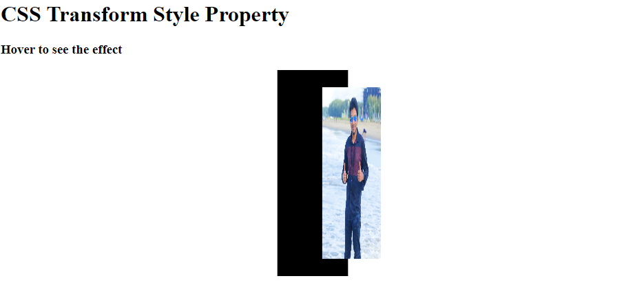

# Learn HTML and CSS in 60 Chapters

### After completing this course, we'll build [20 Projects](#20-html--css-projects) with HTML and CSS.

While you complete the 60-chapter module, jump in the [Projects Section](#20-html--css-projects).

|                            Chapter                             |                                                    Topics                                                    | Video Explanation |
| :------------------------------------------------------------: | :----------------------------------------------------------------------------------------------------------: | :---------------: |
|          [00](#chapter-00-how-the-course-is-designed)          |                     [How The Course is Designed](#chapter-00-how-the-course-is-designed)                     |     Watch Now     |
|                 [01](#chapter-01-introduction)                 |                                   [Introduction](#chapter-01-introduction)                                   |     Watch Now     |
|     [02](#chapter-02-commonly-used-html-tags--their-usage)     |          [Commonly Used HTML Tags & Their Usage](#chapter-02-commonly-used-html-tags--their-usage)           |     Watch Now     |
| [03](#chapter-03-html-entities-hyperlinks-images-audio-videos) | [HTML Entities, Hyperlinks, Images, Audio, Videos](#chapter-03-html-entities-hyperlinks-images-audio-videos) |     Watch Now     |
|                               04                               |                                                                                                              |     Watch Now     |
|                               05                               |                                                                                                              |     Watch Now     |
|                               06                               |                                                                                                              |     Watch Now     |
|                               07                               |                                                                                                              |     Watch Now     |
|                               08                               |                                                                                                              |     Watch Now     |
|                               09                               |                                                                                                              |     Watch Now     |
|                               10                               |                                                                                                              |     Watch Now     |
|        [11](#chapter-11-css-position-z-index-overflow)         |                 [CSS Position, Z-index, Overflow](#chapter-11-css-position-z-index-overflow)                 |     Watch Now     |
|         [12](#chapter-12-css-float-display-alignment)          |                 [CSS Float, Display and Alignment](#chapter-12-css-float-display-alignment)                  |     Watch Now     |
|                 [13](#chapter-13-css-flexbox)                  |                                    [CSS Flexbox](#chapter-13-css-flexbox)                                    |     Watch Now     |
|                [14](#chapter-14-css-selectors)                 |                                  [CSS Selectors](#chapter-14-css-selectors)                                  |     Watch Now     |
|            [15](#chapter-15-css-text-fonts--icons)             |                        [CSS Text, Fonts and Icons](#chapter-15-css-text-fonts--icons)                        |     Watch Now     |
|       [16](#chapter-16-css-navigation-bar-and-dropdowns)       |               [CSS Navigation Bar and Dropdowns](#chapter-16-css-navigation-bar-and-dropdowns)               |     Watch Now     |
|     [17](#chapter-17-css-image-gallery-and-image-sprites)      |            [CSS Image Gallery and Image Sprites](#chapter-17-css-image-gallery-and-image-sprites)            |     Watch Now     |
|                               18                               |                                                                                                              |     Watch Now     |
|    [19](#chapter-19-visualize-and-play-with-css-properties)    |         [Visualize and Play with CSS Properties](#chapter-19-visualize-and-play-with-css-properties)         |     Watch Now     |
|               [20](#chapter-20-css-grid-layout)                |                                [CSS Grid Layout](#chapter-20-css-grid-layout)                                |     Watch Now     |
|                 [21](#chapter-21-css-gradient)                 |                                  [CSS Gradients](#chapter-21-css-gradient)                                   |     Watch Now     |
|           [22](#chapter-22-css-2d-and-3d-transforms)           |                       [CSS 2D and 3D Transforms](#chapter-22-css-2d-and-3d-transforms)                       |     Watch Now     |
|                [23](#chapter-23-css-animations)                |                                 [CSS Animations](#chapter-23-css-animations)                                 |     Watch Now     |
|                               24                               |                                                                                                              |     Watch Now     |
|                               25                               |                                                                                                              |     Watch Now     |
|                               26                               |                                                                                                              |     Watch Now     |
|                               27                               |                                                                                                              |     Watch Now     |
|                               28                               |                                                                                                              |     Watch Now     |
|                               29                               |                                                                                                              |     Watch Now     |
|                               30                               |                                                                                                              |     Watch Now     |
|                               31                               |                                                                                                              |     Watch Now     |
|                               32                               |                                                                                                              |     Watch Now     |
|                               33                               |                                                                                                              |     Watch Now     |
|                               34                               |                                                                                                              |     Watch Now     |
|                               35                               |                                                                                                              |     Watch Now     |
|                               36                               |                                                                                                              |     Watch Now     |
|                               37                               |                                                                                                              |     Watch Now     |
|                               38                               |                                                                                                              |     Watch Now     |
|                               39                               |                                                                                                              |     Watch Now     |
|                               40                               |                                                                                                              |     Watch Now     |
|                               41                               |                                                                                                              |     Watch Now     |
|                               42                               |                                                                                                              |     Watch Now     |
|                               43                               |                                                                                                              |     Watch Now     |
|                               44                               |                                                                                                              |     Watch Now     |
|                               45                               |                                                                                                              |     Watch Now     |
|                               46                               |                                                                                                              |     Watch Now     |
|                               47                               |                                                                                                              |     Watch Now     |
|                               48                               |                                                                                                              |     Watch Now     |
|                               49                               |                                                                                                              |     Watch Now     |
|                               50                               |                                                                                                              |     Watch Now     |
|                               51                               |                                                                                                              |     Watch Now     |
|                               52                               |                                                                                                              |     Watch Now     |
|                               53                               |                                                                                                              |     Watch Now     |
|                               54                               |                                                                                                              |     Watch Now     |
|                               55                               |                                                                                                              |     Watch Now     |
|                               56                               |                                                                                                              |     Watch Now     |
|                               57                               |                                                                                                              |     Watch Now     |
|                               58                               |                                                                                                              |     Watch Now     |
|                               59                               |                                                                                                              |     Watch Now     |
|                               60                               |                                                                                                              |     Watch Now     |

# 20 HTML & CSS Projects

|                     Project No.                      |                                       Project Name                                       | Video Explanation |                           Live Demo                           |
| :--------------------------------------------------: | :--------------------------------------------------------------------------------------: | :---------------: | :-----------------------------------------------------------: |
|                          01                          |                                                                                          |     Watch Now     |                           Live Demo                           |
|  [02](#project-02-simple-website-layout-with-float)  |   [Simple Website Layout with CSS Float](#project-02-simple-website-layout-with-float)   |     Watch Now     |                           Live Demo                           |
| [03](#project-03-simple-website-layout-with-flexbox) | [Simple Website Layout with CSS Flexbox](#project-03-simple-website-layout-with-flexbox) |     Watch Now     |                           Live Demo                           |
|                          04                          |                                                                                          |     Watch Now     |                           Live Demo                           |
|      [05](#project-05-simple-3d-animation-page)      |             [Simple 3D Animation Page](#project-05-simple-3d-animation-page)             |  [Watch Now](#)   | [Live Demo](https://codepen.io/travelerabdulalim/pen/zYjPVQp) |
|                          06                          |                                                                                          |     Watch Now     |                           Live Demo                           |
|                          07                          |                                                                                          |     Watch Now     |                           Live Demo                           |
|                          08                          |                                                                                          |     Watch Now     |                           Live Demo                           |
|                          09                          |                                                                                          |     Watch Now     |                           Live Demo                           |
|                          10                          |                                                                                          |     Watch Now     |                           Live Demo                           |
|                          11                          |                                                                                          |     Watch Now     |                           Live Demo                           |
|                          12                          |                                                                                          |     Watch Now     |                           Live Demo                           |
|                          13                          |                                                                                          |     Watch Now     |                           Live Demo                           |
|                          14                          |                                                                                          |     Watch Now     |                           Live Demo                           |
|                          15                          |                                                                                          |     Watch Now     |                           Live Demo                           |
|                          16                          |                                                                                          |     Watch Now     |                           Live Demo                           |
|                          17                          |                                                                                          |     Watch Now     |                           Live Demo                           |
|                          18                          |                                                                                          |     Watch Now     |                           Live Demo                           |
|                          19                          |                                                                                          |     Watch Now     |                           Live Demo                           |
|                          20                          |                                                                                          |     Watch Now     |                           Live Demo                           |

# Chapter-00: How The Course is Designed

### কোর্সটি যেভাবে সাজানো হয়েছেঃ

- এই পুরো Article কে একটা বই মনে করতে পারেন। কোর্সটি 60 টি Chapter এ ভাগ করা হয়েছে। প্রতিটি Chapter এ HTML/CSS এর বিভিন্ন Topics নিয়ে আলোচনা করা হয়েছে।
- প্রতিটা Chapter এর Module সাজানো হয়েছে ক্রমানুসারে । উদাহরণস্বরূপ, Chapter-05 এর টপিকসগুলো শিখতে হলে অবশ্যই আপনাকে Chapter-04 শেষ করে আসতে হবে। একইভাবে Chapter-04 শিখতে হলে আপনাকে Chapter-03 শেষ করে আসতে হবে ।
- প্রতিটা Chapter এর Topics এর Written Explanation/Article এর সাথে সাথে Video Explanation-ও দেয়া আছে। যাতে শিক্ষার্থীরা খুব সহজেই টপিকসগুলো আত্মস্থ করতে পারে।

### কোর্সটি কাদের জন্য?

- এই কোর্সটিতে যেকেউ অংশগ্রহণ করতে পারবে। শিখার জন্য মনের ইচ্ছাটাই আসল!
- Course টি মূলত Beginner-friendly. যারা Web Programming এ নতুন তাদেরকে উদ্দেশ্য করেই Course টি সাজানো।

### Prerequisite

- HTML সম্পর্কে অল্প ধারনা থাকলে ভালো, না থাকলেও সমস্যা নেই।

# Chapter-01: Introduction

- [What is HTML?](#what-is-html)
- [HTML Basics](#html-basics)
- [How Web Works?](#how-web-works)

### What is HTML?

The full meaning of HTML is **_Hyper Text Transfer Protocol_**. HTML is a Markup language.  
HTML is used to buld the **_STRUCTURE_** of the web pages.

### HTML Basics

- **`<DOCTYPE html>`** is used to **tell** the browser, this is an HTML5 document.
- **`<html>`** is the **container** of all HTML elements. This tag is used to **indicate** the beginning and end of all HTML elements in an HTML Document.

- **`<head>`** element is used to give **browser and search engine** informations about the page.
- **`<title>`** element specifies a title for the HTML page (which is shown in the browser's title bar and in the page's tab).
- **`<body>`** element is the container for all the visible contents such as headings, paragraphs, images, hyperlinks, tables, lists, etc in the webpage.
- The **`<em>`** element is used to define emphasized text. By default, emphasized text is
  displayed in _italic_.
- The **`<strong>`** element is used to represent important content. Browsers, by default, render strong content in **bold**.
- The **`<i>`** and **`<b>`** elements are considered deprecated because HTML should not be used for styling. That’s the role of CSS.
- Headings are represented using **`<h1>`**, **`<h2>`**, **`<h3>`**, **`<h4>`**, **`<h5>`**, **`<h6>`**. Every web page should have one and only one **`<h1>`** element. Headings should have a natural hierarchy and should not be skipped.
- Entities are used to display special characters such as angle brackets, copyright symbol, etc. The most important entities are: **`&nbsp;`** (non-breaking space), **`&lt;`** (less than sign), **`&gt;`** (greater than sign) and **`&copy;`** (copyright symbol).
- The **`<div>`** and **`<span>`** elements are generic containers used for styling purposes. Divs are block-level elements, spans are inline elements. A block-level element starts on a new line and takes up the entire available horizontal space.
- Semantic elements help us write markup that is more meaningful and descriptive to search engines, screen readers and other software. So, use **`<div>`** and **`<span>`** elements when no other semantic element is appropriate.
- The semantic elements in HTML5 are: **`<header>`, `<footer>`, `<nav>`, `<main>`, `<aside>`, `<article>`, `<section>`, `<figure>`, `<time>` and `<mark>.`**

  **An Example of Basic HTML Boilerplate is**

```html
<!DOCTYPE html>
<html lang="en">
  <head>
    <meta charset="UTF-8" />
    <meta http-equiv="X-UA-Compatible" content="IE=edge" />
    <meta name="viewport" content="width=device-width, initial-scale=1.0" />
    <meta
      name="keywords"
      content="TravellerAlim, Alim, Travel, AlimTheTraveller"
    />
    <meta
      name="description"
      content="Alim is an passionate traveler who travels around the world and loves to make adventures"
    />
    <title>TravellerAlim</title>
  </head>
  <body></body>
</html>
```

### How Web Works?

Hey, rather wasting some time, I'm gonna provide you some useful resources to learn how the web works!
Here we go:

1. An amazing Video [Explanation](https://youtu.be/zN8YNNHcaZc) on freeCodeCamp.
2. Another Amazing [Explanation](https://github.com/vasanthk/how-web-works) by Vasa.
3. Video [Explanation](https://www.youtube.com/watch?v=hJHvdBlSxug) on Academind.
4. An [Explanation](https://developer.mozilla.org/en-US/docs/Learn/Getting_started_with_the_web/How_the_Web_works) on Mozilla.

[Go to Top](#learn-html-and-css-in-60-chapters)

<div align="right">
    <b><a href="#learn-html-and-css-in-60-chapters">↥ Go to Top</a></b>
</div>

# Chapter-02: Commonly Used HTML Tags & Their Usage

- [&lt;em&gt;](#em)
- [&lt;i&gt; vs &lt;em&gt;](#i-vs-em)
- [&lt;strong&gt;](#strong)
- [&lt;b&gt; vs &lt;strong&gt;](#b-vs-strong)

### em

The **`<em>`** element is used to define emphasized text. By default, emphasized text is displayed in _italic_. However, it should not be used to apply italic styling; use the CSS `font-style` property for that purpose. Use the `<cite>` element to mark the title of a work (book, play, song, etc.). Use the `<i>` element to mark text that is in an alternate tone or mood, which covers many common situations for italics such as scientific names or words in other languages. Use the `<strong>` element to mark text that has greater importance than surrounding text.<br>
Visit [HERE](https://developer.mozilla.org/en-US/docs/Web/HTML/Element/em) for learning more about this element.

**Example:**

```html
<!DOCTYPE html>
<html lang="en">
  <head>
    <meta charset="UTF-8" />
    <meta http-equiv="X-UA-Compatible" content="IE=edge" />
    <meta name="viewport" content="width=device-width, initial-scale=1.0" />
    <meta
      name="keywords"
      content="TravellerAlim, Alim, Travel, AlimTheTraveller"
    />
    <meta
      name="description"
      content="Alim is an passionate traveler who travels around the world and loves to make adventures"
    />
    <title>TravellerAlim</title>
  </head>
  <body>
    <article>
      Cox’s Bazar is a town on the southeast coast of <em>Bangladesh</em>.
    </article>
  </body>
</html>
```

**Output:**
Cox’s Bazar is a town on the southeast coast of _Bangladesh_.

### i vs em

New developers are often confused at seeing multiple elements that produce similar results. `<em>` and `<i>` are a common example, since they both italicize text. What's the difference? Which should you use?

By default, the visual result is the same. However, the semantic meaning is different. The `<em>` element represents stress emphasis of its contents, while the `<i>` element represents text that is set off from the normal prose, such a foreign word, fictional character thoughts, or when the text refers to the definition of a word instead of representing its semantic meaning. (The title of a work, such as the name of a book or movie, should use `<cite>`.)

This means the right one to use depends on the situation. Neither is for purely decorative purposes, that's what CSS styling is for.

An example for `<em>` could be: "Just _do_ it already!", or: "We _had_ to do something about it". A person or software reading the text would pronounce the words in italics with an emphasis, using verbal stress.

An example for `<i>` could be: "The _Queen Mary_ sailed last night". Here, there is no added emphasis or importance on the word "Queen Mary". It is merely indicated that the object in question is not a queen named Mary, but a ship named _Queen Mary_. Another example for `<i>` could be: "The word _the_ is an article".

**Example:**

```html
<p>
  In HTML 5, what was previously called
  <em>block-level</em> content is now called <em>flow</em> content.
</p>
```

**Result/Output:**
In HTML 5, what was previously called _block-level_ content is now called _flow_ content.

Thanks [Mozilla Developer Network-MDN](https://developer.mozilla.org/en-US/docs/MDN/About) for [this awesome documentation](https://developer.mozilla.org/en-US/docs/Web/HTML/Element/em).

### strong

The `<strong>` element indicates that its contents have strong importance, seriousness, or urgency. Browsers typically render the contents in bold type.

The `<strong>` element is for content that is of "strong importance," including things of great seriousness or urgency (such as warnings). This could be a sentence that is of great importance to the whole page, or you could merely try to point out that some words are of greater importance compared to nearby content.

Typically this element is rendered by default using a bold font weight. However, it should not be used to apply bold styling; use the CSS `font-weight` property for that purpose. Use the `<b>` element to draw attention to certain text without indicating a higher level of importance. Use the `<em>` element to mark text that has stress emphasis.

Another accepted use for `<strong>` is to denote the labels of paragraphs which represent notes or warnings within the text of a page.

### b vs strong

It is often confusing to new developers why there are so many ways to express the same thing on a rendered website. `<b>` and `<strong>` are perhaps one of the most common sources of confusion, causing developers to ask "Should I use `<b>` or `<strong>`? Don't they both do the same thing?"

Not exactly. The `<strong>` element is for content that is of greater importance, while the `<b>` element is used to draw attention to text without indicating that it's more important.

It may help to realize that both are valid and semantic elements in HTML5 and that it's a coincidence that they both have the same default styling (boldface) in most browsers (although some older browsers actually underline `<strong>`).

Each element is meant to be used in certain types of scenarios, and if you want to bold text for decoration, you should instead actually use the CSS `font-weight` property.

The intended meaning or purpose of the enclosed text should be what determines which element you use. Communicating meaning is what semantics are all about.

### em vs strong

While `<em>` is used to change the meaning of a sentence as spoken emphasis does ("I _love carrots_" vs. "I love _carrots_"), `<strong>` is used to give portions of a sentence added importance (e.g., "**Warning**! This is **very dangerous**.") Both `<strong>` and `<em>` can be nested to increase the relative degree of importance or stress emphasis, respectively.

### Example:

**Hope** is a good thing, maybe the best of things and no good thing ever dies.

[Visit here](https://developer.mozilla.org/en-US/docs/Web/HTML/Element/strong) to learn more.

<div align="right">
    <b><a href="#learn-html-and-css-in-60-chapters">↥ Go to Top</a></b>
</div>

# chapter-03: HTML Entities, Hyperlinks, Images, Audio, Videos

- [HTML Entities](#html-entities)
- [Hyperlinks](#hyperlinks)

## HTML Entities

Some characters are reserved in HTML. If you use the less than (<) or greater than (>) signs in your text, the browser might mix them with tags.
Character entities are used to display reserved characters in HTML.
**_Here are the list of some HTML Entities:_**
| Entity | Description | Entity Name |
|:------:|:---------------------------------:|:-----------:|
| | non-breaking space | `&nbsp;`| |
| < | less than | `&lt;` |
| > | greater than | `&gt;` |
| & | ampersand | `&amp;` |
| " | double quotation mark | `&quot;` |
| ' | single quotation mark(apostrophe) | `&apos;` |
| £ | pound | `&pound;` |
| € | euro | `&euro;` |
| © | copyright | `&copy;` |
| ® | registered trademark | `&reg;` |

**Note:** Entities names are case-sensitive.
Here is the [HTML](table.html) and [CSS](table.css) code that generates all the entites listed above.

## Hyperlinks

### What is Hyperlinks?

Hyperlinks allow us to link documents to other documents or resources, link to specific parts of documents, or make apps available at a web address. Almost any web content can be converted to a link so that when clicked or otherwise activated the web browser goes to another web address (URL).

### HTML Link Syntax

The HTML `<a>` tag defines a hyperlink. It has the following syntax:

```html
<a href="url">link text</a>
```

The most important attribute of the `<a>` element is the **_href_** attribute, which indicates the link's destination.

The **link text** is the part that will be visible to the reader. Clicking on the link text, will send the reader to the specified URL address.

#### Example:

```html
<a href="https://www.travelerabdulalim.com/">Visit My Travel Blog</a>
```

#### Output:

[Visit My Travel Blog](https://www.travelerabdulalim.com/)

### HTML Links - The target Attribute

By default, the linked page will be displayed in the current browser window. To change this, you must specify another target for the link.
The **_target_** attribute specifies where to open the linked document.
The **target** attribute can have one of the following values:

- `_self` : Default. Opens the document in the same window/tab as it was clicked.
- `_blank` : Opens the document in a new window or tab.
- `_parent` : Opens the document in the parent frame.
- `_top` : Opens the document in the full body of the window.

View the [Source Code](hyperlinks.html) to see the application of these attributes.

### HTML Links - The title Attribute

The **title** contains additional information about the link, we can see the **title** text while hovering the link.

Click the [Source Code](hyperlinks.html) to view the application of **title** attribute.

### Absolute URL vs. Relative URL

**Absolute URL:**
Points to a location defined by its absolute location on the web, including protocol and domain name.For example, if an `index.html` page is uploaded to a directory called `projects` that sits inside the **root** of a web server, and the website's domain is `https://www.example.com`, the page would be available at `https://www.example.com/projects/index.html`

An absolute URL will always point to the same location, no matter where it's used.

**Relative URL:**
Points to a location that is _relative_ to the file you are linking from, more like what we looked at in the previous section. For example, if we wanted to link from our example file at `https://www.example.com/projects/index.html` to a PDF file in the same directory, the URL would just be the filename — `project-brief.pdf` — no extra information needed. If the PDF was available in a subdirectory inside `projects` called `pdfs`, the relative link would be `pdfs/project-brief.pdf`(the equivalent absolute URL would be `https://www.example.com/projects/pdfs/project-brief.pdf`)

View the [SOURCE CODE](/chapter-03-html-entities-links-images-audio-videos/hyperlinks.html) here.

#### A Real Example of Absolute and Relative URL

Assume we are creating a subsite whose files are in the folder https://paipixel.com/shop.

**1. Absolute URL**

```javascript
   Link to home page
   href="https://paipixel.com/shop/"

   Link to the product page
   href="https://paipixel.com/shop/t-shirts/t-shirt-life-is-good/"
```

**2. Relative URL**

```javascript
   Link from home page to product page
   href="t-shirts/t-shirt-life-is-good/"

   Link from product page to home page
   href="../../"
```

**_Note:_** In general, it is considered best-practice to use relative URLs, so that your website will not be bound to the base URL of where it is currently deployed. For example, it will be able to work on localhost, as well as on your public domain, without modifications.

**3. Protocol-relative URL**

```javascript
Link to home page
href="//paipixel.com/shop/"

Link to product page
href="//paipixel.com/shop/t-shirts/t-shirt-life-is-good/"
```

**_Note_**: It is a good choice if all pages are within the same domain. When you move your site to another domain, you don't have to do a mass replacements of the domain name in the URLs.

**4. Root-relative URL**
Relative to root folder of the domain.

```javascript
Link to home page
href="/shop/"

Link to product page
href="/shop/t-shirts/t-shirt-life-is-good/"
```

**_Note:_** It is a good choice if all pages are within the same domain. When you move your site to another domain, you don't have to do a mass replacements of the domain name in the URLs.

**5. Base-relative URL (home-page-relative)**
The tag `<base>` specifies the base URL, which is automatically added to all relative links and anchors. The base tag does not affect absolute links. As a base URL we'll specify the home page: `<base href="https://paipixel.com/shop/">`.

```javascript
Link to home page
href=""

Link to product page
href="t-shirts/t-shirt-life-is-good/"
```

**_Note:_** Now you can move your site not only to any domain, but in any subfolder. Just keep in mind that, although URLs look like relative, in fact they are absolute. Especially pay attention to anchors. To navigate within the current page we have to write `href="t-shirts/t-shirt-life-is-good/#comments"` not `href="#comments"`. The latter will throw on home page.

### Absolute URL versus Relative URL (Another Discussion)

```html
http://www.example.com/en/public/img/logo.gif \__/
\_____________/\_____________________/ #1 #2 #3
```

1. scheme/protocol
2. host
3. path

A _URL_ is called an absolute _URL_ if it begins with the scheme and scheme specific part (here `//` after `http:`). Anything else is a _relative URL_.

A _URL path_ is called an absolute _URL path_ if it begins with a `/`. Any other _URL path_ is called a _relative URL path_.

Thus:

- `http://www.example.com/en/public/img/logo.gif` is an _absolute URL_,
- `../../public/img/logo.gif` is a _relative URL_ with a _relative URL path_ and
- `/en/public/img/logo.gif` is a _relative URL_ with an _absolute URL path_.

Click to view the [Source Code](hyperlinks.html) which demonstrates all the examples above.

### Creating link to target a section/article on the same page

[Click Here](hyperlinks.html) to view the source code.

### Creating link to jump in Top

[Click Here](hyperlinks.html) to view the source code.

**References:**

- https://developer.mozilla.org/en-US/docs/Learn/HTML/Introduction_to_HTML/Creating_hyperlinks
- https://stackoverflow.com/questions/2005079/absolute-vs-relative-urls
- https://stackoverflow.com/questions/904046/absolute-urls-relative-urls-and
- https://www.w3schools.com/html/html_links.asp
- https://en.wikipedia.org/wiki/Uniform_Resource_Identifier#Generic_syntax

<div align="right">
    <b><a href="#learn-html-and-css-in-60-chapters">↥ Go to Top</a></b>
</div>

# Chapter-11: CSS Position, Z-index, Overflow

- [CSS Position](#css-position)
  - [Position Property Values](#position-property-values)
  - [Static](#static)
  - [Absolute](#absolute)
  - [Fixed](#fixed)
  - [Relative](#relative)
  - [Sticky](#sticky)
- [CSS Z-index Property](#css-z-index-property)
  - [How Z-index Works](#how-z-index-works)
- [CSS Overflow](#css-overflow)
  - [How CSS Overflow Property Works](#how-css-overflow-property-works)
  - [Example of CSS Overflow Property](#example-of-css-overflow-property)

## CSS Position

### Position Property Values

| **Value** |                                                                                                                                                                                                          **Description**                                                                                                                                                                                                          |
| :-------: | :-------------------------------------------------------------------------------------------------------------------------------------------------------------------------------------------------------------------------------------------------------------------------------------------------------------------------------------------------------------------------------------------------------------------------------: |
|  static   |                                           Default Value. অর্থাৎ কোন Element এর যদি কোন position property না দেয়া হয়, তাহলে by default, static সেট হয়ে যায়। এই Property এর বৈশিষ্ট্য হলো, element টি যে order এ আছে, সেই order এ document এ render এবং position সেট হবে। কোন Element এর Position Static থাকা অবস্থায় ওই Element এ Left, Right, Top, Bottom এর Property গুলো কাজ করবে না।                                           |
| absolute  | The element is positioned relative to its first positioned (not static) ancestor element. অর্থাৎ position absolute একা একা কাজ করতে পারে না, তাকে কোন একটা Positioned Ancestor Element অর্থাৎ এমন একটা Ancestor এর Under এ থাকতে হয় যার Static বাদে অন্য যেকোনো Position Property আছে, এবং ওই Ancestor Element এর Position থেকে সে তার Position Change করে। যদি এমন কোন Ancestor Element না থাকে, তাহলে Body এর সাপেক্ষে মুভ করে। |
|   fixed   |                                                                                               The element is positioned relative to the browser window. এবং element টি একেবারে Fixed থাকে, আমার Document এ হাজার হাজার লাইন Text ও থাকে, তাহলেও fixed element তার Position কোনমতেও Change করবে না। একেবারে ঘারত্যারা যাকে বলে ! :D                                                                                                |
| relative  |                                             The element is positioned relative to its normal position, so "left:20px" adds 20 pixels to the element's left position. অর্থাৎ Relative Element স্বাধীন। তাকে কোন Parent Element এর Under এ থাকতে হবে বিষয় টা সেরকম নয়। যখনি কোন Element এর Property Relative করা হবে, তখন ওই Element এ Left, Right, Top, Down Properties গুলো কাজ করবে।                                             |
|  sticky   |          যদি element এ top: 100px; দেয়া হয়, তাহলে এই element যে Position এ Normally থাকার কথা সেই Position এই থাকবে, কিন্তু Users Scroll করে ওই Position এর নিচে চলে যাবে, তখন এই Sticky element ও সাথে সাথে নিচে চলে যাবে। আর যখন নিচে যাবে তখন top থেকে 100px নিচে থাকবে। Fixed আর Sticky কখনই এক নয়। Fixed হলে element টি তার Normal Position এ না থেকে তার Parent Element থেকে Left, Right, Top, Bottom Count করবে।           |

### Static

Default Value. অর্থাৎ কোন Element এর যদি কোন position property না দেয়া হয়, তাহলে by default, static সেট হয়ে যায়। এই Property এর বৈশিষ্ট্য হলো, element টি যে order এ আছে, সেই order এ document এ render এবং position সেট হবে। কোন Element এর Position Static থাকা অবস্থায় ওই Element এ Left, Right, Top, Bottom এর Property গুলো কাজ করবে না।
তাই কোন Element এ Static Property দেয়া না দেয়া একই কথা।

### Absolute

The element is positioned relative to its first positioned (not static) ancestor element. অর্থাৎ position absolute একা একা কাজ করতে পারে না, তাকে কোন একটা Parent Element এর Under এ থাকতে হয়, এবং ওই Parent Element এর Position থেকে সে তার Position Change করে।
অর্থাৎ কোন একটা Absolute Element এ যদি `left: 100px` দেয়া হয়, তাহলে ওই Element টি তার Parent Element এর Left থেকে 100px সরে সরে যাবে। Absolute Property সারারনত ব্যবহার করা হয় যখন একটা Element কে আরেকটি Element এর ভিতরে নিয়ে কাজ করার প্রয়োজন পরে।

#### Example of Absolute Property

[Open Project in CodePen](https://codepen.io/travelerabdulalim/pen/vYjOJWd)

### Fixed

The element is positioned relative to the browser window. এবং element টি একেবারে Fixed থাকে, আমার Document এ হাজার হাজার লাইন Text ও থাকে, তাহলেও fixed element তার Position কোনমতেও Change করবে না। একেবারে ঘারত্যারা যাকে বলে ! :D
Fixed Propertyও Absolute এর মত কোন একটা Parent Element এর Child হিসেবে থাকে।

#### Example of Fixed Property

[Open Project in CodePen](https://codepen.io/travelerabdulalim/pen/oNdXeEe)

### Relative

The element is positioned relative to its normal position, so "left:20px" adds 20 pixels to the element's left position. অর্থাৎ Relative Element স্বাধীন। তাকে কোন Parent Element এর Under এ থাকতে হবে বিষয় টা সেরকম নয়। যখনি কোন Element এর Property Relative করা হবে, তখন ওই Element এ Left, Right, Top, Down Properties গুলো কাজ করবে।

#### Example of Relative Property

[Open Project in CodePen](https://codepen.io/travelerabdulalim/pen/dyeozmZ)

### Sticky

যদি element এ top: 100px; দেয়া হয়, তাহলে এই element যে Position এ Normally থাকার কথা সেই Position এই থাকবে, কিন্তু User যখন Scroll করে ওই Position এর নিচে চলে যাবে, তখন এই Sticky element ও সাথে সাথে নিচে চলে যাবে। আর যখন নিচে যাবে তখন top থেকে 100px নিচে থাকবে। Fixed আর Sticky কখনই এক নয়। Fixed হলে element টি তার Normal Position এ না থেকে তার Parent Element থেকে Left, Right, Top, Bottom Count করবে।

অপরপক্ষে, Sticky Element এ যদি bottom: 100px; দেয়া হয় তাহলে Element টি যে Position এ Normally থাকার কথা সেই Position এই থাকবে, কিন্তু User যখন Scroll করে ওই Position এর উপরে
চলে যাবে, তখন এই Sticky Element ও সাথে সাথে উপরে চলে যাবে।

#### Example of Sticky Property

[Open Project in CodePen](https://codepen.io/travelerabdulalim/pen/abGOyjJ)

## CSS Z-index Property

### How Z-index Works

- The `z-index` property specifies the stack order of an element. An element can have a positive or negative stack order.
- z-index only works on `positioned elements` (position: absolute, position: relative, position: fixed, or position: sticky) and `flex items` (elements that are direct children of display: flex elements).
- An element with greater stack order is always above an element with a lower stack order. অর্থাৎ যে Element এর Z-index যত বেশি সে Element Stack এর তত উপরে থাকবে।

### Example of Z-index Property

[Open Live Project in CodePen](https://codepen.io/travelerabdulalim/pen/jOxPQGZ)

## CSS Overflow

### How CSS Overflow Property Works

- The CSS `overflow` property controls what happens to content that is too big to fit into an area.
- The overflow property has the following values:

  - `visible` - Default. The overflow is not clipped. The content renders outside the element's box.
  - `hidden` - The overflow is clipped, and the rest of the content will be invisible.
  - `scroll` - The overflow is clipped, and a scrollbar is added to see the rest of the content.
  - `auto` - Similar to scroll, but it adds scrollbars only when necessary.

- Setting the overflow value to scroll, the overflow is clipped and a scrollbar is added to scroll inside the box. Note that this will add a scrollbar both horizontally and vertically (even if you do not need it).

### Example of CSS Overflow Property

[Open Live Project in CodePen](https://codepen.io/travelerabdulalim/pen/MWGaJXB)

<div align="right">
    <b><a href="#learn-html-and-css-in-60-chapters">↥ Go to Top</a></b>
</div>

# Chapter-12: CSS Float, Display, Alignment

- [CSS Float](#css-float-property)
  - [CSS Float Property](#css-float-property)
  - [CSS Float Property কেন ব্যবহার করা হয়?](#css-float-property-কেন-ব্যবহার-করা-হয়)
  - [কি ঘটে যখন কোন Element এ Float Property থাকে?](#কি-ঘটে-যখন-কোন-element-এ-float-property-থাকে)
  - [Float এবং Position Absolute এর Document Flow তুলনা](#float-এবং-position-absolute-এর-document-flow-তুলনা)
  - [Example of CSS Float Property (Scource Codes)](#example-of-css-float-property-source-codes)
  - [Example of CSS Float Property (Screenshot)](#example-of-css-float-property-sreenshot)
  - [Another Example of CSS Float Property](#another-example-of-css-float-property)
  - [Float যেসব প্রবলেম তৈরি করে](#float-যেসব-প্রবলেম-তৈরি-করে)
  - [Clear Property](#clear-property)
  - [Example of Clearfix](#example-of-clearfix)
  - [Clearfix Hack](#clearfix-hack)
- [CSS Display](#css-display-property)
  - [Concept of Inline Elements](#concepts-of-inline-element)
  - [Inline, Block and Inline-block Examples](#inline-block-and-inline-block-examples)
- [CSS Alignment of Elements, Texts and Images](#css-alignment-of-elements-texts-and-images)
  - [How to Horizontally Center A Block Element](#how-to-horizontally-center-a-block-element)
  - [How to Horizontally & Vertically Center a Block Element](#how-to-horizontally--vertically-center-a-block-element)
  - [How to Center Texts Inside An Element](#how-to-center-texts-inside-an-element)
  - [How to Center an Image](#how-to-center-an-image)
  - [How to Align an Element - Using Position](#how-to-align-an-element---using-position)
  - [CSS Alignment Examples](#css-alignment-examples)

## CSS Float Property

**Note: CSS Float Property is now deprecated in modern web-programming concept.**

CSS `float` property কোন একটা Element কে তাঁর Container এর ডানে বা বামে নিয়ে যায়। এবং Text বা অন্যান্য Elements যাতে ঐ Floated Element কে Wrap করতে পারে বা জড়িয়ে ধরে থাকতে পারে সেই Permission দেয়।

**Float Value**

- `left` - The element floats to the left of its container.
- `right` - The element floats to the right of its container.
- `none` - This is default. The element does not float (will be displayed just where it occurs in the text).
- `inherit` - The element inherits the float value of its parent.

### CSS Float Property কেন ব্যবহার করা হয়?

- সাধারণত একটা Image এর চারপাশে Text কে Wrap করার জন্য।
- কোন Inline Element কে Text বা অন্য কোন Element দিয়ে Wrap করার জন্য।
- Horizontally কোন Element এর Position Left থেকে Right বা Right থেকে Left করার জন্য।
- Horizontally অনেকগুলো Elements কে একটার পর একটা সাঁজাতে।

### কি ঘটে যখন কোন Element এ Float Property থাকে?

- Normal Document Flow থেকে উঠে যায় এবং এই Element তার Parent এ কোন Height দেয় না। অর্থাৎ আমরা জানি, Parent এর Height হলো Childs এর Height এর যোগফল। কিন্তু Floated Element এর Height Parent এ যোগ হয় না।
- Element টি যদি একটি Block Element হয় এবং Width দেয়া না হয় তাহলে আমরা জানি সেটি by default width 100% নেয়। কিন্তু ঐ Element এ যদি Float Property থাকে, তাহলে by default কোন Width থাকে না। সুতরাং কোন Block Element এ Float use করলে অবশ্যই ঐ Element এ width property দেয়া বাধ্যতামূলক।
- Element টি যদি Block-ও হয়, তবুও Inline এর মতই আচরণ করে।

### Float এবং Position Absolute এর Document Flow তুলনা

কোন Element এ যখন Float বা Position Absolute Property ব্যবহার করা হয়, তখন উভয় ক্ষেত্রেই ঐ Element টি Webpage এর Normal Document Flow থেকে উঠে যায়। তবে Float এবং Position Absolute এর ক্ষেত্রে Element টির Document Flow থেকে উঠে যাওয়ার সামান্য পার্থক্য আছে। কোন Element এ যখন Float ব্যবহার করা হয়, তখন সে Normal Document Flow থেকে 100% উঠে যায় না। এটা আমরা বুঝতে পারি যখন ঠিক তাঁর পরে কোন text থাকে এবং ঐ text তাঁকে Wrap করে বা জড়িয়ে ধরে থাকে কিন্তু Overlap করে না।
অপরদিকে কোন Element এ Position Absolute ব্যবহার করলে ঐ Element টি সম্পূর্ণরূপে Normal Document Flow থেকে উঠে যায় এবং তাঁর পরে কোন Element থাকলে সেটা তার নিচে চলে আসে অর্থাৎ Overlap করে।

Floated Element Example:


Absolute Positioned Element:


### Example of CSS Float Property (Screenshot)


Another Example:


### Example of CSS Float Property (Source Codes)

**&#9885; [Open Live Project in CodePen](https://codepen.io/CodeJogot/pen/LYgmJZv)**

### Another Example of CSS Float Property

**&#9885; [Open Live Project in CodePen](https://codepen.io/CodeJogot/pen/bGmMxwg)**

### Float যেসব প্রবলেম তৈরি করে

কোন একটা Element কে যখন Float property দেয়া হয়, তখন ঐ Element টি তার নিচের সব Elements গুলোকে Affect করে। ধরি, X একটি Element. আমরা যদি চাই ঐ Floated Element টি X element এবং X element এর নিচে যত Element আছে তার উপর কোন প্রভাব ফেলতে পারবে না, তাহলে X Element এ Clear property ব্যবহার করতে হবে। Float এর এই প্রবলেম এর সমাধান হলো Clear Property.

### Clear Property

কোন একটা Floated Element এর পাশের Element টির কি হবে সেটা নির্ধারণ করে Clear Property.

The `clear` property can have one of the following values:

- This is default. `none` - The element is not pushed below left or right floated elements.
- `left` - The element is pushed below left floated elements. অর্থাৎ ধরি A element একটি Floated Element, যার Property `float: left` দেয়া। ঠিক তার নিচে আছে B element, যার property `clear: left` দেয়া। তাহলে এই B element টি A element এর নিচে pushed হবে। B element এ যদি `clear: left` না দেয়া হতো, তাহলে B element টি A element এর কারনে Unexpected bahavior করতো।
- `right` - The element is pushed below right floated elements.
- `both` - The element is pushed below both left and right floated elements. This is safe to use when you are in a confusion between `left` and 'right'.
- `inherit` - The element inherits the clear value from its parent.

### Clearfix Hack

**Clearfix Hack কেন ব্যবহার করবো?**

- একটা Floated Element যদি তার Container এর চেয়ে বড় হয়, তাহলে এটি Overflow করবে। এই প্রবলেম সমাধান করার জন্য।
- একটি Element Floated থাকার কারনে তার নিচের Element এ যেন প্রভাব ফেলতে না পারে।

**Clearfix কিভাবে তৈরি করা হয়**

- Floated Element এর Container/Parent Element এর `::after` Pseudo Element তৈরি করতে হয়। এই Pseudo Element এ নিচের Code টি বসালে এটি Clearfix হিসেবে কাজ করবে।

```css
.clearfix::after {
  content: "";
  clear: both;
  display: table;
}
```

**Note: অনেক ক্ষেত্রে আমাদের `display: block`-ও ব্যবহার করা লাগতে পারে, এটা Requirement এর উপর নির্ভর করবে।**

### Example of Clearfix

**&#9885; [Open Live Project in CodePen](https://codepen.io/CodeJogot/pen/mdzLGOJ)**

## CSS Display Property

### Concepts of Inline Element

- Inline Elements এ Width এবং Height কাজ করে না। এমনকি margin padding এগুলোও মাঝে মাঝে কাজ করে না। যদি Inline Elements এ Width বা Height এর প্রয়োজন হয় বা Margin Padding দেয়ার দরকার হয়, তাহলে এই Inline Elements কে আমরা চাইলে Inline-block Elements তৈরি করতে পারি। `display: inline-block` এই property দিলে element টি inline-block element হয়ে যাবে এবং তখন width, height, margin, padding এগুলো কাজ করবে।

### Inline, Block and Inline-block Examples

**&#9885; [Open Live Project in CodePen](https://codepen.io/CodeJogot/pen/poxKjKE)**

## CSS Alignment of Elements, Texts and Images

### How to Horizontally Center A Block Element

There are several ways:
**_Way-01: Using Margin Auto_**

```css
div {
  margin: 0 auto;
}
```

**_Way-02: Using Flexbox_**

```css
.parent-div {
  display: flex;
  justify-content: center;
}
.target-div {
}
```

**_Way-03: Using Positioning and Transform_**

```css
div {
  position: absolute;
  left: 50%;
  transform: translateX(-50%);
}
```

**_Way-04: Using Inline-block Concept_**

```css
.parent-div {
  text-align: center;
}
.target-div {
  display: inline-block;
}
```

### How to Horizontally & Vertically Center A Block Element

There are several ways:

**_Way-01: Using Flexbox_**

```css
.parent-div {
  display: flex;
  justify-content: center;
  align-items: center;
}
.target-div {
}
```

**_Way-02: Using CSS Grid_**

```css
.parent-div {
  display: grid;
  place-items: center;
}
.target-div {
}
```

**_Way-03: Using Positioning and Transform_**

```css
div {
  position: absolute;
  top: 50%;
  left: 50%;
  transform: translate(-50%, -50%);
}
```

### How to Center Texts Inside An Element

- To center the text inside an element, use `text-align: center;`

### How to Center an Image

- To center an image, first make it a `block` element and then use `margin: 0 auto`

### CSS Alignment Examples

**&#9885; [How to Center A Block Element Horizontally Way-01](https://codepen.io/CodeJogot/pen/VwEdePJ)**

**&#9885; [How to Center A Block Element Horizontally Way-02](https://codepen.io/CodeJogot/pen/BaqVjwQ)**

**&#9885; [How to Center A Block Element Horizontally Way-03](https://codepen.io/CodeJogot/pen/VwEdeyZ)**

**&#9885; [How to Center A Block Element Horizontally Way-04](https://codepen.io/CodeJogot/pen/BaqVjYp)**

**&#9885; [How to Center A Block Element Horizontally & Vertically Way-01](https://codepen.io/CodeJogot/pen/vYVrLjO)**

**&#9885; [How to Center A Block Element Horizontally & Vertically Way-02](https://codepen.io/CodeJogot/pen/QWZxyxO)**

**&#9885; [How to Center A Block Element Horizontally & Vertically Way-03](https://codepen.io/CodeJogot/pen/RweJrBr)**

<div align="right">
    <b><a href="#learn-html-and-css-in-60-chapters">↥ Go to Top</a></b>
</div>

# Chapter-13: CSS Flexbox

- [CSS Flexbox](#css-flexbox)
  - [CSS Flexbox Layout Module](#css-flexbox-layout-module)
  - [Flexbox Elements](#flexbox-elements)
  - [CSS Flexbox Tips](#tips)
  - [Flex Direction](#flex-direction)
  - [Flex Direction Example](#flex-direction-example)
  - [Justify Content Property in Flex](#justify-content-property-in-flex)
  - [Justify Content Property in Flex Example](#justify-content-property-in-flex-example)
  - [Align Items Property in Flex](#align-items-property-in-flex)
  - [Align Items Property in Flex Example](#align-items-property-in-flex-example)
- [The CSS Flexbox Container Properties Summary](#the-css-flexbox-container-properties-summary)
- [A Basic Website Layout Using CSS Flexbox](#a-basic-website-layout-using-css-flexbox)
- [কিছু গুরুত্বপূর্ণ Flex Items Property](#কিছু-গুরুত্বপূর্ণ-flex-items-property)

## CSS Flexbox

### What is Flexbox?

Flexbox is a CSS box model to easily **layout**, **align** and **distribute** space among items within a **container** either horizontally or vertically.

অর্থাৎ ফ্লেক্সবক্স হলো একটা CSS Box Model যে Horizontally বা Vertically কতোগুলো ITEMS গুলোকে Layout দেয়, Align করে এবং তাদের মধ্যে Space Distribute করে।

### CSS Flexbox Layout Module

Before the Flexbox Layout module, there were four layout modes:

1. Block, for sections in a webpage.
2. Inline, for text.
3. Table, for two-dimensional table data.
4. Positioned, for explicit position of an element.

**Note:** The Flexible Box Layout Module, makes it easier to design flexible responsive layout structure without using float or positioning.

### Flexbox Elements

- To start using the Flexbox model, you need to first define a flex container. অর্থাৎ Flexbox Model নিয়ে কাজ করতে হলে আমাদের প্রথম যে কাজটি করতে হবে তা হলো একটি Flex Container তৈরি করা।
- একটা Flex Model এর অবশ্যই একটা Flex Container থাকবে অর্থাৎ Flex Items গুলো একটা Parent Element ( যাকে Flex Containerও বলে) থাকবে। এবং ওই Flex Container/Parent Element এর **_display_** property এর Value **_flex_** থাকবে।
- Flex Container এর যারা Direct Child তারা Automatically **_Flex items_** হয়ে যাবে।

নিচে একটি Flex Container তৈরি করে দেখানো হলোঃ


এখানে Flex Container হলো Blue Area Element. এবং তিনটি Flex Items হলো 1, 2 এবং 3.

Example: [Open in CodePen](https://codepen.io/CodeJogot/pen/WNaaXwJ)

#### Tips

- Using **_rem_** is good practice than using **_px_**.
- Using **_float_** is deprecated in modern programming. Use **_flexbox_** instead.

### Flex Direction

`flex-direction` এর Value, by default থাকে `row`. `flex-direction` এর কয়েকটি উদাহরণ নিচে দেওয়া হলোঃ

- `flex-direction: row;`
- `flex-direction: row-reverse;`
- `flex-direction: column;`
- `flex-direction: column-reverse;`

`flex-wrap` has the following values:

- `flex-wrap: wrap;`
- `flex-wrap: no-wrap;`
- `flex-wrap: wrap-reverse;`

**Note:** The `flex-flow` property is a shorthand property for setting both the `flex-direction` and `flex-wrap` properties. Example: `flex-flow: row wrap;`

### Flex Direction Example

[Open Live Project in CodePen](https://codepen.io/CodeJogot/pen/XWxxzMv)

### Justify Content Property in Flex

- The `justify-content: center;` flex items গুলোকে Container এর Horizontally Center এ নিয়ে যায়।
- The `justify-content: flex-start;` flex items গুলোকে Container এর শুরুতে নিয়ে যায় (this is default).
- The `justify-content: flex-end;` flex items গুলোকে Container এর শেষে নিয়ে যায় ।
- The `justify-content: space-around;` flex items গুলোর শুরু ও শেষে সমান Space নিয়ে তাদের Horizontally মাঝখানে রাখে ।
- The `justify-content: space-between;` flex items গুলোর শুধু মাঝে সমান Space নিয়ে তাদের Horizontally মাঝখানে রাখে ।


### JUSTIFY CONTENT Property in Flex Example

[Open Live Project in CodePen](https://codepen.io/CodeJogot/pen/wvYYPem)

### ALIGN ITEMS Property in Flex

The align-items property is used to align the flex items.

- `align-items: center;` flex items গুলোকে Vertically Center এ নিয়ে যায়।
- `align-items: flex-start;` flex items গুলোকে Vertically Top এ নিয়ে যায়।
- `align-items: flex-end;` flex items গুলোকে Vertically Bottom এ নিয়ে যায়।
- `align-items: stretch;` stretches the flex items to fill the container (this is default).
- `align-items: baseline;` aligns the flex items such as their baselines aligns.


### ALIGN ITEMS Property in Flex Example

[Open Live Project in CodePen](https://codepen.io/CodeJogot/pen/mdzzqBM)

### The CSS Flexbox Container Properties Summary

|  **Property**   |                                                                                                                                                                          **Description**                                                                                                                                                                          |
| :-------------: | :---------------------------------------------------------------------------------------------------------------------------------------------------------------------------------------------------------------------------------------------------------------------------------------------------------------------------------------------------------------: |
|  align-content  | এটা `align-items` এর মতোই কাজ করে, পার্থক্য হলো `align-items` দিলে Space কে প্রতিটা items এর উপরে নিচে ছড়িয়ে items গুলোকে Vertically Align করে, আর অন্যদিকে `align-content` শুধুমাত্র প্রথম ও শেষ item এর উপরে ও নিচে space দেয়, বাকি items কে space না দিয়েই vertically align করে। [align-content vs align-items Example](#align-content-vs-align-items-example) |
|   align-items   |                                                                                                                                                                Vertically Items গুলোকে Align করে।                                                                                                                                                                 |
|     display     |                                                                                                                                                              Element টি কি Type এর সেটা নির্দেশ করে।                                                                                                                                                              |
| flex-direction  |                                                                                                            এই প্রপার্টি Flex Container এর মধ্যে দিতে হয়। Flex Container এর মধ্যে যে Items গুলো আছে তাদের direction এই প্রপার্টি দ্বারা নির্দেশ করা হয়।                                                                                                            |
|    flex-flow    |                                                                                                                                                 এটি `flex-direction` এবং `flex-wrap` এর একটি shorthand property.                                                                                                                                                  |
|    flex-wrap    |                                                                                                                                          Flex Items গুলো wrap করবে কি করবে না, সেটা এই প্রপার্টি দ্বারা ঠিক করে দেয়া হয়।                                                                                                                                          |
| justify-content |                                                                                                                     `align-items` হলো Vertically items গুলোকে align করে, অন্যদিকে `justify-content` হলো Horizontally items গুলোকে align করে।                                                                                                                      |

### Align Content vs Align Items Example


### কিছু গুরুত্বপূর্ণ Flex Items Property

**_1. order_**

- `order` প্রপার্টি একটি Flex Item Property, অর্থাৎ এটি শুধু Flex Items গুলোর ক্ষেত্রে ব্যবহার করা যাবে, Flex Container এ না।
- `oder` Property দিয়ে আমরা Markup Change না করেই, Flex items এর order পরিবর্তন করতে পারি।

**_2. flex-grow_**

- `flex-grow` প্রপার্টি একটি Flex Item Property, অর্থাৎ এটি শুধু Flex Items গুলোর ক্ষেত্রে ব্যবহার করা যাবে, Flex Container এ না।

- `flex-grow: 1` দিলে যতগুলো Items আছে তারা সবাই মিলে Vertically or Horizontally সবটুকু যায়গা নিয়ে Resposive এর মতো behave করবে। অর্থাৎ Browser এর যায়গা টেনে ছোট করলে তারাও ধীরে ধীরে ছোট হবে, Browser এর যায়গা টেনে বড় করলে তারাও ধীরে ধীরে বড় হবে। এক্ষেত্রে, আমরা যদি Items গুলোর Fixed Width করে দেই, তাও তারা Window Size অনুযায়ী Grow করবে ।

**_3. flex-shrink_**

- `flex-shrink` `flex-grow` এর মতোই কাজ করে, শুধু উল্টা ভাবে। এক্ষেত্রে বলে রাখা ভালো যে, যখনই `flex-grow: 1` করা হবে তখন `flex-shrink` এর Valueও 1 হয়ে যাবে Responsive করার জন্য।

**_4. flex-basis_**

- খুবই গুরুত্বপূর্ণ একটা প্রপার্টি । এইটা দিয়ে আমরা Flex Items এর Width set করতে পারি । এটা অনেকটা min-width এর মতো কাজ করে, কিন্তু min-width এর সাথে এর পার্থক্য হলো, যদি কোন Item এর `flex-basis: 200px` দেয়া থাকে, তাহলে যদি তার জন্য পর্যাপ্ত যায়গা না থাকে, তাহলে সে ধীরে ধীরে Window Size অনুযায়ী কমতে থাকবে, যেটা `min-width` এর ক্ষেত্রে কখনই হবে না। তাই Responsive এর জন্য `flex-basis` খুবই গুরুত্বপূর্ণ একটি Property.

**_5. flex_**

- `flex` property হলো `flex-grow`, `flex-shrink` এবং `flex-basis` এর shorthand property. যেমন, `flex: 1 1 200px;`

### A Basic Website Layout Using CSS Flexbox

<div align="right">
    <b><a href="#learn-html-and-css-in-60-chapters">↥ Go to Top</a></b>
</div>

# Chapter-14: CSS Selectors

- [CSS Selectors](#css-selectors)
  - [What is CSS Selectors](#what-is-css-selectors)
  - [Types of CSS Selectors](#types-of-css-selectors)
  - [01. Simple Selectors](#01-simple-selectors)
  - [02: Combinator Selectors](#02-combinator-selectors)
  - [03. Pseudo-class Selectors](#03-pseudo-class-selectors)
  - [All CSS Pseudo Classes](#all-css-pseudo-classes)
  - [04. All CSS Pseudo Elements](#04-all-css-pseudo-elements)
  - [05. Attribute Selectors](#05-attribute-selectors)

## CSS Selectors

### What is CSS Selectors?

A CSS selector selects the HTML element(s) you want to style.

### Types of CSS Selectors

CSS Selectors কে ৫ ভাগে ভাগ করা যায়ঃ

1. Simple selectors (select elements based on name, id, class).
2. Combinator selectors (select elements based on a specific relationship between them).
3. Pseudo-class selectors (select elements based on a certain state).
4. Pseudo-elements selectors (select and style a part of an element).
5. Attribute selectors (select elements based on an attribute or attribute value).

### 01. Simple Selectors

CONTENTS WILL BE WRITTEN SOON INSHALLAH...

### 02: Combinator Selectors

A combinator is something that explains the relationship between the selectors.
A CSS selector can contain more than one simple selector. Between the simple selectors, we can include a combinator.
অর্থাৎ, একটা Selector একের অধিক Simple Selectors নিয়ে তৈরি হতে পারে। এই Simple Selectors দের আমরা চাইলে Combinator দিয়ে Connect করতে পারি।

There are four different combinators in CSS:

1. Descendant selector (space)
2. Child selector (>)
3. Adjacent sibling selector (+)
4. General sibling selector (~)

#### Descendant Selector (Space)

Descendant Selector হলো কোন একটা Element এর Under এ যত Child Elements আছে তাদের Select করে। সেই Child এর যদি Child থাকে তাদেরকেও Select করে।
যেমন,

```css
div p {
  background-color: yellow;
}
```

এখানে div element এর মধ্যে যত p element আছে সব select হবে।

#### Child selector (>)

Child Selector শুধুমাত্র তাদের Immediate Child কে Select করে। Child এর Child কে Select করে না, যেটা Descendant Select করে।

```css
div p {
  background-color: yellow;
}
```

এখানে div element এর Immediate Child Select হবে, অর্থাৎ p select হবে। এখন যদি এই p এর মধ্যেও আরও p থাকে, সেগুলো select হবে না।

#### Adjacent Sibling Selector (+)

এই Select টার নামই তার পরিচয়। অর্থাৎ Adjacent Sibling Selector তার প্রথম Sibling কে Select করবে। অর্থাৎ তার পাশে তার অনেক ভাইবোন থাকতে পারে, তাই সে শুধু তার সবচেয়ে কাছে সে ভাই বা বোন লেগে আছে, তাকে Select করবে।
যেমন,

```html
<div>
  <p>Paragraph 1 in the div.</p>
  <p>Paragraph 2 in the div.</p>
</div>

<p>Paragraph 3. After a div.</p>
<p>Paragraph 4. After a div.</p>

<div>
  <p>Paragraph 5 in the div.</p>
  <p>Paragraph 6 in the div.</p>
</div>

<p>Paragraph 7. After a div.</p>
<p>Paragraph 8. After a div.</p>
```

```css
div + p {
  background-color: yellow;
}
```

এখানে `<p>Paragraph 3. After a div.</p>` এবং `<p>Paragraph 7. After a div.</p>` এই দুটো Selector Select হবে।

#### General Sibling Selector (~)

General sibling selector (~) তার নিচে থাকা সব ভাইবোনকেই Select করবে।
যেমন,

```html
<div>
  <p>Paragraph 1 in the div.</p>
  <p>Paragraph 2 in the div.</p>
</div>

<p>Paragraph 3. After a div.</p>
<p>Paragraph 4. After a div.</p>

<div>
  <p>Paragraph 5 in the div.</p>
  <p>Paragraph 6 in the div.</p>
</div>

<p>Paragraph 7. After a div.</p>
<p>Paragraph 8. After a div.</p>
```

```css
div + p {
  background-color: yellow;
}
```

এখানে `<p>Paragraph 3. After a div.</p>` , `<p>Paragraph 4. After a div.</p>` , `<p>Paragraph 7. After a div.</p>` , `<p>Paragraph 8. After a div.</p>` এই সবকটি ভাইবোন Select হবে।

### 03. Pseudo-class Selectors

Pseudo-class Selector বিভিন্ন State বা অবস্থায় ব্যবহার করা হয়।
যেমন, এই Selector সাধারণত নিচের ক্ষেত্রে ব্যবহার করা হয়ঃ
১। যখন কোন একটা Element এর উপর মাউস হোভার করা হয়,
২। যখন কোন একটা Link Visit কিংবা Univisted করা হয়,
৩। যখন একটা Element কে Focus করা হয়।

#### Syntax

```css
selector:pseudo-class {
  property: value;
}
```

#### Anchor Pseudo-classes

Example:

```css
/* unvisited link */
a:link {
  color: #ff0000;
}

/* visited link */
a:visited {
  color: #00ff00;
}

/* mouse over link */
a:hover {
  color: #ff00ff;
}

/* selected link */
a:active {
  color: #0000ff;
}
```

**Note:** `a:hover` MUST come after `a:link` and `a:visited` in the CSS definition in order to be effective! `a:active` MUST come after `a:hover` in the CSS definition in order to be effective! Pseudo-class names are not case-sensitive.

#### Pseudo-classes and HTML Classes

Pseudo-classes can be combined with HTML classes:
When you hover over the link in the example, it will change color:

```css
a.highlight:hover {
  color: #ff0000;
}
```

#### Hover on `<div>`

আমরা যদি একটা Div Element এর উপর Hover করি, তাহলে ঐ Div Element এর কি হবে, সেটা আমরা চাইলে বলে দিতে পারি।
যেমন,

```css
div {
  background-color: green;
  color: white;
  padding: 25px;
  text-align: center;
}

div:hover {
  background-color: blue;
}
```

#### Simple Tooltip Hover

Hover over a <div> element to show a <p> element (like a tooltip):
Example:

```html
<div class="simple-class-hover">
  Hover me this DIV element to show the P element.
  <p class="tool-tip">Tada! I'm here!</p>
</div>
```

```css
.tool-tip {
  display: none;
  background-color: coral;
}

.simple-class-hover:hover p {
  display: block;
}
```

#### Implementation Codes of the Above Topics

[Open in CodePen](https://codepen.io/travelerabdulalim/pen/JjvJpEO)

#### CSS - The ':first-child' Pseudo-class

যদি `p:first-child` এভাবে দেয়া হয়, এর মানে দাঁড়াবে p যেসব Element এর প্রথম Child Element হিসেবে আছে ঐগুলা Select হবে।
যেমন,

```html
<div>
  <p>This is Paragraph 1</p>
  <p>This is Paragraph 2</p>
  <p>This is Paragraph 3</p>
</div>
<div>
  <p>This is Paragraph 4</p>
  <p>This is Paragraph 5</p>
  <p>This is Paragraph 6</p>
</div>
```

```css
p:first-child {
  background-color: bisque;
}
```

এখানে Paragraph 1 এবং Paragraph 4 Select হবে।

[Open Example in CodePen](https://codepen.io/travelerabdulalim/pen/GRdEQeV)

#### Match The First `<i>` Element in All `<p>` Elements

আমরা যদি `i:first-child` এভাবে দেই, তাহলে ঐসব i element select হবে যেগুলো যেকোনো element এর প্রথম child element. কিন্তু যদি `p i:first-child` এভাবে দেই, তাহলে শুধুমাত্র যেসব p element এর প্রথম child i element আছে, ঐগুলো select হবে।

Example:

```html
<p>This is <i>1st</i> i element. This is <i>2nd</i> i element.</p>
<p>This is <i>3rd</i> i element. This is <i>4th</i> i element.</p>
<div>This is <i>5th</i> i element. This is <i>6th</i> i element.</div>
```

```css
p i:first-child {
  background-color: red;
}
```

এখানে লক্ষ্য করুন, Div Element এর মধ্যে যে প্রথম i element আছে, সেটা কিন্তু Select হয় নাই।

Example Source Code:
[Open in CodePen](https://codepen.io/travelerabdulalim/pen/KKRqLxM)

#### Match all `<i>` elements in all first child `<p>` elements

`p:first-child i` এর অর্থ হলো, কোন একটা P element যদি অন্য কোন element এর first child হয়, তাহলে ঐ p element এর মধ্যে যত i element আছে সব i elements কেই ধরবে ।

Example:

```html
<body>
  <h1>Match all i elements in all first child p elements</h1>
  <div>
    <p>This is <i>1st</i> paragraph. <i>This is another i element</i></p>
    <p>This is <i>2nd</i> paragraph <i>This is another i element</i></p>
  </div>
  <article>
    <p>This is <i>3rd</i> paragraph <i>This is another i element</i></p>
    <p>This is <i>4th</i> paragraph <i>This is another i element</i></p>
  </article>
  <article>
    <p>
      <i>1</i>
      <i>2</i>
      <i>3</i>
    </p>
    <p>
      <i>4</i>
      <i>5</i>
      <i>6</i>
    </p>
  </article>
</body>
```

```css
p:first-child i {
  color: red;
}
```

Screenshot:


Example Codes:

[Open in CodePen](https://codepen.io/travelerabdulalim/pen/XWqgLyo)

### All CSS Pseudo Classes

| Selector No. | Selector Name        | Example               | Example Description                                                                                      |
| ------------ | -------------------- | --------------------- | -------------------------------------------------------------------------------------------------------- |
| 01           | :root                | root                  | Selects the document's root element                                                                      |
| 02           | :link                | a:link                | Selects all unvisited links                                                                              |
| 03           | :visited             | a:visited             | Selects all visited links                                                                                |
| 04           | :hover               | a:hover               | Selects links on mouse over                                                                              |
| 05           | :active              | a:active              | Selects the active link.                                                                                 |
| 06           | :target              | #news:target          | Selects the current active #news element (clicked on a URL containing that anchor name)                  |
| 07           | :checked             | input:checked         | Selects every checked `<input>` element                                                                  |
| 08           | :enabled             | input:enabled         | Selects every enabled `<input>` element                                                                  |
| 09           | :disabled            | input:disabled        | Selects every disabled `<input>` element                                                                 |
| 10           | :focus               | input:focus           | Selects the `<input>` element that has focus                                                             |
| 11           | :in-range            | input:in-range        | Selects `<input>` elements with a value within a specified range                                         |
| 12           | :out-of-range        | input:out-of-range    | Selects `<input>` elements with a value outside a specified range                                        |
| 13           | :valid               | input:valid           | Selects all `<input>` elements with a valid value                                                        |
| 14           | :invalid             | input:invalid         | Selects all `<input>` elements with an invalid value                                                     |
| 15           | :optional            | input:optional        | Selects `<input>` elements with no "required" attribute                                                  |
| 16           | :required            | input:required        | Selects `<input>` elements with a "required" attribute specified                                         |
| 17           | :read-only           | input:read-only       | Selects `<input>` elements with a "readonly" attribute specified                                         |
| 18           | :read-write          | input:read-write      | Selects `<input>` elements with no "readonly" attribute                                                  |
| 19           | :empty               | p:empty               | Selects every `<p>` element that has no children                                                         |
| 20           | :first-child         | p:first-child         | Selects every `<p>` elements that is the first child of its parent                                       |
| 21           | :last-child          | p:last-child          | Selects every `<p>` elements that is the last child of its parent                                        |
| 22           | :first-of-type       | p:first-of-type       | Selects every `<p>` element that is the first `<p>` element of its parent                                |
| 23           | :last-of-type        | p:last-of-type        | Selects every `<p>` element that is the last `<p>` element of its parent                                 |
| 24           | :lang(language)      | p:lang(it)            | Selects every `<p>` element with a lang attribute value starting with "it"                               |
| 25           | :not(selector)       | :not(p)               | Selects every element that is not a `<p>` element                                                        |
| 26           | :nth-child(n)        | p:nth-child(2)        | Selects every `<p>` element that is the second child of its parent                                       |
| 27           | :nth-last-child(n)   | p:nth-last-child(2)   | Selects every `<p>` element that is the second child of its parent, counting from the last child         |
| 28           | :nth-of-type(n)      | p:nth-of-type(2)      | Selects every `<p>` element that is the second `<p>` element of its parent                               |
| 29           | :nth-last-of-type(n) | p:nth-last-of-type(2) | Selects every `<p>` element that is the second `<p>` element of its parent, counting from the last child |
| 30           | :only-of-type        | p:only-of-type        | Selects every `<p>` element that is the only `<p>` element of its parent                                 |
| 31           | :only-child          | p:only-child          | Selects every `<p>` element that is the only child of its parent                                         |

#### `:target` Pseudo-class

`:target` এর অর্থ হলো, কোন একটা Anchor Element এর href Attribute এ যে Element এর Id এর নাম দেওয়া থাকবে সেই Element কে Select করবে।

Example:

```html
<body>
  <h1>`:target` Pseudo-class</h1>
  <div>
    <a href="#article-01">Go To Article 01</a>
  </div>
  <div>
    <a href="#article-02">Go To Article 02</a>
  </div>
  <article>
    <h2 id="article-01">Article-01</h2>
    Codejogot is an programming platform. It helps the students learn with fun.
    Codejogot is an programming platform. It helps the students learn with fun.
  </article>
  <article>
    <h2 id="article-02">Article-02</h2>
    During my university life, I used to solve competitive programming problems
    in various online judges such as UVa, CodeForces, TopCoder, HackerRank,
    GeeksforGeeks etc. Till now, I've solved more than 1300 problems in these
    sites. Now-a-days, I spend most of the time in farming, travelling and
    developing my own projects and ideas.
  </article>
</body>
```

```css
:target {
  border: 2px solid darkorange;
  background-color: bisque;
}
```

#### Screenshot


[Open Example Project in CodePend](https://codepen.io/travelerabdulalim/pen/qBYXBMz)

#### Pseudo-class `:checked`

যে `input` element এ `checked` attribute থাকবে ঐ element কে ধরবে। এবার element টি ধরার পর চাইলে এর width and height পরিবর্তন করা যাবে।

Example:

```html
<body>
  <h1>Psedo-class `:checked`</h1>
  <form action="">
    <input type="radio" checked="checked" />
    <label for="">Male</label> <br />
    <input type="radio" />
    <label for="">Female</label> <br />
    <input type="checkbox" checked="checked" />
    <label for="">C++</label> <br />
    <input type="checkbox" />
    <label for="">Python</label>
  </form>
</body>
```

```css
input:checked {
  height: 20px;
  width: 20px;
}
```

Screenshot:


[Open in CodePen](https://codepen.io/travelerabdulalim/pen/ZEoJYXN)

#### Pseudo-class `:enabled` and `:disabled`

`:enabled` সেই Input Elements দের Select করবে যাদের property `disabled` নেই। একইভাবে `:disabled` সেই Input Elements দের Select করবে যাদের property `disabled` করা আছে।

Example:

```html
<body>
  <h1>`:enabled` and `:disabled` Pseudo-class</h1>
  <form action="">
    <label for="">First Name</label>
    <input type="text" /> <br />
    <label for="">Last Name</label>
    <input type="text" /> <br />
    <label for="">Country</label>
    <input type="text" disabled value="Bangladesh" /> <br />
  </form>
</body>
```

```css
input[type="text"]:enabled {
  background-color: darkgray;
}

input[type="text"]:disabled {
  background-color: red;
}
```

Screenshot:


[Open in Codepen](https://codepen.io/travelerabdulalim/pen/qBYXdWm)

#### `:focus` Pseudo-class

কোন একটা Input Element এ যখন Click করে Mouse এর Cursor রাখা হয়, তখন `:focus` Selector টি ঐ Input Element টিকে Select করে।

Example:

```html
<form action="">
  <label for="">Name</label>
  <input type="text" /> <br />
  <label for="">Email</label>
  <input type="email" />
</form>
```

```css
input:focus {
  background-color: aqua;
}
```

Screenshot:


[Open in CodePen](https://codepen.io/travelerabdulalim/pen/NWMvNyK)

#### `:in-range` and `:out-of-range` Pseudo-class

কোন একটা Input Field এর মধ্যে আমরা যে Value বসাই সেটা যদি Range এর মধ্যে থাকে তাহলে `:in-range` Selector কাজ করে, অন্যথায় `:out-of-range` কাজ করে।

Example:

```html
<input type="number" min="5" max="10" value="7" />
```

```css
input:in-range {
  background-color: green;
  color: white;
}

input:out-of-range {
  background-color: red;
  color: white;
}
```

Screenshot:


[Open in CodePen](https://codepen.io/travelerabdulalim/pen/jOxLqdq)

#### Valid and Invalid Pseud-class

কোন Input Element এ যদি আমরা Valid infortmation দেই তাহলে `:valid` pseudo-class কাজ করবে, অন্যথায় `:invalid` Pseudo-class কাজ করবে।

Example:

```html
<label for="">Email</label> <input type="email" />
```

```css
input:valid {
  border: 2px solid green;
}

input:invalid {
  border: 2px solid red;
}
```

Screenshot:


[Open in Codepen](https://codepen.io/travelerabdulalim/pen/abGyEyb)

#### Optional and Required Pseudo-class

কোন একটা Input Element এ যদি `required` attribute না দেয়া থাকে, তাহলে তখন `:optional` Pseudo-class কাজ করবে ।

Example:

```html
<form action="">
  <label for="">Name</label>
  <input type="text" required /> <br />
  <label for="">Country</label>
  <input type="text" />
</form>
```

```css
input:optional {
  background-color: beige;
}
```

Screenshot:


[Open in CodePen](https://codepen.io/travelerabdulalim/pen/bGMrajK)

#### Read-only and Read-write Pseudo-class

কোন একটা Input Element এ যদি `readonly` attribute দেয়া থাকে, তাহলে `:read-only` Pseudo-class কাজ করবে। অন্যথায়, `read-write` Pseudo-class কাজ করবে।

Example:

```html
<form action="">
  <label for="">Name</label>
  <input type="text" /> <br />
  <label for="">Country</label>
  <input type="text" readonly value="Bangladesh" />
</form>
```

```css
input:read-only {
  background-color: yellow;
}

input:read-write {
  background-color: aliceblue;
}
```

Screenshot:


[Open in CodePen](https://codepen.io/travelerabdulalim/pen/MWGvQgg)

#### Empty Pseudo-class

`p:empty` Pseudo-class ঐসব p Elements দের Select করে যাদের কোন Children নেই এবং কোন text-ও নেই।

Example:

```html
<p>This is Paragraph 1</p>
<p></p>
<p>This is Paragraph 3</p>
```

```css
p:empty {
  height: 2rem;
  background-color: red;
}
```

Screenshot:


[Open in CodPen](https://codepen.io/travelerabdulalim/pen/yLjoveB)

#### First-child and Last-child Pseudo-class

যদি `p:first-child` দেয়া হয়, এর অর্থ হলো কোন p যদি কোন element এর first child হয়, তাহলে ঐ p কে select করবে। একইভাবে, যদি `p:last-child` দেয়া হয়, এর অর্থ হলো কোন p যদি কোন element এর last child হয়, তাহলে ঐ p কে select করবে।

Example:

```html
<div>
  <p>This is Paragraph 1</p>
  <p>This is Paragraph 2</p>
  <p>This is Paragraph 3</p>
</div>
<article>
  <p>This is Paragraph 4</p>
  <p>This is Paragraph 5</p>
  <p>This is Paragraph 6</p>
</article>
<p>This is Paragraph 7</p>
```

```css
p:first-child {
  background-color: greenyellow;
}
p:last-child {
  background-color: yellow;
}
```

Screenshot:


[Open in CodePen](https://codepen.io/travelerabdulalim/pen/yLjovoN)

#### First-of-type and Last-of-type Pseudo-class

`p:first-of-type` এর অর্থ হলো কোন একটা Parent Element এর যদি অনেকগুলো child elements থাকে, তাহলে প্রথম যে p element পাবে সেটাকে select করবে। এর মানে এটা নয় যে, প্রথম child হতে হবে।
একইভাবে, `p:last-of-type` এর অর্থ হলো কোন একটা Parent Element এর যদি অনেকগুলো child elements থাকে, তাহলে শেষ যে p element পাবে সেটাকে select করবে।

Example:

```html
<body>
  <h1>First-of-type and Last-of-type Pseudo-class</h1>
  <p>this is paragraph 1</p>
  <p>this is paragraph 2</p>
  <h3>this is h3</h3>
  <div>
    <h4>this is h4</h4>
    <p>this is paragraph 4</p>
    <p>this is paragraph 5</p>
    <h3>this is another h3</h3>
  </div>
</body>
```

```css
p:first-of-type {
  background-color: greenyellow;
}
p:last-of-type {
  background-color: burlywood;
}
```

Screenshot:


[Open in CodePen](https://codepen.io/travelerabdulalim/pen/xxjLYyP)

#### :not Pseudo-class

`:not(p)` এর মানে হলো, p elements বাদে বাকি সব elements কে select করবে।

Example:

```html
<body>
  <h1>:not() Pseudo-class</h1>
  <p>this is paragraph 1</p>
  <p>this is paragraph 2</p>
  <div>this is a div element</div>
</body>
```

```css
p {
  color: black;
}

:not(p) {
  color: darkorange;
}
```

Screenshot:


#### :nth-child() Pseudo-class

`p:nth-child(2)` এর অর্থ হলো কোন একটা Parent Element এর 2 নং Child Element যদি p হয়, তাহলে ঐ p কে select করবে।

Example:

```html
<body>
  <h1>nth-child() Pseudo-class</h1>
  <div>
    <h4>this is h4</h4>
    <p>This is Paragraph 1</p>
    <p>This is Paragraph 2</p>
  </div>
  <div>
    <h4>this is another h4</h4>
    <p>This is Paragraph 5</p>
    <p>This is Paragraph 6</p>
  </div>
</body>
```

```css
p:nth-child(2) {
  color: red;
}
```

Screenshot:


[Open in CodePen](https://codepen.io/travelerabdulalim/pen/abGyYdG)

#### nth-last-child() Pseudo-class

এটি nth-child() এর মতোই, nth-child() এর সময় Count করতে হতো শুরু থেকে, আর nth-last-child() এর ক্ষেত্রে count করতে হবে শেষ থেকে।

Example:

```html
<body>
  <h1>nth-last-child() Pseudo-class</h1>
  <div>
    <p>This is Paragraph 1</p>
    <p>This is Paragraph 2</p>
    <h4>this is h4</h4>
  </div>
  <div>
    <p>This is Paragraph 5</p>
    <p>This is Paragraph 6</p>
    <h4>this is another h4</h4>
  </div>
</body>
```

```css
p:nth-last-child(2) {
  color: red;
}
```

Screenshot:


[Open in CodePen](https://codepen.io/travelerabdulalim/pen/rNvzdMp)

#### nth-of-type() Pseudo-class

`p:nth-of-type(2)` এর অর্থ হলো কোন Parent Element এর 2 নং p element কে select করবে।

আর যদি element এর নাম উল্লেখ করে না দেই, যেমন, `:nth-of-type(2)` এর অর্থ হলো যেকোনো Parent Element এর 2 নং Child Element কে select করবে।

Example:

```html
<body>
  <h1>nth-of-type Pseudo-class</h1>
  <div>
    <p>This is some text.</p>
  </div>
  <div>
    <p>This is some text.</p>
  </div>
  <div>
    <p>This is some text.</p>
  </div>
  <ul>
    <li>First list item</li>
    <li>Second list item</li>
    <li>Third list item</li>
    <li>Fourth list item</li>
    <li>Fifth list item</li>
  </ul>
</body>
```

```css
div:nth-of-type(2) {
  color: red;
}
li:nth-of-type(2) {
  color: lightgreen;
}

:nth-of-type(3) {
  color: blue;
}
```

Screenshot:


[Open in CodePen](https://codepen.io/travelerabdulalim/pen/wvjqmQg)

#### nth-of-last-type()

এটি `:nth-of-type` এর মতোই, পার্থক্য শুধু শেষ থেকে count করতে হবে।

#### only-of-type Pseudo-class

`p:only-of-type` এর অর্থ হলো যেসকল Parent Element এর Child কেবলমাত্র একটা p, সেই p কে select করবে। যদি কোন Parent Element এর একাধিক p থাকে, তাহলে তাদের select করবে না।

Example:

```html
<body>
  <h1>only-of-type</h1>
  <div>
    <p>This is Paragraph 1</p>
  </div>
  <div>
    <p>This is Paragraph 2</p>
    <p>This is Paragraph 3</p>
  </div>
</body>
```

```css
p:only-of-type {
  background-color: lightgreen;
}
```

Screenshot:


[Open in CodePen](https://codepen.io/travelerabdulalim/pen/XWqaqdG)

#### only-child Pseudo-class

`p:only-child` এর অর্থ হলো যদি কোন Parent Element এর কেবল একটি p element থাকে তাহলে সেটিকে select করবে ।

Example:

```html
<body>
  <h1>Only-child Pseudo-class</h1>
  <div>
    <p>This is Paragraph 1</p>
  </div>
  <div>
    <p>This is Paragraph 2</p>
    <p>This is Paragraph 3</p>
  </div>
</body>
```

```css
p:only-child {
  background-color: lightpink;
}
```

Screenshot:


[Open in CodePen](https://codepen.io/travelerabdulalim/pen/LYmjmyp)

### 04. All CSS Pseudo Elements

**Pseudo Element কি**

Pseudo Element হলো একটা Keyword যেটা কোন একটা Selector এর Specific একটা অংশকে Style করে, নতুন কোন Element তৈরি করা ছাড়াই। অর্থাৎ আমরা যে Specific অংশকে Style করতে চাচ্ছি, ঐ অংশকে একটা Element এর মধ্যে নিয়ে Style করা যেত, তবে এক্ষেত্রে নতুন আরও একটি Element তৈরি করা লাগতো। Pseudo Element এর মাধ্যমে আমরা নতুন কোন Element তৈরি করা ছাড়াই ঐ Specific অংশকে ধরতে পারি এবং Style করতে পারি। যেমনঃ কোন একটা Paragraph এর প্রথম লাইন বা প্রথম Letter কে ধরতে আমরা Pseudo Element ব্যবহার করতে পারি।

**Note:** ::before, ::after এগুলো সবই কিন্তু একেকটা Element. অর্থাৎ CSS এ Div, Span, Section এগুলো যেমন Element তেমনি ঐগুলাও (::before, ::after, ::first-letter) একেকটা Element. এবং by default এগুলো Inline Element.

| **Selector No.** | **Selector Name** |   **Example**   |                   **Example Description**                    |
| :--------------: | :---------------: | :-------------: | :----------------------------------------------------------: |
|        01        |      ::after      |    p::after     |              Insert content after `<p>` element              |
|        02        |     ::before      |    p::before    |             Insert content before `<p>` element              |
|        03        |  ::first-letter   | p::first-letter |          Selects the first letter of `<p>` element           |
|        04        |   ::first-line    |  p::first-line  |           Selects the first line of `<p>` element            |
|        05        |    ::selection    |  p::selection   | Selects the portion of an element that is selected by a user |

#### Example

```html
<body>
  <h1>Pseudo Elements</h1>
  <p>Abdul Alim</p>
  <p>Rafiqul Islam</p>
</body>
```

```css
p::before {
  content: "Name: ";
}

p::after {
  content: " Country: Bangladesh ";
}

p::first-letter {
  font-size: 5rem;
  color: pink;
}

p::first-line {
  background-color: lightcyan;
}

p::selection {
  background-color: red;
}
```

#### Screenshot


#### Source Codes

[Open Project in CodePen](https://codepen.io/travelerabdulalim/pen/YzLxLJV)

#### Marker Pseudo Element

`::marker` Pseudo Element টি list items coloring করতে ব্যবহার করা হয়।

Example:

```html
<ul>
  <li>C++</li>
  <li>Java</li>
  <li>Python</li>
  <li>Kotlin</li>
</ul>
<ol>
  <li>Farmer</li>
  <li>Traveller</li>
  <li>Developer</li>
</ol>
```

```css
::marker {
  color: red;
}
```

Screenshot:


[Open in Codepen](https://codepen.io/travelerabdulalim/pen/abGyGXd)

### 05. Attribute Selectors

| Selector No. | Selector Name       | Example              | Example Description                                                                       |
| ------------ | ------------------- | -------------------- | ----------------------------------------------------------------------------------------- |
| 01           | [attribute]         | [target]             | Selects all elements with a target attribute                                              |
| 02           | [attribute=value]   | [target=_blank]      | Selects all elements with target="\_blank"                                                |
| 03           | [attribute~=value]  | [title~=flower]      | Selects all elements with a title attribute containing the word "flower"                  |
| 04           | [attribute\|=value] | [lang\|=en]          | Selects all elements with a lang attribute value starting with "en"                       |
| 05           | [attribute^=value]  | a[href^="https"]     | Selects every `<a>` element whose href attribute value begins with "https"                |
| 06           | [attribute$=value]  | a[href$=".pdf"]      | Selects every `<a>` element whose href attribute value ends with ".pdf"                   |
| 07           | [attribute*=value]  | a[href*="w3schools"] | Selects every `<a>` element whose href attribute value contains the substring "w3schools" |

Note: This table has some type because of vs-code extensions, plz visit https://www.w3schools.com/css/css_attribute_selectors.asp for original table.

#### Example Source Codes

```html
<body>
  <h1>Attribute Selectors</h1>
  <a href="http://google.com" target="_blank" rel="noopener noreferrer"
    >Google</a
  >
  <a href="http://google.com">Google</a>
  
  
</body>
```

```css
a[target] {
  color: red;
}
/* attribute with value */
a[target="_blank"] {
  background-color: aquamarine;
}
/* title text anywhere */
img[title~="Logo"] {
  border: 2px solid red;
}
/* start with*/
a[href^="http"] {
  font-size: 2rem;
}
/* end with */
img[alt$="Jogot"] {
  border-radius: 50%;
}
/* substring */
a[href*="google"] {
  font-style: italic;
}
```

#### Screenshot


#### Open in Codepen

[Open in Codepen](https://codepen.io/travelerabdulalim/pen/eYrEKBJ)

<div align="right">
    <b><a href="#learn-html-and-css-in-60-chapters">↥ Go to Top</a></b>
</div>

# Chapter-15: CSS Text, Fonts & Icons

- [CSS Text](#css-text)
  - [Text Alignment & Text Direction Properties](#text-alignment--text-direction-properties)
  - [Text Decoration](#text-decoration)
  - [Text Tranformation](#text-tranformation)
  - [Text Spacing](#text-spacing)
  - [Text Shadow](#text-shadow)
- [CSS Fonts](#css-fonts)
  - [Font Family](#)
  - [Font Style, Weight, Variant, Size]()
- [CSS Icons](#css-icons)
  - [How to Use Icons]()
- [Assignments](#assignments)
  - [Problem 01](#problem-01)
  - [Problem 02](#problem-02)

## CSS Text

### Text Alignment & Text Direction Properties

| **Property Name** | **Property Values**                                              | **Role/Task**                                                          | **Example**                                                                                                         |
| ----------------- | ---------------------------------------------------------------- | ---------------------------------------------------------------------- | ------------------------------------------------------------------------------------------------------------------- |
| `text-align`      | left, right, center, justify                                     | কোন টেক্সটকে Horizontally Align করার জন্য এই Property ব্যবহার করা যায়। | `text-align: center`. কোন element এ যদি এই প্রপার্টি দেয়া হয়, তাহলে ঐ Element এর সমস্ত টেক্সট মাঝখানে চলে যাবে।     |
| `text-align-last` | left, right, center, justify                                     | কোন Text এর লাস্ট লাইনকে Align করতে ব্যবহার করা হয়।                    | `text-align-last: right` এটা যদি কোন একটা P element কে দেয়া হয়, তাহলে ঐ P element এর লাস্ট লাইন ডান দিকে align হবে। |
| `direction`       | ltr, rtl                                                         |                                                                        |                                                                                                                     |
| `unicode-bidi`    | normal, embed, bidi-override                                     |                                                                        |                                                                                                                     |
| `vertical-align`  | baseline, length, sub, super, top, text-top, middle, text-bottom | inline বা inline-block or table-cell box কে Vertically Align করে       |                                                                                                                     |

### Text Decoration

### Text Tranformation

### Text Spacing

### Text Shadow

## CSS Fonts

### Font Family

### Font Style, Weight, Variant, Size

## CSS Icons

## Assignments

### Problem-01


### Problem-02


# Chapter-16: CSS Navigation Bar and Dropdowns

- [Introduction to CSS Navbar](#introduction-to-css-navbar)
- [Simple Project to Create a Vertical Navbar](#simple-project-to-create-a-vertical-navbar)
- [Simple Project to Create a Horizontal Navbar](#simple-project-to-create-a-horizontal-navbar)
- [CSS Dropdowns Simple Project](#css-dropdowns-simple-project)

## Introduction to CSS Navbar

CSS Navigation Bar কিভাবে তৈরি করতে হয়, তা শিখার জন্য আমরা দুটি প্রোজেক্ট করবো। সেগুলো হলোঃ

- এক, আমরা খুব সাধারন একটা Vertical Navbar তৈরি করবো।
- দুই, আমরা আরও একটা খুব সাধারন Horizontal Navbar তৈরি করবো।

## Simple Project to Create a Vertical Navbar

এই প্রোজেক্ট এ বুঝার মতো যে কাজগুলো করা হয়েছে তা নিচে দেয়া হলোঃ

1. আমরা ul element এর css এ `list-style-type: none` লিখে লিস্ট এর যে Bullet Sign ছিলো তা সরিয়ে ফেলেছি।
2. a element এর মধ্যে `display: block` এবং `width: 80px` দিয়েছি, এর ফলে যেটা হলো তা হলো, শুধু Text ই না, পুরো 80px width জুড়েই জায়গাটা Clickable হয়ে গেলো।
3. যেহেতু আমাদের সবগুলো লিঙ্ক ul element এর মধ্যে আছে, তাই 2 no point এ আমরা যে কাজ করেছি, তা যদি আমরা a এর মধ্যে `width: 80px` না দিয়ে যদি ul element এর মধ্যে দেই, তাহলে Same কাজই করবে।

### Project Screenshot


### Vertical Navbar Live Project

[Open Live Project in CodePen](https://codepen.io/travelerabdulalim/pen/LYmjqYx)

## Simple Project to Create a Horizontal Navbar

### Project Screenshot


### Horizontal Navbar Live Project

[Open Live Project in CodePen](https://codepen.io/travelerabdulalim/pen/eYrGdyx)

## CSS Dropdowns Simple Project

### Project Screenshot


### Open Source Codes in CodePen

[Open Source Codes in CodePen](https://codepen.io/travelerabdulalim/pen/qBYPqLV)

<div align="right">
    <b><a href="#learn-html-and-css-in-60-chapters">↥ Go to Top</a></b>
</div>

# Chapter-17: CSS Image Gallery and Image Sprites

- [CSS Image Gallery: A Responsive Image Gallery Project](#css-image-gallery-a-responsive-image-gallery-project)
  - [What We learn While Building This Project](#what-we-learn-while-building-this-project)

## CSS Image Gallery: A Responsive Image Gallery Project

কিভাবে Images নিয়ে কাজ করতে হয় এবং একটা Responsive Image Gallery তৈরি করা যায়, তা নিচের প্রোজেক্ট করার মাধ্যমে আমরা শিখবো ইনশাল্লাহ।

এই প্রোজেক্ট এ আমরা Media Queries ব্যবহার করে Images গুলো কে Rearrange করবো । যেমন, 700px এর চেয়ে বড় Screen এ আমরা চারটা Image কে Side by Side দেখাবো। 700px এর চেয়ে ছোট Screen এ আমরা ২ টা Image কে side by side দেখাবো। এরপর, 500px এর চেয়ে ছোট Screen এ আমরা একটা image কে side by side দেখাবো।

### What We learn While Building This Project

এই প্রজেক্টি করার সময় যা যা শিখলামঃ

- `figcaption` এর ব্যবহার ।

### Project Screenshot

# Chapter-18: Website Layout

- [How to Create A Website Layout](#how-to-create-a-website-layout)

### How to Create A Website Layout

- একটা Website Layout তৈরি করতে যে বিষয়টা খেয়াল করতে হবে তা হলো, প্রথমে Website কে উপর থেকে নিচ বরাবর (Row) কয়টা ভাগে ভাগ করা যায়, এরপর দেখতে হবে ঐ প্রতিটা ভাগে আবার উপর থেকে নিচ (row) বা বাম থেকে ডান (column) বরাবর কয়টা ভাগে ভাগ করা যায়। তারপর আবার সেই Sub-section কে আবার প্রথমে দেখতে হবে উপর থেকে নিচ বরাবর ভাগ করা যায় কিনা, যদি না যায়, তাহলে বাম থেকে ডান বরাবর ভাগ করতে হবে, এইভাবে চলতে থাকবে যতক্ষণ পর্যন্ত পুরো Website ভাগ না করা হয়। এভাবে একটি Website এর Layout তৈরি করা হয়।
  Video তে বিষয়টি আরও ভালোভাবে বর্ণনা করা আছে।

<div align="right">
    <b><a href="#learn-html-and-css-in-60-chapters">↥ Go to Top</a></b>
</div>

# Chapter-19: Visualize and Play with CSS Properties

Very Very helpful link to visualize, practice and play with css properties.
Link: https://www.w3schools.com/cssref/playdemo.asp?filename=playcss_grid-template
Credit: W3Schools

Note: Practice the properties as more as you can!

<div align="right">
    <b><a href="#learn-html-and-css-in-60-chapters">↥ Go to Top</a></b>
</div>

# Chapter-20: CSS Grid Layout

- [A Sample Example of CSS Grid Layout Module](#a-sample-example-of-css-grid-layout-module)
- [Basic Concept And Benefits of CSS Grid Layout](#basic-concept-and-benefits-of-css-grid-layout)
- [Grid Elements](#grid-elements)
- [All CSS Grid Properties](#all-css-grid-properties)
- [CSS Grid Layout Example-01](#css-grid-layout-example-01)
- [Full Responsive with Auto-fit and Minmax in Grid](#full-responsive-with-auto-fit-and-minmax-in-grid)
- [CSS Grid Tips](#css-grid-tips)
- [Visualize and Play with Grid Properties](#visualize-and-play-with-grid-properties)

### A Sample Example of CSS Grid Layout Module


### Basic Concept And Benefits of CSS Grid Layout

- The CSS Grid Layout Module offers a grid-based layout system, with rows and columns, making it easier to design web pages without having to use floats and positioning.
- CSS Grid Layout এ Multidimensional Layout অর্থাৎ একইসাথে Row and Column নিয়ে কাজ করা যায়, যেখানে CSS Flexbox হলো One Dimensional, অর্থাৎ শুধু Row বা শুধু Column নিয়ে কাজ করা যায়।
- Simpler Markup.
- Framework not needed. অর্থাৎ শুধু Multi-dimensional Grid তৈরি করার জন্য কোন Framework ব্যবহার করার দরকার নেই, এই কাজ CSS Grid দিয়ে খুব সহজেই করে ফেলা যায়।
- Great Browsers Support.
- CSS Grid এক কথায় CSS Flexbox এর বাবা ! :D কারন CSS Grid দিয়ে আমরা Flexbox এর সমস্ত কিছু তো করতে পারবই, plus আরও অনেক Features আমরা ব্যবহার করতে পারবো, বিশেষ করে 2-dimensional (row and column both) Scenario এর ক্ষেত্রে CSS Grid খুব ভালো একটা সমাধান।

### Grid Elements

- A grid layout consists of a parent element (Grid Container), with one or more child elements. অর্থাৎ একটা Grid Layout এর একটা Parent Element বা Grid Container থাকবে, Grid Container এর Under এ একাধিক Grid Elements থাকবে।
- একটা Grid Layout তৈরি করতে Grid Container এর CSS Property তে `display: grid;` অথবা `display: inline-grid` দিতে হবে।

### All CSS Grid Properties

|       **Property**        |                                         **Syntax**                                          |                                                                                                                                                                                                                                                                                                                                                                                                      **Description**                                                                                                                                                                                                                                                                                                                                                                                                       |
| :-----------------------: | :-----------------------------------------------------------------------------------------: | :------------------------------------------------------------------------------------------------------------------------------------------------------------------------------------------------------------------------------------------------------------------------------------------------------------------------------------------------------------------------------------------------------------------------------------------------------------------------------------------------------------------------------------------------------------------------------------------------------------------------------------------------------------------------------------------------------------------------------------------------------------------------------------------------------------------------: |
|      **column-gap**       |                        column-gap: length\|normal\|initial\|inherit;                        |                                                                                                                                                                                                                                                                                                                                                                   The column-gap property sets the gap between the columns. Example: `column-gap: 50px;`                                                                                                                                                                                                                                                                                                                                                                   |
|        **row-gap**        |                         row-gap: length\|normal\|initial\|inherit;                          |                                                                                                                                                                                                                                                                                                                                                                       The row-gap property sets the gap between the rows. Example: `row-gap: 50px;`                                                                                                                                                                                                                                                                                                                                                                        |
|          **gap**          |                                  gap: row-gap column-gap;                                   |                                                                                                                                                                                                                                                                                                                                                     The gap property is a shorthand property for the row-gap and the column-gap properties. Example: `gap: 25px 50px;`                                                                                                                                                                                                                                                                                                                                                     |
|  **gird-template-rows**   |     grid-template-rows: none\|auto\|max-content\|min-content\|length\|initial\|inherit;     |                                                                               The `grid-template-rows` property specifies the number and the heights of the rows in a grid layout. Example-01: `grid-template-rows: 50px 100px 70px 120px 150px;` Here, there are 5 rows. 1st row size is 50px, 2nd row size is 100px, 3rd row size is 70px, 4th row size is 120px and 5th row size is 150px. Example-02: `grid-template-rows: auto auto auto;`, means there are 3 rows with equal row size depending on the Grid Containers Height. Example-03: `grid-template-rows: 1fr 2fr 1fr;` , এর অর্থ হলো পুরো আমাদের Window টাকে ৪ ভাগ করবে, ১ ভাগ দিবে প্রথম Row কে, ২ ভাগ দিবে দ্বিতীয় Row কে এবং ১ ভাগ দিবে তৃতীয় Row কে । এটা 100% Responsive.                                                                                |
| **grid-template-columns** |   grid-template-columns: none\|auto\|max-content\|min-content\|length\|initial\|inherit;    |                                                              The `grid-template-columns` property specifies the number and the heights of the columns in a grid layout. Example-01: `grid-template-rows: 50px 100px 70px 120px 150px;` Here, there are 5 columns. 1st column size is 50px, 2nd column size is 100px, 3rd column size is 70px, 4th column size is 120px and 5th column size is 150px. Example-02: `grid-template-columns: auto auto auto;`, means there are 3 columns with equal column size depending on the Grid Containers Width. Example-03: `grid-template-columns: 3fr 2fr 3fr` , এর অর্থ হলো পুরো Window টাকে ৮ ভাগে ভাগ করবে, ৩ ভাগ দিবে প্রথম Column কে, ২ ভাগ দিবে দ্বিতীয় কলামকে এবং ৩ ভাগ দিবে তৃতীয় কলামকে। এটা 100% Responsive.                                                               |
|    **grid-row-start**     |                           grid-row-start: auto\|row-line\|span n;                           | একটা Grid Element কতো নাম্বার Row-line থেকে শুরু হবে সেটা বলে দেয়া হয় এই প্রপার্টি দ্বারা। এছাড়া একটা Grid Element কতোগুলো Row এর যায়গা নিজে একাই দখল করবে সেটাও বলে দেয়া যায় এই Property দ্বারা। Example-01: `grid-row-start: auto;` এটা By default Property. অর্থাৎ যে Grid Element এই Property set করে দেয়া হোক না কেন, প্রথম Grid Element থেকেই Grid Render হওয়া শুরু করবে। Example-02: `grid-row-start: span 3;` , এই প্রপার্টি যদি 2 নং Grid Element কে দেয়া হয়, তাহলে 2 নং Grid Element তিনটা Row এর সমান যায়গা দখল করবে। Example-03: `grid-row-start: 2;` এই প্রপার্টি যদি 3 নং Grid Element কে দেয়া হয়, তাহলে 3 নং Grid Element 2 নং Row-line এর শুরুতে বসে যাবে। বিষয়টি আরও ভালোভাবে বুঝতে নিচের W3 Schools লিঙ্কটি খুবই কার্যকরী। https://www.w3schools.com/cssref/playdemo.asp?filename=playcss_grid-row-start |
|     **grid-row-end**      |                            grid-row-end: auto\|row-line\|span n;                            |                                                                                                                                                                                                                                                                           Example-01: `grid-row-end: 3;` , এই প্রপার্টি যদি 2 নং Grid Element কে দেয়া হয়, তাহলে 2 নং Grid Element 3 নং Row-line এ End হবে। আরও ভালোমতো Practice and Visualize করতে নিচের লিঙ্কে যাওঃ https://www.w3schools.com/cssref/playdemo.asp?filename=playcss_grid-row-end                                                                                                                                                                                                                                                                           |
|   **grid-column-start**   |                        grid-column-start: auto\|span n\|column-line;                        |                                                                                                                                                                                            The grid-column-start property defines on which column-line the item will start. Example-01: `grid-column-start: 3;`, এই প্রপার্টি যদি ২ নং গ্রিড ইলেমেন্টকে দেয়া হয়, তাহলে সেই গ্রিড ইলেমেন্ট ৩ নং Column-line এ বসে যাবে। তাহলে ২ নং গ্রিড এর জন্য যে নির্ধারিত স্থান ছিলো সেটা কি হবে? সেই স্থান ফাঁকা থাকবে। নিচের লিঙ্কে ভিজুয়ালাইজ করে দেখো : https://www.w3schools.com/cssref/playdemo.asp?filename=playcss_grid-column-start                                                                                                                                                                                            |
|    **grid-column-end**    |                         grid-column-end: auto\|span n\|column-line;                         |                                                                                                                                                                                                          The grid-column-end property defines how many columns an item will span, or on which column-line the item will end. Example-01: `grid-column-end: 3;` এই প্রপার্টি যদি ১ নং গ্রিড ইলেমেন্টকে দেয়া হয়, তাহলে ১ নং গ্রিড ইলেমেন্ট ৩ নং Column-line এ End হবে। নিচের লিংকে ভিজিট করে নিজে নিজে Visualize করে দেখোঃ https://www.w3schools.com/cssref/playdemo.asp?filename=playcss_grid-column-end&preval=5                                                                                                                                                                                                           |
|       **grid-row**        |                          grid-row: grid-row-start / grid-row-end;                           |                                                                                                                                                                                                                                                                                                                                         Example-01: `grid-row: 1 / 3`, অর্থাৎ যে Element এ এই Property দেয়া হবে, সেই Element টি ১ নং row-line এ শুরু হবে, ৩ নং row-line এ শেষ হবে।                                                                                                                                                                                                                                                                                                                                         |
|      **grid-column**      |                      grid-column: grid-column-start / grid-column-end;                      |                                                                                                                                                                                                                                                                                                                                    Example-01: `grid-column: 1 / 3`, অর্থাৎ যে Element এ এই Property দেয়া হবে, সেই Element টি ১ নং column-line এ শুরু হবে, ৩ নং column-line এ শেষ হবে।                                                                                                                                                                                                                                                                                                                                     |
|       **grid-area**       | grid-area: grid-row-start / grid-column-start / grid-row-end / grid-column-end \| itemname; |                                                                                                                                                                                                                                                                                                                                                                                                Example-01: `grid-area: h;`                                                                                                                                                                                                                                                                                                                                                                                                 |
|  **grid-template-areas**  |                            grid-template-areas: none\|itemnames;                            |                                                                                                                                                                                                                                                                                                                                                     Example-01: `grid-template-areas: "m h h h h h h h h h h h" "m c c c c c c c c c c c" "f f f f f f f f f f f f";`                                                                                                                                                                                                                                                                                                                                                      |
|    **justify-content**    |       justify-content: start\|end\|center\|space-between\|space-around\|space-evenly;       |                                                                                                                                                                                                                                                                                                                               Example-01: `justify-content: center;` এই Property যখন কোন Container কে দেয়া হবে, তখন ঐ Container এ যতগুলো Items থাকবে তারা সব Horizontally Center এ চলে যাবে।                                                                                                                                                                                                                                                                                                                               |
|     **align-content**     |        align-content: start\|end\|center\|space-between\|space-around\|space-evenly;        |                                                                                                                                                                                                                                                                                                                                 Example-01: `align-content: center;` এই Property যখন কোন Container কে দেয়া হবে, তখন ঐ Container এ যতগুলো Items থাকবে তারা সব Vertically Center এ চলে যাবে।                                                                                                                                                                                                                                                                                                                                 |

### CSS Grid Layout Example-01

[Open Live Project in CodePen](https://codepen.io/travelerabdulalim/pen/rNvLeXL)

### Full Responsive with Auto-fit and Minmax in Grid

[Open Live Project in CodePen](https://codepen.io/travelerabdulalim/pen/gOzMMvN)

### CSS Grid Tips

- Shorthand property of `grid-template-rows` and `grid-template-columns` is `grid-template: `grid-template-rows / grid-template-columns`.
- যদি আমরা `grid-template-rows: 1fr 1fr 1fr 1fr 1fr` দিতে চাই, তাহলে এইভাবে ৫ বার না লিখে সংক্ষেপে `grid-template-rows: repeat(5, 1fr)` দিতে পারি।

### Visualize and Play with Grid Properties

[Visualize and Play with Grid Properties](https://www.w3schools.com/cssref/playdemo.asp?filename=playcss_grid-template-rows)
Credit: W3Schools

<div align="right">
    <b><a href="#learn-html-and-css-in-60-chapters">↥ Go to Top</a></b>
</div>

# Chapter-21: CSS Gradient

- [CSS Gradients Introduction](#css-gradients-introduction)
  - [Basic Concepts of CSS Gradients](#basic-concepts-of-css-gradients)
  - [Types of Gradients](#types-of-gradients)
- [Linear Gradients](#linear-gradients)
  - [Syntax of Linear Gradients](#syntax-of-linear-gradients)
  - [Direction of Linear Gradients](#direction-of-linear-gradients)
  - [Direction - Top to Bottom](#direction---top-to-bottom-this-is-default)
  - [Direction - Left to Right](#direction---left-to-right)
  - [Direction - Top Left to Bottom Right](#direction---top-left-to-bottom-right)
  - [Direction - 180deg](#direction---180deg)
  - [Direction - 90deg](#direction---90deg)
  - [Direction - 0% x% 100%](#direction---0-x-100)
  - [Direction - 20% 70%](#direction---20-70)
  - [Direction - 50% 50%](#direction---50-50)
  - [Direction - 20% 20%-80% 80%](#direction---20-20-80-80)
  - [Using Transparency as Direction](#using-transparency-as-direction)
  - [Repeating a linear-gradient](#repeating-a-linear-gradient)
  - [Linear Gradient Source Codes](#linear-gradient-source-codes)
- [Radial Gradients](#radial-gradients)
  - [Basic Concept of Radial Gradients](#basic-concept-of-radial-gradients)
  - [By Default Shape of Radial Gradients](#by-default-shape-of-radial-gradients)
  - [Circle Shaped Example of Radial Gradients](#circle-shaped-example-of-radial-gradients)
  - [Providing The % To Tell Where The Color Should Transition](#providing-the--to-tell-where-the-color-should-transition)
  - [Bangladesh Flag Using Radial Gradients](#bangladesh-flag-using-radial-gradients)
  - [Position of Radial Gradients](#position-of-radial-gradients)
  - [Position at X% Y%](#position-at-x-y)
  - [Position at Closest Side](#position-at-closest-side)
  - [Position at Farthest Side](#position-at-farthest-side)
  - [Position at Closest Corner](#position-at-closest-corner)
  - [Repeating a radial-gradient](#repeating-a-radial-gradient)
  - [Transparent Radial Gradients](#transparent-radial-gradient)
  - [Using Multiple Radiant Gradients](#using-multiple-radiant-gradients)
  - [Multiple Radiant Gradients with Border Radius 50%](#multiple-radial-gradients-with-border-radius-50)
- [Conic Gradients](#conic-gradients)
  - [Introduction To Conic Gradients](#introduction-to-conic-gradients)
  - [Conic Gradient Syntax](#conic-gradient-syntax)
  - [Conic Gradient with Three Colors](#conic-gradient-with-three-colors)
  - [Starting Position of Conic Gradient](#starting-position-of-conic-gradient)
  - [Changing the Center](#changing-the-center)
  - [Changing Both: Starting Position and Center](#changing-both-starting-position-and-center)
  - [Using Color Stops Xdeg, Ydeg, Zdeg](#using-color-stops-xdeg-ydeg-zdeg)
  - [Creating A Beautiful Pie Chart](#creating-a-beautiful-pie-chart)
  - [Beautiful Design with 'Background-Size' Property](#beautiful-design-with-background-size-property)
  - [Repeating Conic Gradient](#repeating-conic-gradient)

## CSS Gradients Introduction

### Basic Concepts of CSS Gradients

- CSS gradients let you display smooth transitions between two or more specified colors.

### Types of Gradients

1. Linear Gradients (goes down/up/left/right/diagonally).
2. Radial Gradients (defined by their center).
3. Conic Gradients (rotated around a center point).

## Linear Gradients

- Linear Gradients তৈরি করতে অন্তত ২ টি Colors লাগবে। ধরি, `background-image: linear-gradient(red, blue);` তাহলে লাল রং থেকে নীল রং Transition হবে, উপর থেকে নিচ বরাবর (Top to Bottom), যেটা By default প্রপার্টি, আমরা চাইলে এই By default প্রপার্টিকে পরিবর্তন করতে পারি।

### Syntax of Linear Gradients

`background-image: linear-gradient(direction, color-stop1, color-stop2, ...);`

### Direction of Linear Gradients

- Linear Gradient এর কাজটা হলো একটা Color থেকে ধীরে ধীরে আরেকটা Color তৈরি করা, যেটাকে ইংরেজিতে Transition বলা হচ্ছে। এখন কোন একটা Color কোথা থেকে শুরু করে কোথায় গিয়ে দ্বিতীয় Color এ Transition হবে সেটা আমরা `Direction` এর মাধ্যমে বলে দিতে পারি।

### Direction - Top to Bottom (this is default )

- অর্থাৎ আমরা যদি কোন Direction না দেই, তাহলে by default, Top to Bottom এ Transition হবে। অর্থাৎ আমরা যে Color sets গুলা দিয়ে দিবো সেটা by default উপর থেকে নিচের দিকে Transition হবে।

Example: `background-image: linear-gradients(red, yellow);` . This linear gradient starts red, transitioning to yellow.

Output Screenshot:


### Direction - Left to Right

Example: `background-image: linear-gradients(to right, red, yellow);`
The following example shows a linear gradient that starts from the left. It starts red, transitioning to yellow.

Output Screenshot:


### Direction - Top Left to Bottom Right

Example: `background-image: linear-gradients( to bottom right, red, yellow);`
The following example shows a linear gradient that starts at top left (and goes to bottom right). It starts red, transitioning to yellow.

Output Screenshot:


### Direction - 180deg

যদি Direction এর উপর আমরা আরও বেশি Control নিতে চাই, তাহলে আমাদের যে Pre-defined Directions (to bottom, to top, to right, to left, to bottom right, etc.) আছে, এগুলোর বদলে আমরা Angle ব্যবহার করতে পারি। A value of 0deg is equivalent to "to top". A value of 90deg is equivalent to "to right". A value of 180deg is equivalent to "to bottom".
যেহেতু `to bottom` হলো by default property, তাই `180deg` একইভাবে by default property. অর্থাৎ প্রথম ও দ্বিতীয় Color এর মধ্যে যদি একটা Line টানা যায়, সেই Line ভূমির সাথে 180 Degree কোন করে থাকবে, এইটা by default. এখন তুমি চাইলে এই Degree কম বেশি করতে পারো।

Example: `background-image: linear-gradient(180deg, red, yellow);`

Output Screenshot:


### Direction - 90deg

Example: `background-image: linear-gradient(90deg, red, yellow);`

Output Screenshot:


### Direction - 0% x% 100%

Example: `background-image: linear-gradient(#feffff 0%, #ddf1f9 35%, #a0d8ef 100%);`

Output Screenshot:


### Direction - 20% 70%

**Example: `background-image: linear-gradient(red 20%, yellow 70%);` এর অর্থ হলো Position 20% থেকে Position 70% পর্যন্ত Red থেকে Yellow Color এ Transition হবে। এবং 0 থেকে 20% Solid Red ও 70% থেকে 100% Solid Yellow Color থাকবে। Position ও Percentage এর বিষয়টা খুব ভালো করে খেয়াল করো এবং বুঝার চেষ্টা করো, কারন এই বিষয়ে খুব একটা ভালো Tutorial Online এ নেই বললেই চলে।**

Output Screenshot:


### Direction - 50% 50%

Example: `background-image: linear-gradient(to top right, red 50%, yellow 50%);`

খেয়াল করে দেখুন, এখানে 0% থেকে 50% পর্যন্ত Solid red color এবং 50% থেকে 100% পর্যন্ত Solid yellow color থাকবে, কিন্তু Transition হবার মতো কোন যায়গা নেই।

Output Screenshot:


### Direction - 20% 20%-80% 80%

Example: `background-image: linear-gradient(to top right, red 20%, green 20% 80%, red 80%);`

### Using Transparency as Direction

অর্থাৎ এখানে আসলে একটা Color ই থাকবে যার Value একদম ০ থেকে বাড়তে বাড়তে ১০০% হবে। এক্ষেত্রে আমরা rgba() function ব্যবহার করতে পারি, এই Function এর Last Parameter এ 0 দেওয়া মানে Full Transparency, 1 দেওয়া মানে Full Color (No Transparency).

Example: `background-image: linear-gradient(to right, rgba(255,0,0,0), rgba(255,0,0,1));`

Output Screenshot:


### Repeating a linear-gradient

Example: `background-image: repeating-linear-gradient(red, yellow 10%, green 20%);`

Output Screenshot:


### Linear Gradient Source Codes

[Open Live Project in CodePen](https://codepen.io/travelerabdulalim/pen/gOzMQYd)

## Radial Gradients

### Basic Concept of Radial Gradients

- Linear Gradient এর মতোই Radial Gradient তৈরি করতে অন্তত দুইটা Colors প্রয়োজন হয়। Radient Gradient Center থেকে তৈরি হয়।
- By default, Radiant Gradient এর আকৃতি Elipse এর মতো।
- By default, shape is ellipse, size is farthest-corner, and position is center.
- Radial Gradient - Evenly Spaced Color Stops (this is default).

### By Default Shape of Radial Gradients

Example Code:

```css
background-image: radial-gradient(red, yellow, green);
```

Screenshot:


### Circle Shaped Example of Radial Gradients

```css
background-image: radial-gradient(circle, red, yellow, green);
```

Screenshot:


### Providing The % To Tell Where The Color Should Transition

আমরা চাইলে কোন Color কোথায় থেকে Transition হবে সেটা বলে দিতে পারি ।
যেমন,

Screenshot:

```css
background-image: radial-gradient(red 5%, yellow 15%, green 60%);
```

**যেমন এখানে Red 5% এবং Yellow 15% এর অর্থ হলো 5% থেকে 15% পর্যন্ত Red ধীরে ধীরে Yellow তে Transition হবে। আবার Yellow 15% এবং Green 60% এর মানে হলো, Yellow 15% থেকে 60% পর্যন্ত Yellow ধীরে ধীরে Green এ Transition হবে। এখানে লক্ষণীয় হলো, 0-5% পর্যন্ত Solid Red Color থাকবে এবং 60%-100% পর্যন্ত Solid Green Color থাকবে। এই বিষয়টা ভালো করে বুঝে নাও, কারন Online এ এই বিষয়ে ভালো মানের Tutorial খুজে পাইনি।**

Screenshot:


### Bangladesh Flag Using Radial Gradients

```css
background-image: radial-gradient(circle, red 30%, green 30%);
```

Screenshot:


### Position of Radial Gradients

By default, Radiant Gradient এর Position `center center` করা থাকে। আমরা চাইলে এই Position কে Change করতে পারি।

Example (Top Center):

```css
background-image: radial-gradient(at top center, red, yellow, green);
```

Screenshot:


Example: (Right Bottom)

```
background-image: radial-gradient(at right bottom, red, yellow, green);
```

Screenshot:


### Position at X% Y%

আমরা চাইলে `center center` লিখার বদলে `50% 50%` ও লিখতে পারি, এর মানে হলো Center টা Left থেকে 50% এবং Top থেকে 50%. আবার `right bottom` লিখার বদলে `100% 100%` ও লিখতে পারি। অর্থাৎ Center তখন Left থেকে 100%, Top থেকে 100% Position এ থাকবে.
এই লিখার মাধ্যমে আমারা কেবল 0%, 50% ও 100% নিয়ে কাজ করতে পারি, কিন্তু ধরলাম আমরা চাচ্ছি Center টাকে Left থেকে 30% এবং Top থেকে 40% এ নিয়ে যাব, তাহলে কিন্তু আমরা লিখার মাধ্যমে করতে পারবো না, সেক্ষেত্রে আমাদের সরাসরি % দিয়ে করবো।

Example:

```css
background-image: radial-gradient(at 30% 40%, red, yellow, green);
```

Screenshot:


### Position at Closest Side

By default, Radial Gradiant এ আমরা Center এর Position যেটাই দেই না কেন, সে Farthest Corner পর্যন্ত Transition করে, কিন্তু আমরা যদি চাই, Gradient এর বর্তমান Position থেকে সে তার Closest Sides পর্যন্ত Transition করবে তাহলে আমরা সেটা বলে দিতে পারি।

Example:

```css
background-image: radial-gradient(closest-side at 30% 40%, red, yellow, green);
```

Screenshot:


### Position at Farthest Side

আমরা যে Position Set করে দিবো, সেখান থেকে Fartest Side পর্যন্ত Transition হবে।

Example:

```css
background-image: radial-gradient(farthest-side at 30% 40%, red, yellow, green);
```

Screenshot:


### Position at Closest Corner

আমরা যে Position Set করে দিবো, সেখান থেকে Closest Corner পর্যন্ত Transition হবে।

Example:

```css
background-image: radial-gradient(
  closest-corner at 30% 40%,
  red,
  yellow,
  green
);
```

Screenshot:


### Repeating a radial-gradient

Example:

```css
background-image: repeating-radial-gradient(red, yellow 10%, green 15%);
```

এখানে 15% থেকে 100% পর্যন্ত Solid Green Color হতো যদি এটা শুধু radial-gradient হতো, এটা যেহেতু repeating-radial-gradient তাই ঐ 15% থেকে 100% red, yellow and green এর Transition Repeat হবে।

Screenshot:


### Transparent Radial Gradient

Example:

```css
background-image: radial-gradient(rgba(255, 0, 0, 1), rgba(255, 0, 0, 0));
```

Screenshot:


### Using Multiple Radiant Gradients

Example:

```css
background-image: radial-gradient(
    at 50% 0%,
    rgba(255, 0, 0, 0.5),
    rgba(255, 0, 0, 0)
  ), radial-gradient(at 50% 100%, rgba(47, 0, 255, 0.5), rgba(255, 0, 0, 0)),
  radial-gradient(at 100% 50%, rgba(47, 0, 255, 0.5), rgba(255, 0, 0, 0)),
  radial-gradient(at 0% 50%, rgba(255, 0, 0, 0.5), rgba(255, 0, 0, 0));
```

Screenshot:


### Multiple Radial Gradients with Border Radius 50%

Same as previous example just added `border-radius: 50%`

Example:

```css
background-image: radial-gradient(
    at 50% 0%,
    rgba(255, 0, 0, 0.5),
    rgba(255, 0, 0, 0)
  ), radial-gradient(at 50% 100%, rgba(47, 0, 255, 0.5), rgba(255, 0, 0, 0)),
  radial-gradient(at 100% 50%, rgba(47, 0, 255, 0.5), rgba(255, 0, 0, 0)),
  radial-gradient(at 0% 50%, rgba(255, 0, 0, 0.5), rgba(255, 0, 0, 0));
border-radius: 50%;
```

Screenshot:


### Radial Gradients Source Codes of All Examples

[Open Live Project in CodePen](https://codepen.io/travelerabdulalim/pen/poVELjM)

## Conic Gradients

### Introduction To Conic Gradients

- By default, Conic Gradient এ Colors গুলো ধীরে ধীরে Clock-wise Transition হয়।
- By default, angle is 0deg and position is center.
- If no degree is specified, the colors will be spread equally around the center point.

### Conic Gradient Syntax

```css
background-image: conic-gradient(
  [from angle] [at position,
  ] color [degree],
  color [degree],
  ...
);
```

### Conic Gradient with Three Colors

Example:

```css
background-image: conic-gradient(red, yellow, green);
```

Screenshot:


আমরা চাইলে এখানে `border-radius: 50%;` set করে একে চতুর্ভুজ থেকে বৃত্ত আকৃতি নিয়ে আসতে পারি।

Code:

```css
background-image: conic-gradient(red, yellow, green);
border-radius: 50%;
```

Screenshot:


কিন্তু এখানে একটা বিষয় লক্ষণীয়, উপরের দিকে Solid Red and Solid Green একসাথে মিশে যাবার কারনে তা স্পষ্ট বুঝা যাচ্ছে, যেহেতু তারা ভিন্ন Color. তাই আমরা যদি প্রথম ও শেষ Color একই দেই, তাহলে সুন্দর একটা Conic Radient তৈরি হবে, এবং দুই Color এর মাঝে যে স্পষ্ট লাইন সেটা আর Visible হবে না।

Code:

```css
background-image: conic-gradient(red, yellow, green, red);
border-radius: 50%;
```

Screenshot:


### Starting Position of Conic Gradient

আমরা চাইলে Conic Gradient কোথা থেকে শুরু হবে সেটা বলে দিতে পারি।

Code:

```css
background-image: conic-gradient(from 45deg, red, yellow, green);
border-radius: 50%;
```

Screenshot:


### Changing the Center

আমরা চাইলে Conic Gradient এর Center-ও পরিবর্তন করতে পারি। By default, Center টি থাকে 50% 50% এ, অর্থাৎ Left থেকে 50%, Top থেকে 50%. আমরা কিভাবে এই Position Change করতে পারি, তা নিচে দেখানো হলো ।

Code:

```css
background-image: conic-gradient(at 60% 40%, red, yellow, green);
border-radius: 50%;
```

Screenshot:


### Changing Both: Starting Position and Center

আমরা চাইলে Conic Gradient এর Center এবং Starting Angle দুটোই পরিবর্তন করতে পারি ।

Code:

```css
background-image: conic-gradient(from 90deg at 60% 40%, red, yellow, green);
border-radius: 50%;
```

Screenshot:


### Using Color Stops Xdeg, Ydeg, Zdeg

একটা উদাহরণ নিয়ে আলোচনা করি, `conic-gradient(red 45deg, yellow 190deg, green 300deg)`, এখানে red 45deg and yellow 190deg এর অর্থ হলো Red Color 45deg থেকে 190deg পর্যন্ত ধীরে ধীরে Red থেকে Yellow তে Transition হবে। এবং 0deg থেকে 45deg পর্যন্ত Solid Red Color থাকবে। একইভাবে, yellow 190deg এবং green 300deg এর মানে হলো, yellow Color 190deg থেকে 300deg পর্যন্ত Yellow থেকে Green তে Transition হবে। এবং 300deg থেকে 360deg Solid green Color থাকবে। এই Cencepts গুলো Linear এবং Radial Gradient এর মতই। একবার ভালোভাবে বুঝলে, সব পানি হয়ে যাবে !
Anyways, এখন উদাহরণ দেখুন, বিষয়গুলো পরিষ্কার হয়ে যাবে।

Code:

```css
background-image: conic-gradient(red 45deg, yellow 190deg, green 300deg);
border-radius: 50%;
```

Screenshot:


### Creating A Beautiful Pie Chart

আমরা যখন `yellow 100deg 150deg` দিবো, এর মানে হলো Solid Yellow Color 100deg থেকে 150deg পর্যন্ত হবে। এই Technique ব্যবহার করে নিচে আমরা একটা সুন্দর Pie Chart তৈরি করবো।

Code:

```css
background-image: conic-gradient(
  red 45deg,
  yellow 45deg 90deg,
  green 90deg 135deg,
  blue 135deg 180deg,
  orange 180deg 225deg,
  aqua 225deg 270deg,
  purple 270deg 315deg,
  violet 315deg 360deg
);
border-radius: 50%;
```

Screenshot:


### Beautiful Design with 'Background-Size' Property

Code:

```css
background-image: conic-gradient(
  red 45deg,
  yellow 45deg 90deg,
  green 90deg 135deg,
  blue 135deg 180deg,
  orange 180deg 225deg,
  aqua 225deg 270deg,
  purple 270deg 315deg,
  violet 315deg 360deg
);
border-radius: 50%;
background-size: 20px 20px;
```

Screenshot:


### Repeating Conic Gradient

Repeating Conic Gradient, Repeating Linear Gradient এবং Repeating Radial Gradient এর মতোই কাজ করে।

Code:

```css
background-image: repeating-conic-gradient(red 20deg, yellow 30deg 40deg);
border-radius: 50%;
```

Screenshot:


<div align="right">
    <b><a href="#learn-html-and-css-in-60-chapters">↥ Go to Top</a></b>
</div>

# Chapter-22: CSS 2D and 3D Transforms

- [Introduction To CSS 2D Transforms](#introduction-to-css-2d-transforms)
- [2D Transforms Methods At A Glance](#2d-transforms-methods-at-a-glance)
- [2D Transforms Screenshots](#2d-transforms-screenshots)
- [Open 2D Transforms Source Codes in CodePen](#open-2d-transforms-source-codes-in-codepen)

## Introduction To CSS 2D Transforms

- CSS Transform আমাদেরকে কোন একটা element কে Move, Rotate, Scale এবং Skew করতে সাহায্য করে ।

## 2D Transforms Methods At A Glance

একনজরে CSS 2D Transform এর Methods গুলোঃ

| Method No. | Method Name | Description                                                                                                                     | Example Description                                                                                                                                                                                                                                                                                                                                                         |
| ---------- | ----------- | ------------------------------------------------------------------------------------------------------------------------------- | --------------------------------------------------------------------------------------------------------------------------------------------------------------------------------------------------------------------------------------------------------------------------------------------------------------------------------------------------------------------------- |
| 01         | translate() | translate() method, element এর Position পরিবর্তন করে।                                                                           | transform: translate(50px, 100px); এইটা যদি কোন একটা Div element কে দেয়া হয়, তাহলে ঐ Div element টি 50px Left থেকে Right এর দিকে সরে যাবে এবং 100px Top থেকে Bottom এর দিকে সরে যাবে।                                                                                                                                                                                       |
| 02         | rotate()    | rotate() method, কোন একটা element কে Clockwise বা Counter-clockwise rotate করে                                                  | transform: rotate(20deg); এই প্রপার্টি যদি কোন একটা Div Element কে দেয়া হয়, তাহলে ঐ Div Element, 20deg Clockwise Rotate করবে।                                                                                                                                                                                                                                               |
| 03         | scale()     | scale() method কোন একটা element এর Size কে Increase বা Decrease করে।                                                            | transform: scale(2, 3); এইটা কোন একটা Element এ যদি দেই, এর অর্থ হলো ঐ Element এর Width হবে 2 গুন এবং Height হবে 3 গুন।                                                                                                                                                                                                                                                     |
| 04         | scaleX()    | scaleX() method কোন একটা element এর Width Increase বা Decrease করে।                                                             | transform: scaleX(2); এইটা কোন একটা element এর CSS এ যখন দিবো, এর অর্থ হলো ঐ element টির Width দিগুন হবে।                                                                                                                                                                                                                                                                   |
| 05         | scaleY()    | scaleY() method কোন একটা element এর Height Increase বা Decrease করে।                                                            | transform: scaleY(0.5); এইটা কোন একটা element এর CSS এ যখন দিবো, এর অর্থ হলো ঐ element টির Height অর্ধেক হয়ে যাবে।                                                                                                                                                                                                                                                          |
| 06         | skewX()     | skewX() method, X অক্ষ বরাবর Elements ডান থেকে বাম দিকে বা বাম থেকে ডান দিকে বাঁকিয়ে বা হেলিয়ে ফেলে।                            | transform: skewX(20deg); এর অর্থ হলো ঐ Element টি X অক্ষ বরাবর ডান থেকে বাম দিকে 20deg হেলে যাবে।                                                                                                                                                                                                                                                                           |
| 09         | skewY()     | skewY() method, Y অক্ষ বরাবর কোন element কে উপর থেকে নিচ দিকে বা নিচ থেকে উপর দিকে Y অক্ষ বরাবর হেলে বা বেঁকে যাবে।             | transform: skewY(20deg); এর অর্থ হলো ঐ Element টি Y অক্ষ বরাবর উপর থেকে নিচ দিকে বেকে বা হেলে যাবে।                                                                                                                                                                                                                                                                         |
| 10         | skew()      | skew() method হলো shorthand property of skewX() and skewY()                                                                     | transform: skew(20deg, 10deg) এইটা যদি কোন element কে দেয়া হয়, এর মানে হলো ঐ element টি X অক্ষ বরাবর ডান থেকে বাম দিকে 20deg এবং Y অক্ষ বরাবর উপর থেকে নিচ দিকে 10deg হেলে বা বেঁকে যাবে।                                                                                                                                                                                   |
| 11         | matrix()    | matrix() method হলো একসাথে 6 টা Parameters নেয়। অর্থাৎ matrix(scaleX(), skewY(), skewX(), scaleY(), translateX(), translateY()) | transform: matrix(2, -0.3, 0.2, 0.5, 20, 30); এইটা যদি কোন একটা Element কে দেয়া হয়, তাহলে ঐ Element টির Width দ্বিগুণ হয়ে যাবে, element টি Y অক্ষ বরাবর নিচ থেকে উপর ৩০ ডিগ্রি বেঁকে যাবে, X অক্ষ বরাবর 20 ডিগ্রি ডান থেকে বাম দিকে বেঁকে যাবে, element টির Height অর্ধেক হয়ে যাবে, element টি Left থেকে Right এর দিকে 20px সরে যাবে এবং উপর থেকে নিচের দিকে 30px সরে যাবে। |

**Tips:**

1. দেখো একটা বিষয় সেটা হলো `scaleX()` এবং `scaleY()` এই দুটো methods কখনই ব্যবহার করার দরকার নেই, কারন তোমার কাছে তো `scale()` method আছে । ধরো তোমার শুধু Width দ্বিগুণ করা দরকার, তাহলে তুমি `scale(2, 1)` এটা ব্যবহার করলেই হলো, Width দ্বিগুণ হবে, কিন্তু height same থাকবে। একইভাবে, তুমি চাইলে `skewX()` এবং `skewY()` ব্যবহার না করে শুধু `skew()` ব্যবহার করতে পারো।

## 2D Transforms Screenshots


## Open 2D Transforms Source Codes in CodePen

[Open Project in CodePen](https://codepen.io/travelerabdulalim/pen/YzLrbYE)

## CSS 3D Transforms

- 3D Transform এ Perspective নামে একটা Property আছে, যা সিনেমা হলে দর্শকের মতো কাজ করে, অর্থাৎ আপনি যত দূর থেকে দেখবেন তত ভালো করে দেখতে পাবেন। Perspective এর Value যত বেশি দেয়া হবে তত খুব ভালো করে 3D Animation বুঝা যাবে।

- Persective এর Value বাড়িয়ে বা কমিয়ে আমরা চাইলে সুন্দর সুন্দর Design করতে পারি।

### RotateX()

- RotateX() Method X অক্ষ বরাবর কোন element কে উপর থেকে নিচের দিকে rotate করে।

Screenshot:


### RotateY()

- RotateY() Method Y অক্ষ বরাবর কোন Element কে বাম থেকে ডান দিকে Rotate করে।

Screenshot:


### RotateZ()

- RotateZ() Method Z অক্ষ বরাবর কোন Element কে বাম থেকে ডান দিকে rotate করে।

- সবচেয়ে মজার বিষয় হলো, 3D তে RotateZ() method আসলে 2D তে হুবুহু Rotate() method এর মতো কাজ করে।

Screenshot:


### Book Opening and Door Opening Effect Using RotateY and Tranform Origin

Screenshot:


### Book Opening and Door Opening Live Project

[Open in CodePen](https://codepen.io/travelerabdulalim/pen/xxjPqKy)

### Perspective Origin

Perspective Origin হলো এমন একটি property যেটার মাধ্যমে আমরা নির্ধারণ করে দিতে পারি, কোন Angle থেকে Object বা Element টা দেখা হচ্ছে।

এর Value হিসেবে `left bottom`, `top center` , `right top` ইত্যাদি set করা যায়। By default, `center center` set করা থাকে।

### TranslateZ()

- TranslateZ(), Z অক্ষ বরাবর অর্থাৎ Display Monitor থেকে চোখের সামনের দিকে আসতে থাকে । যেমন, যে element এ translateZ(60px) দেয়া হবে এর অর্থ হলো ঐ element টি তার বর্তমান Position থেকে সামনের দিকে অর্থাৎ Monitor থেকে তোমার চোখের সামনের দিকে 60px চলে আসবে । বিষয়টি আরও ভালো করে বুঝার জন্য এটা নিয়ে Dev Tool এ Inspect করো।

Screenshot:


[Open in CodePen](https://codepen.io/travelerabdulalim/pen/poVdVKL)

### ScaleZ()

- scaleZ() একা কাজ করতে পারে না। তার সাথে আরও কোন transform property দিয়ে কাজ করতে হয়।
- বিষয়টি আরও ভালো করে বুঝার জন্য এটা নিয়ে Dev Tool এ Inspect করো।

Screenshot:


[Open in CodePen](https://codepen.io/travelerabdulalim/pen/MWGOXKL)

### CSS Tranform Style Property

- খুব Important একটা Property এটি। আমরা যখন একটা Parent ও Child উভয় Div কেই 3D Property ব্যবহার করতে যাব, তখন Normally Parent এর 3D property কাজ করলেও Child এর 3D property কাজ করবে না। দুটোকেই কাজ করানোর জন্য `transform-style` property ব্যবহার করা হয়। By default, `transform-style` এর value `flat` দেওয়া থাকে।

- `transform-style` property সবসময় Parent Element কে দিতে হয়, child যতই থাকুক না কেন।

Screenshot:



[Open in CodePen](https://codepen.io/travelerabdulalim/pen/bGMYjeP)

### Random Tips

- যখনই এরকম প্রয়োজন হবে যে, একটা Box এর মধ্যে এক বা একাধিক elements যেখানে খুশি সেখানে রাখতে চাই, তাহলে box কে Parent এবং বাকি সবাইকে Child Elements দিতে হবে। আর box কে Position: Relative, এবং Childs দের Position: Absolute দিতে হবে।

- বিভিন্ন elements (যেমন ঃ image etc) এগুলোর ক্ষেত্রে best practice হলো vh, vw এবং % use করা, এতে full responsive হয়। Pixel এগুলা একটা fixed area নিয়ে নেয়, এর ফলে ছোট screen এ Unexpected behave করে।

- CSS এর কোন কিছু ভালো করে বুঝতে না পারলে, Inspect Element করো। এটা best practice to learn and observe new things.

### Backface-visibility Property

- কোন একটা 3D Object কে Rotate করলে যদি আমরা চাই যে তার পিছনের দিকটা না দেখাতে তাহলে আমরা `backface-visibility: hidden` করে দিতে পারি, By default এটি `visible` থাকে।

<div align="right">
    <b><a href="#learn-html-and-css-in-60-chapters">↥ Go to Top</a></b>
</div>

# Chapter-23: CSS Animations

- [Introduction to CSS Animation](#introduction-to-css-animation)
- [Keyframe](#keyframe)
- [Some Animations Property and Examples](#some-animations-property-and-examples)
- [Specify the Speed Curve of the Animation](#specify-the-speed-curve-of-the-animation)
- [Animation Fill Mode Property](#animation-fill-mode-property)
- [Animation Shorthand](#animation-shorthand)

### Introduction to CSS Animation

- CSS Animation দ্বারা আমরা চাইলে JavaScript বা কোন Library ব্যবহার না করেই শুধু CSS ব্যবহার করেই বিভিন্ন Animations তৈরি করতে পারি ।
- Animation কাকে বলে? এক বা একাধিক Elements কে এক Style থেকে ধীরে ধীরে অন্য Style এ পরিবর্তন করাকেই Animation বলে।
- CSS Animation তৈরি করার জন্য Keyframes ব্যবহার করতে হয়। একটা সুনির্দিষ্ট সময়ে কি রকম Style হবে সেটা নির্ধারণ করাই Keyframe এর কাজ।

### Keyframe

- CSS Animation তৈরি করার জন্য Keyframes ব্যবহার করতে হয়। একটা সুনির্দিষ্ট সময়ে কি রকম Style হবে সেটা নির্ধারণ করাই Keyframe এর কাজ।

Example:

```css
/* The animation code */
@keyframes example {
  0% {
    background-color: red;
  }
  25% {
    background-color: yellow;
  }
  50% {
    background-color: blue;
  }
  100% {
    background-color: green;
  }
}

/* The element to apply the animation to */
div {
  width: 100px;
  height: 100px;
  background-color: red;
  animation-name: example;
  animation-duration: 4s;
}
```

এখানে `animation-duration` 4 seconds. এই 4 Seconds সময়কে যদি 100% এ ভাগ করি, তাহলে 0% থেকে 0% সময় Background Color Red থাকবে, 0% থেকে 25% সময়ে Background Color Yellow থাকবে, 25% থেকে 50% সময় Blue থাকবে, এবং 50% থেকে 100% সময় পর্যন্ত Background Color Green থাকবে।

### Some Animations Property and Examples

- `animation-delay` Property দ্বারা কতক্ষন পর Animation শুরু হবে সেটা বলে দেয়া যায়। যেমন, `animation-delay: 4s` এর অর্থ হলো 4 seconds পর animations শুরু হবে।

- `animation-iteration-count` দ্বারা বলে দেয়া যায়, Animation টি কতবার চলবে। যেমন, `animation-iteration-count: 3` এর অর্থ হলো Animation টি 3 বার চলবে। `animation-iteration-count: infinite;` এর অর্থ Animation টি কখনই থামবে না, চলতেই থাকবে।

- `animation-direction` এই property এর কয়েকটি Value আছে, যেমন,
  - `reverse` Animation টি 0% থেকে 100% না হয়ে, 100% থেকে 0% , অর্থাৎ উল্টাদিকে Animation হয়।
  - `alternative` ব্যবহার করলে প্রথমে সোজাভাবে তারপর উল্টাভাবে animation হবে। এভাবে যতগুলো Iteration দেয়া থাকবে ততবার চলতে থাকবে।
    `alternative-reverse` ব্যবহার করলে প্রথমে উল্টাভাবে তারপর সোজাভাবে animation হতে থাকবে। এভাবে যতগুলো Iteration দেয়া থাকবে ততবার চলতে থাকবে।

[Open in CodePen](https://codepen.io/travelerabdulalim/pen/ZEommZJ)

### Specify the Speed Curve of the Animation

`animation-time-function` এর কয়েকটি value আছে, সেগুলো হলোঃ

- `linear` , Animation এর শুরু থেকে শেষ পর্যন্ত একই Speed এ থাকবে।
- `ease` , Animation এর শুরুতে ও শেষে Speed Slow থাকে এবং মাঝখানে Speed Fast থাকে, এটা By Default Property.
- `ease-in`, Animation এর শুরুতে Speed Slow থাকে।
- `ease-out`, Animation এর শেষে Speed Slow থাকে।
- `ease-in-out`, Animation এর শুরু থেকে শেষ পর্যন্ত Speed Slow থাকে।

[Open in CodePen](https://codepen.io/travelerabdulalim/pen/yLjQZJG)

### Animation Fill Mode Property

- Animation শেষ হবার পর Element টা কোন অবস্থায় থাকবে সেটা `animation-fill-mode` property দ্বারা বলে দেয়া যায়।
- `animation-fill-mode` by defualt `none` থাকে ।
- `animation-fill-mode: forwards` এর অর্থ হলো Animation শেষে Element টার State হবে Last Kayframe এর Style.
- `animation-fill-mode: backwards` এর অর্থ হলো Animation শেষে Element টার State হবে First Kayframe এর Style.

### Animation Shorthand

`animation: name duration timing-function delay iteration-count direction fill-mode;`

<div align="right">
    <b><a href="#learn-html-and-css-in-60-chapters">↥ Go to Top</a></b>
</div>

# Project-02: Simple Website Layout with Float

### Difficulty: Easy (2/10)

### You Will Learn

- কিভাবে একটি Website এর Layout তৈরি করতে হয় শুধুমাত্র HTML and CSS এর Basic Concept দ্বারা ও float দ্বারা ।

### Project Description

এই প্রজেক্টে আমরা একটা Simple Website Layout বানাবো CSS এর Basic Concept ও Float ব্যবহার করে।

### Project Screenshot

_Click the following image to view Project_
[](https://codepen.io/travelerabdulalim/pen/QWrrWgV)

### Live Project Link

[Open in CodePen](https://codepen.io/travelerabdulalim/pen/QWrrWgV)

### Video Explanation

Coming Soon...

### Project Source Codes

[Source Codes](./project-02-simple-website-layout-with-basic-css/)

[<h3 align="center">Back to Project Section</h3>](#20-html--css-projects)

# Project-03: Simple Website Layout with Flexbox

### Difficulty: Easy (2/10)

### You Will Learn

- কিভাবে একটি Website এর Layout তৈরি করতে হয় CSS Flexbox দ্বারা ।
- যদিও এই কাজটা CSS Grid এর সাহায্যে খুব সহজেই তৈরি করা যায়, কারন CSS Flexbox হলো One dimensional Concept, যেখানে CSS Grid এর সাহায্যে খুব সহজেই 2-dimensional Layout তৈরি করা যায়।

### Project Description

এই প্রজেক্টে আমরা একটা Simple Website Layout বানাবো CSS এর Flexbox ব্যবহার করে। যদিও এই কাজটা CSS Grid এর সাহায্যে খুব সহজেই তৈরি করা যায়, কারন CSS Flexbox হলো One dimensional Concept, যেখানে CSS Grid এর সাহায্যে খুব সহজেই 2-dimensional Layout তৈরি করা যায়।

### Project Screenshot

_Click the following image to view Project_
[]()

### Live Project Link

[Open in CodePen]()

### Video Explanation

Coming Soon...

### Project Source Codes

[Source Codes](./project-03-simple-website-layout-with-flexbox/)

[<h3 align="center">Back to Project Section</h3>](#20-html--css-projects)

# Project-04: Simple Website Layout with CSS Grid

### Difficulty: Easy (2/10)

### You Will Learn

- কিভাবে একটি Website এর Layout তৈরি করতে হয় CSS Grid দ্বারা ।
- CSS Grid দ্বারা খুব সহজেই একটা Website এর Layout তৈরি করা যায়, যেখানে CSS Float বা CSS Flexbox দ্বারা Layout তৈরি করতে বেশ বেগ পেতে হয়। CSS Grid কতোটা কাজের, সেটা এই প্রজেক্ট করলে আরও স্পষ্ট হয়ে যাবে।
- এই প্রজেক্টে আরও শিখতে পারবেন, `grid-template-area` কতোটা Amazing একটা Property.

### Project Description

এই প্রজেক্টে আমরা একটা Simple Website Layout বানাবো CSS এর Grid ব্যবহার করে। Float ব্যবহার করা আধুনিক Web Development এ অনেকটাই Deprecated. আবার যে কাজ CSS Flexbox দিয়ে তৈরি করা যায়, সে কাজ CSS Grid দিয়েও তৈরি করা যায় এবং CSS Flexbox এর চেয়ে অনেক সহজেই তৈরি করা যায় । তাই আমি বলবো, CSS Float বা CSS Flexbox এর চেয় CSS Grid ব্যবহার করা সবচেয়ে উত্তম এবং আধুনিক Web Development এ CSS Grid ব্যবহার করতে Encourage করা হয়।

### Project Screenshot

_Click the following image to view Project_
[](https://codepen.io/travelerabdulalim/pen/poVVaYa)

### Live Project Link

[Open in CodePen](https://codepen.io/travelerabdulalim/pen/poVVaYa)

### Video Explanation

Coming Soon...

### Project Source Codes

[Source Codes](./project-04-simple-website-layout-with-css-grid/)

[<h3 align="center">Back to Project Section</h3>](#20-html--css-projects)

# Project-05: Simple 3D Animation Page

### Difficulty: Easy (3/10)

### You Will Learn

- কিভাবে 2D and 3D Transforms ব্যবহার করে 2D and 3D Elements/Objects/Projects বানানো যায়।

### Project Description

এই প্রজেক্টে আমরা একটা Simple 3D Animation Page বানাবো। যেখানে Background এ একটা image থাকবে, এবং তার সামনে 3 টা Elements থাকবে। Elements 3 টা কিভাবে 3D Space এ আছে এবং 2D/3D Transform Property ব্যবহার করে কিভাবে এই কাজটা করা হলো তা প্রোজেক্ট টি করার মাধ্যমে শিখা যাবে ।

### Project Screenshot

_Click the following image to view Project_
[](https://codepen.io/travelerabdulalim/pen/zYjPVQp)

### Live Project Link

[Open in CodePen](https://codepen.io/travelerabdulalim/pen/zYjPVQp)

### Video Explanation

Coming Soon...

### Project Source Codes

[Source Codes](./project-05-simple-3d-animation-page/)

[<h3 align="center">Back to Project Section</h3>](#20-html--css-projects)
